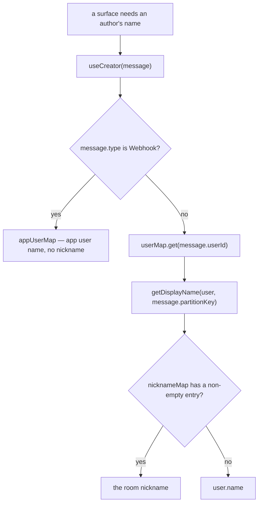

# Per-Room Nicknames

Members can set a per-room display name that overrides their global username within that room.

## The resolution rule

All member name display goes through `getDisplayName(user, roomId)` from `useUserToRoomStore`. **Never read `user.name` or `member.name` directly in a room context.**

```text
WRONG   — {{ member.name }}                     (ignores room nickname)
CORRECT — {{ getDisplayName(member, roomId) }}  (nickname, falls back to global name)
```

The one name a template may render directly is `creator.name` from `useCreator`, because that composable has already resolved it — see below.

Nicknames are stored as `text().notNull().default("")` — empty string means "no nickname set", never null. Empty string is falsy, so fallback uses `||`, never `??`:

```ts
// WRONG — empty string passes through, user sees blank name
getNicknameMap(roomId)?.get(user.id) ?? user.name;

// CORRECT
getNicknameMap(roomId)?.get(user.id) || user.name;
```

Applied in: mention labels (`useMessageWithMentions`), the member list sidebar (`MemberListItem`), the profile card that pops out of it (`ProfileCard/Index`), the room settings Members panel (`Settings/Type/Member/ListItem`), the push notification title (queried server-side before the EventGrid publish), and — through `useCreator` — every message in the timeline.

**`useCreator` resolves the nickname itself**, so the seven surfaces that render a message author (avatar initials, the batch header, reply titles, forward and pin lines, the delete and pin confirmations) get it from one place rather than each remembering to call `getDisplayName`. It reads the room from the message's own `partitionKey`, so a message rendered outside the current room — a search hit, a thread preview — resolves against the room it was written in rather than the room on screen. A webhook message is the one exception: its author is an app user, which is not a member of the room and therefore has no nickname to overlay.

The resolution is a single ordered chain, and every surface enters it at the same point:



## Data model

One column: `usersToRooms.nickname` — `text`, NOT NULL DEFAULT `""`, max 32 chars.

## Client state — `useUserToRoomStore`

Two internal maps, both keyed by `roomId`, deliberately split for privacy:

- **`myUserToRoom`** — `Map<roomId, UserToRoomInMessage | undefined>` — the **current user's own** full row for that room (notificationType, lastMessageAt, isHidden…), reached per room through `getMyUserToRoom` / `setMyUserToRoom`; populated by `readMyUsersToRooms` and the `onUpdateUserToRoom` subscription. There is no per-user inner map here — nobody else's row is ever held. What the store **exports** under that name is `useDataMap`'s current-key ref, not the map — one row, the room in view's — so it is named for the row rather than for the map behind it.
- **`nicknameMap`** — `Map<roomId, Map<userId, string>>` — **all members'** nicknames (including self); populated by `readNicknames` (called per-room from `readMetadata` in `useReadMembers`) and the same subscription.

## Procedures

Two focused procedures keep each member's private fields (notificationType, lastMessageAt, isHidden) to themselves:

| Procedure            | Input                   | Returns                          | Who                |
| :------------------- | :---------------------- | :------------------------------- | :----------------- |
| `readNicknames`      | `{ roomId, userIds[] }` | `{ userId, roomId, nickname }[]` | All listed members |
| `readMyUsersToRooms` | `{ roomIds[] }`         | Full `UserToRoomInMessage[]`     | Current user only  |

`readMyUsersToRooms` is called from `useReadRooms` to pre-load the current user's private settings (unread state, notification type) for all rooms at startup.

## Setting your nickname

Room settings → **My Profile** tab (visible to all members, no permission required). Text field pre-filled with the current nickname; empty = no nickname. Saves via `updateUserToRoom({ roomId, nickname })`; the update propagates via the `onUpdateUserToRoom` subscription into both maps.

## Key files

| File                                                                      | Role                                     |
| :------------------------------------------------------------------------ | :--------------------------------------- |
| `packages/app/app/store/message/room/userToRoom.ts`                       | `useUserToRoomStore`, `getDisplayName`   |
| `packages/app/app/composables/message/room/useCreator.ts`                 | message author, nickname already applied |
| `packages/app/app/composables/message/mentions/useMessageWithMentions.ts` | mention label resolution                 |
| `packages/app/app/components/Message/Model/Room/Settings/Type/Profile/`   | My Profile tab + nickname field          |

## Notes

Setting **other** members' nicknames via the `ManageNicknames` permission bit is not wired to a UI yet — the bit exists in `RoomPermission` (see [RBAC](/docs/esbabbler/rbac)) but only self-service nickname editing is built.
