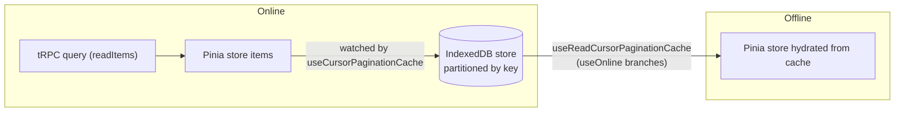

# Offline Cache

The offline cache is a local IndexedDB mirror of Pinia state. **The stores remain the source of truth**; generic cache composables handle online/offline branching, store-to-cache writes, and offline hydration. Pagination helpers (`readItems` / `readMoreItems`) stay focused on pagination state — they never accept cache options or call IndexedDB.

## How it works



Two generic composable pairs — cursor and offset pagination share the same convention:

| Composable                     | Purpose                                                                          |
| ------------------------------ | -------------------------------------------------------------------------------- |
| `useCursorPaginationCache`     | Watches cursor-paginated store items, writes IndexedDB, hydrates offline changes |
| `useReadCursorPaginationCache` | Wraps first-page reads: online query, offline IndexedDB read                     |
| `useOffsetPaginationCache`     | Offset-paginated equivalent                                                      |
| `useReadOffsetPaginationCache` | Offset-paginated equivalent                                                      |

Feature wiring is a thin wrapper supplying partition key, store refs, and hooks: `useMessageCache` (room partition, filters loading messages), `useMemberCache` (room partition, hydrates counts/user store), `useRoomCache` (user partition).

### partitionKey is always required

Every object store is partitioned; `readIndexedDb` / `writeIndexedDb` always take an explicit `partitionKey`:

- **Messages** → `roomId` (entity already has a `partitionKey` field; key path `[partitionKey, rowKey]`, limit 50)
- **Members** → `roomId` (injected `partitionKey`; key path `[partitionKey, id]`)
- **Rooms** → `userId` (injected `partitionKey`; key path `[partitionKey, id]`)

## Patterns

Feature cache composables wrap the generic one — `getWriteItems` only for feature-specific filtering, `onHydrate` only for side effects not represented by the paginated store itself (member counts, companion user maps):

```typescript
export const useFooCache = () => {
  const roomStore = useRoomStore();
  const { currentRoomId } = storeToRefs(roomStore);
  const fooStore = useFooStore();
  const { items } = storeToRefs(fooStore);
  const { initializeCursorPaginationData } = fooStore;

  useCursorPaginationCache({
    configuration: FooIndexedDbStoreConfiguration,
    getWriteItems: (items) => items.filter((item) => !item.isLoading),
    initializeCursorPaginationData,
    items,
    partitionKey: currentRoomId,
  });
};
```

Fetch composables call the read-cache helper inside their `readItems` query function — it owns `useOnline` and returns cached pagination data offline. Online metadata reads belong inside the online query passed to the helper.

## Key files

| File                                                              | Role                                                       |
| :---------------------------------------------------------------- | :--------------------------------------------------------- |
| `packages/app/app/models/cache/indexedDb/`                        | store name enum, configuration interface, typed `DBSchema` |
| `packages/app/app/services/cache/indexedDb/openIndexedDb.ts`      | singleton `openDB` + `resetIndexedDb` (tests)              |
| `packages/app/app/services/cache/indexedDb/readIndexedDb.ts`      | read all items by `partitionKey`                           |
| `packages/app/app/services/cache/indexedDb/writeIndexedDb.ts`     | replace all items for a `partitionKey` (respects `limit`)  |
| `packages/app/app/composables/cache/indexedDb/`                   | the four generic pagination cache composables              |
| `packages/app/app/composables/message/message/useMessageCache.ts` | message wiring                                             |
| `packages/app/app/composables/message/room/useMemberCache.ts`     | member wiring                                              |
| `packages/app/app/composables/message/room/useRoomCache.ts`       | room wiring                                                |

## Notes

- `ReadItemsCacheOptions` was removed — do not reintroduce cache parameters to pagination helpers.
- Tests: the generic composable owns the whole cache lifecycle (persist on change, clear on empty, hydrate on switch, partition-key guards), tested once for both pagination variants. A feature cache tests only what is its own — its `getWriteItems` filter, its `onHydrate` side effects, and one end-to-end wiring pass over its partition-key source and store hook. Awaiting landed cache state is `waitForSynchronizedFunctions()`; the composables return nothing. `fake-indexeddb/auto` is loaded in `vitest.config.ts` `setupFiles` — no mocking needed.
