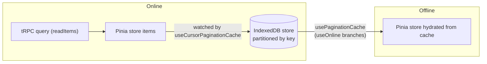

# Offline Cache

The offline cache is a local IndexedDB mirror of Pinia state. **The stores remain the source of truth**; generic cache composables handle online/offline branching, store-to-cache writes, and offline hydration. Pagination helpers (`readItems` / `readMoreItems`) stay focused on pagination state — they never accept cache options or call IndexedDB.

## How it works



One generic composable owns the whole lifecycle, behind a thin shape adapter per pagination variant:

| Composable                 | Purpose                                                                                |
| -------------------------- | -------------------------------------------------------------------------------------- |
| `usePaginationCache`       | Persists on change, clears on empty, hydrates on mount, on switch and on going offline |
| `useCursorPaginationCache` | Adapts the hydrated rows into a `CursorPaginationData` for the store's hook            |
| `useOffsetPaginationCache` | Offset-paginated equivalent                                                            |

Feature wiring is a thin wrapper supplying partition key, store refs, and hooks: `useMessageCache` (room partition, filters loading messages), `useMemberCache` (room partition, hydrates counts/user store), `useRoomCache` (user partition).

### partitionKey is always required

Every object store is partitioned; `readIndexedDb` / `writeIndexedDb` always take an explicit `partitionKey`:

- **Messages** → `roomId` (entity already has a `partitionKey` field; key path `[partitionKey, rowKey]`, limit 50)
- **Members** → `roomId` (injected `partitionKey`; key path `[partitionKey, id]`)
- **Rooms** → `userId` (injected `partitionKey`; key path `[partitionKey, id]`)

### Readiness is the store's, not the cache's

A partitioned cache asks one question, on every switch and on every mount: **are the rows currently loaded this partition's own?** The list cannot answer it — an empty list is either "not loaded yet" or "loaded and genuinely empty" — so the answer is a per-partition `isLoaded` flag **recorded by the store that performed the load**, set the moment a read or a hydration lands and therefore set for a partition the server says is empty too. The pagination data map keys it exactly like the slice it describes, and the cache takes it as an option.

Both halves of the cache read that one flag, and neither keeps a copy:

- **Hydration** bails when the partition is already loaded, so a cache page can never replace rows the store already holds. This matters most on a **remount over a surviving list**: the layout that owns the cache is torn down and rebuilt whenever the user navigates away and back, while the Pinia list is not, and a readiness flag owned by the cache would start fresh under rows that did not — hydrating the capped cache page over a room the user has scrolled back through, offline, with no way to refetch it.
- **Persistence** happens only for a loaded partition, and readiness is watched beside the rows rather than only reacting to them: a first load that lands empty changes nothing in the list, so without that the previous session's rows would stay cached — and reachable on the next offline open — for a partition that no longer has any.

That flag only means anything while **the store's list cannot outlive its partition**, so a store whose partition key can change while it is alive keys its list per partition (below). Guards added inside the cache to compensate for a list that is shared across partitions are guesses over ambiguous state; fix the store's scoping instead.

### The store list must be partition-scoped too

A store whose partition key can change while it is alive therefore uses `useCursorPaginationDataMap(() => currentKey)` / `useOffsetPaginationDataMap` — messages and members both key on `currentRoomId`. The unkeyed `useCursorPaginationData` is correct only where the key cannot change under the store: the room list partitions on the signed-in user, and signing out reloads the page, so that list is recreated with its partition rather than outliving it.

## Patterns

Feature cache composables wrap the generic one — `getWriteItems` only for feature-specific filtering, `onHydrate` only for side effects not represented by the paginated store itself (member counts, companion user maps):

```typescript
export const useFooCache = () => {
  const roomStore = useRoomStore();
  const { currentRoomId } = storeToRefs(roomStore);
  const fooStore = useFooStore();
  const { isLoaded, items } = storeToRefs(fooStore);
  const { initializeCursorPaginationData } = fooStore;

  useCursorPaginationCache({
    configuration: FooIndexedDbStoreConfiguration,
    getWriteItems: (items) => items.filter((item) => !item.isLoading),
    initializeCursorPaginationData,
    isLoaded,
    items,
    partitionKey: currentRoomId,
  });
};
```

Nothing in a fetch composable touches the cache: hydration is a watcher's job, fired on mount, on a partition switch and on going offline, so `readItems` stays an online query and the store's own hook is the only seam between them.

## Key files

| File                                                              | Role                                                       |
| :---------------------------------------------------------------- | :--------------------------------------------------------- |
| `packages/app/app/models/cache/indexedDb/`                        | store name enum, configuration interface, typed `DBSchema` |
| `packages/app/app/services/cache/indexedDb/openIndexedDb.ts`      | singleton `openDB` + `resetIndexedDb` (tests)              |
| `packages/app/app/services/cache/indexedDb/readIndexedDb.ts`      | read all items by `partitionKey`                           |
| `packages/app/app/services/cache/indexedDb/writeIndexedDb.ts`     | replace all items for a `partitionKey` (respects `limit`)  |
| `packages/app/app/composables/cache/indexedDb/`                   | the generic pagination cache composables                   |
| `packages/app/app/composables/message/message/useMessageCache.ts` | message wiring                                             |
| `packages/app/app/composables/message/room/useMemberCache.ts`     | member wiring                                              |
| `packages/app/app/composables/message/room/useRoomCache.ts`       | room wiring                                                |

## Notes

- `ReadItemsCacheOptions` was removed — do not reintroduce cache parameters to pagination helpers.
- Neither half of the cache alerts. `readIndexedDb` / `writeIndexedDb` report a refused operation to their caller rather than swallowing it, and `usePaginationCache` declares the one `onError` both halves use — the user never asked for the cache, so a browser that refuses it (quota reached, private mode, a database another tab has blocked) is logged and nothing more. A second error channel inside the services is a channel that can disagree with that one.
- Tests: the generic composable owns the whole cache lifecycle (persist on change, clear on empty, hydrate on mount/switch/offline, readiness and partition-key guards), tested once for both pagination variants. A feature cache tests only what is its own — its `getWriteItems` filter, its `onHydrate` side effects, and one end-to-end wiring pass over its partition-key source and store hook. Awaiting landed cache state is `waitForSynchronizedFunctions()`; the composables return nothing. `fake-indexeddb/auto` is loaded in `vitest.config.ts` `setupFiles` — no mocking needed.
