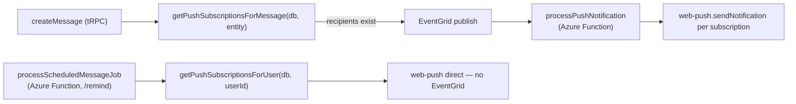

# Push Notifications

Web push notifications delivered with the `web-push` library. The app never pushes directly — it publishes an EventGrid event and an Azure Function does the delivery, so retries are independent of the tRPC request lifecycle (see [/docs/architecture/azure-services](/docs/architecture/azure-services)).

## How it works



## Recipient filtering

`getPushSubscriptionsForMessage(db, { message, partitionKey, userId })`:

1. Parse mention `data-id` attributes from the message HTML → split into `regularUserIds | @here | @everyone`.
2. One SQL query:

```text
pushSubscriptions
  INNER JOIN usersToRooms ON userId
  LEFT JOIN userStatuses ON userId   ← always joined (needed for @here)
  WHERE roomId = partitionKey
    AND userId != sender
    AND (
      notificationType = All
      OR (DirectMessage AND userId IN regularIds)
      OR (@everyone AND notificationType != Never)
      OR (@here AND notificationType != Never AND status IN (Online, null))
    )
```

`userStatuses` is always left-joined even when there is no `@here` mention, so the query shape stays consistent.

The notification title uses the sender's per-room nickname when set (see [/docs/esbabbler/nicknames](/docs/esbabbler/nicknames)).

### `NotificationType` (on `usersToRooms`)

| Value           | Behavior                                   |
| --------------- | ------------------------------------------ |
| `All`           | Notified for all messages in the room      |
| `DirectMessage` | Only when directly `@mentioned` by user ID |
| `Never`         | Muted — no notifications                   |

## Reminder notifications

`/remind` takes a different path — no EventGrid; the Service Bus-triggered `processScheduledMessageJob` Function pushes directly via `getPushSubscriptionsForUser(db, userId)`, which returns **all** subscriptions for that one user regardless of room membership or notification preferences (a reminder is self-addressed). See [/docs/esbabbler/scheduled-messages](/docs/esbabbler/scheduled-messages).

## Key files

| File                                                                        | Role                           |
| :-------------------------------------------------------------------------- | :----------------------------- |
| `packages/db/src/services/message/getPushSubscriptionsForMessage.ts`        | recipient filtering            |
| `packages/azure-functions/src/functions/processPushNotification.ts`         | delivery handler               |
| `packages/azure-functions/src/services/message/sendReminderNotification.ts` | reminder variant (direct push) |
