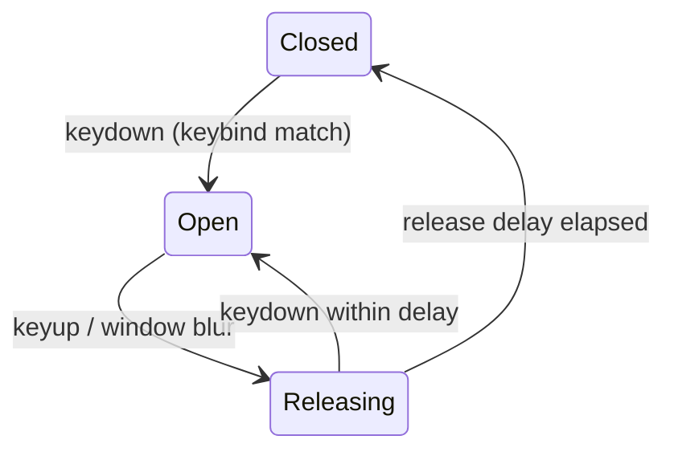

# Push-to-Talk

`VoiceInputMode.PushToTalk` is a real hold-to-talk mode: while the configured key is held the mic transmits; released, it gates to silence after a short grace period (the release delay) so word endings aren't clipped — Discord's Push to Talk Release Delay.

## How it works

The `usePushToTalk` composable registers `keydown`/`keyup`/`blur` listeners that drive the existing [`MicrophoneProcessor`](/docs/esbabbler/voice-video) gate from key state instead of the voice-activity dB level. The **call store** hosts it on the main window (isInCall is injected so the store avoids a circular import) — living with the store so the listener survives navigation, like the call itself — and `Pip/Host` registers it again on the PiP window, since key events don't cross documents.

- **Key match** — the stored `pushToTalkKeybind` is a single `event.code` captured by the Keybinds field in the Voice & Video panel; a keydown matching it (outside editable targets — composer, inputs, contenteditable) opens the gate and `preventDefault`s.
- **Gate** — `MicrophoneProcessor.voiceInputMode` selects the gate source per animation frame: `VoiceActivity` compares the live dB level against the sensitivity threshold; `PushToTalk` reads `isPushToTalkKeyHeld`, set by the liveKit store's `setPushToTalkKeyHeld`.
- **Release delay** — releasing the key schedules the gate close after `pushToTalkReleaseDelayMs` (slider under Input Mode, 0–2000 ms, default 20 ms); pressing again within the delay cancels the pending close. A window `blur` releases too, so the gate can't stick open when keyup is lost with focus.
- **Reset rules** — switching input mode away from Push To Talk closes the gate immediately, and rebinding mid-hold closes it too (the old key's keyup would no longer match).

## Data model

`userSettings.pushToTalkKeybind` (text, `""` = unbound) and `userSettings.pushToTalkReleaseDelayMs` (integer, CHECK 0..2000, default 20) — see [/docs/esbabbler/settings](/docs/esbabbler/settings). No procedures beyond the existing `updateUserSettings`.

## Key files

| File                                                                                                  | Role                                                              |
| :---------------------------------------------------------------------------------------------------- | :---------------------------------------------------------------- |
| `packages/app/app/composables/message/room/call/usePushToTalk.ts`                                     | keydown/keyup/blur listener composable (hosted by the call store) |
| `packages/app/app/util/dom/checkIsEditableTarget.ts`                                                  | cross-realm-safe editable-target skip                             |
| `packages/app/app/models/message/room/call/MicrophoneProcessor.ts`                                    | key-driven gate mode (`isPushToTalkKeyHeld`)                      |
| `packages/app/app/store/message/room/liveKit.ts`                                                      | `setPushToTalkKeyHeld` + release-delay timer                      |
| `packages/app/app/components/Message/Content/Call/Pip/Host.vue`                                       | PiP window listener wiring                                        |
| `packages/app/app/components/Message/Model/User/Settings/Type/Voice/PushToTalkKeybindButton.vue`      | keybind capture field                                             |
| `packages/app/app/components/Message/Model/User/Settings/Type/Voice/PushToTalkReleaseDelaySlider.vue` | release-delay slider                                              |

## Notes

Browser limitation: keys only arrive while an app window (main or PiP) is focused — true global OS-level push-to-talk needs a desktop app and is out of scope (same constraint family as [currently-playing activity](/docs/esbabbler/rejected/currently-playing-activity)). The PiP window being focusable mitigates this for the presenting case.
