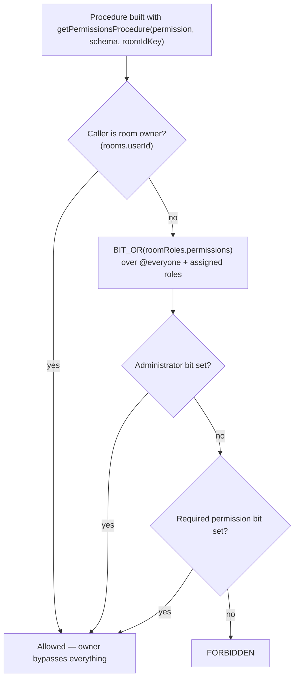

# RBAC

Discord-complexity role-based access control per room. Every privileged operation — moderation, settings, invites, webhooks — is gated through it.

## How it works

Each room has roles (`roomRoles`) carrying a `permissions` **bigint bitfield** of `RoomPermission` flags. `bigint` (not `number`) lets the field grow past 32 bits; since TypeScript enums cannot hold bigints, `RoomPermission` is a `const` object of `1n << n` values. A user's effective permissions are the SQL `BIT_OR` of the room's `@everyone` role plus every role assigned to them in `usersToRoomRoles`.

Authority is layered: **Owner** (`rooms.userId`, immune to all role manipulation) → **Administrator** permission (all bits, bypasses hierarchy but not ownership) → explicit permission bits (subject to hierarchy) → `@everyone` baseline. The `@everyone` role is a real `roomRoles` row (`isEveryone = true`, one per room via partial unique index) applied implicitly to every member — it is never stored in `usersToRoomRoles`. `createRoom` seeds it in the same transaction.

**Hierarchy** prevents lower roles acting upward: a user's _top position_ is the max `position` across explicitly assigned roles (owner = infinity), and role management or member-targeting actions require the actor's top position to exceed the target's (`isManageable`).

`RoomPermission` bits, in order: `ReadMessages`, `SendMessages`, `ManageMessages`, `MentionEveryone`, `ManageRoom`, `ManageRoles`, `ManageInvites`, `KickMembers`, `BanMembers`, `MuteMembers`, `MoveMembers`, `ManageNicknames`, `ManageWebhooks`, `Administrator`. **Bit-ordering rule:** `Administrator` stays the highest bit; new permissions are inserted before `ManageWebhooks`/`Administrator` (which shifts those bits and requires a data migration of stored values).

## Data model

| Table              | Key facts                                                                                              |
| ------------------ | ------------------------------------------------------------------------------------------------------ |
| `roomRoles`        | `roomId` FK, `name`, `color`, `position` (higher = more authority), `permissions` bigint, `isEveryone` |
| `usersToRoomRoles` | `(userId, roomId, roleId)` composite PK — explicit role assignments                                    |

## Service layer & guards

`server/services/room/rbac/`:

| Function                                  | Purpose                                         |
| ----------------------------------------- | ----------------------------------------------- |
| `getPermissions(db, userId, roomId)`      | `BIT_OR` aggregate → bigint                     |
| `hasPermission(db, userId, roomId, perm)` | Owner bypass → Administrator bit → specific bit |
| `getTopRolePosition(db, userId, roomId)`  | Max assigned-role position                      |
| `isManageable(...)`                       | Hierarchy check for acting on a member/role     |

tRPC procedure builders in `server/trpc/procedure/room/`:

| Guard                     | Use                                                             |
| ------------------------- | --------------------------------------------------------------- |
| `getMemberProcedure`      | Caller must be a room member — standard message/room operations |
| `getPermissionsProcedure` | Caller must hold a specific `RoomPermission` — moderation/admin |
| `getOwnerProcedure`       | Owner only — destructive room operations                        |

## Key files

| File                                                                 | Role                                 |
| -------------------------------------------------------------------- | ------------------------------------ |
| `packages/db-schema/src/schema/roomRolesInMessage.ts`                | `RoomPermission` const + roles table |
| `packages/db-schema/src/schema/usersToRoomRolesInMessage.ts`         | Assignment table                     |
| `packages/app/server/services/room/rbac/`                            | Service functions (+ tests)          |
| `packages/app/server/trpc/procedure/room/getPermissionsProcedure.ts` | Permission middleware builder        |
| `packages/app/server/trpc/routers/role.ts`                           | Role CRUD + `readMemberRoles`        |

## Notes

- `readMemberRoles` is deliberately a separate procedure from `readMembers` (called in parallel from `useReadMembers`) rather than a join.
- Default `@everyone` permissions: `ReadMessages | SendMessages | MentionEveryone | ManageInvites`.
