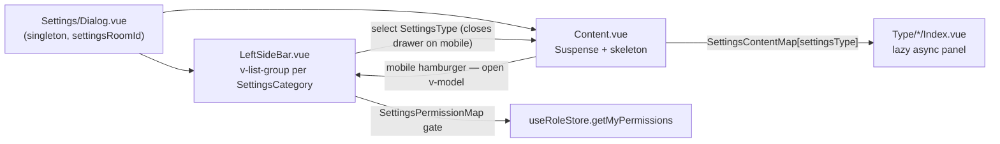

# Room Settings

A Discord-style fullscreen settings dialog for a room, opened from the room list. Opening settings for a room other than the one being viewed navigates to that room first — the Roles and Members panels load and key their data (roles, members, permissions, selection) by the current room, so the dialog always targets the room whose data is live. Its information architecture matches Discord Server Settings: a two-level sidebar of category groups (`v-list-group`) whose items are the panels, with the first category headed by the room name itself and **Delete** kept as a standalone destructive item below the categories.

## Categories and panels

`SettingsCategoryMap` owns the grouping; every `SettingsType` except `Delete` belongs to exactly one category (enforced by the map's co-located test).

| Category                 | Panels                                       | Gated panels (permission)                                                 |
| ------------------------ | -------------------------------------------- | ------------------------------------------------------------------------- |
| _(room name)_            | Overview · Roles · Profile                   | —                                                                         |
| Integrations             | Webhooks                                     | —                                                                         |
| Moderation               | Word Filter · Audit Log · Bans · Attachments | Word Filter + Audit Log + Attachments (`ManageRoom`), Bans (`BanMembers`) |
| User Management          | Members · Invites                            | —                                                                         |
| _(below the categories)_ | Delete                                       | owner-only inside its confirm dialog                                      |

Gating lives in `SettingsPermissionMap` — a panel with an entry is hidden from members lacking that `RoomPermission`; a category with no visible panels disappears entirely. Room owners bypass all checks via `hasPermission`.

**Roles** (previously a combined "Permissions" panel) edits roles and their permission bitfields; **Members** (previously a tab inside it) assigns/revokes member roles; **Invites** manages your invite link — the same manager component (`Invite/Manager.vue`) the header's Add Friends dialog uses; **Attachments** edits the room's upload limits, described in [/docs/esbabbler/file-media](/docs/esbabbler/file-media).

## How it works

The dialog mirrors the [user settings dialog](/docs/esbabbler/settings) conventions: panels are lazy `defineAsyncComponent`s rendered in `<Suspense :timeout="0">` with the shared `MessageModelSettingsSkeleton` fallback, and the active panel item in the open category group is highlighted by the generic `StyledSlideIndicator` rail (items carry `data-slide-indicator-key`). Unlike the user dialog there is no in-panel section scrollspy — room panels are single-view tools (tables and two-pane editors), so the second nav level selects panels, not scroll sections.

## Saving a panel

Every panel that edits the room row saves through `useSaveRoom`, not through its own `executeMutation` call. The panel holds its controls as its own refs — deliberately not a clone of the row, so a rejected save leaves what the user entered standing with `isDirty` still true and the next blur retries it ([client data access](/docs/architecture/client-data)) — and hands `useSaveRoom` only the fields it owns. The composable adds the room id, keys the write on it so panels editing different fields of one room queue instead of clobbering each other, and builds the rollback by reading back **exactly the keys the save wrote**. Snapshotting the whole row instead would revert a field another client changed between the apply and the rejection.

Two panels writing disjoint fields is therefore the normal case rather than a special one, and adding a third is a call with a different field set — never another copy of the optimistic block.

## Mobile

The shared `MessageModelSettingsLeftSideBar` drawer is `permanent` only on desktop; on `smAndDown` (`useVDisplay`) it becomes a `temporary` overlay drawer, closed by default and opened by a `mdi-menu` hamburger the content header renders on mobile. Selecting any panel closes the drawer so the content takes the full width — the room dialog threads this open-state through the `Dialog` (`open` v-model on the sidebar, `open:drawer` emit from the content), and the [user settings dialog](/docs/esbabbler/settings) does the same via `isDrawerOpen` on its dialog store. The two-pane panels that would otherwise sit side by side — Roles and Members (list column + editor column) — stack to a single column under the `sm` breakpoint (`cols="12" sm="4"` on the list column) so neither pane is squeezed.

## Key files

| File                                                                  | Role                                                   |
| :-------------------------------------------------------------------- | :----------------------------------------------------- |
| `packages/app/app/models/message/room/SettingsType.ts`                | panel enum (values double as titles)                   |
| `packages/app/app/models/message/room/SettingsCategory.ts`            | sidebar category enum                                  |
| `packages/app/app/services/message/settings/SettingsCategoryMap.ts`   | category → panels grouping                             |
| `packages/app/app/services/message/settings/SettingsListItemMap.ts`   | panel icons/colors                                     |
| `packages/app/app/services/message/settings/SettingsContentMap.ts`    | panel → lazy component                                 |
| `packages/app/app/services/message/settings/SettingsPermissionMap.ts` | panel → required `RoomPermission`                      |
| `packages/app/app/composables/message/room/useSaveRoom.ts`            | shared optimistic room-row save + key-scoped rollback  |
| `packages/app/app/components/Message/Model/Room/Settings/`            | dialog + sidebar + `Type/*` panels                     |
| `packages/app/app/components/Message/Model/Room/Invite/Manager.vue`   | invite-link manager shared with the Add Friends dialog |
