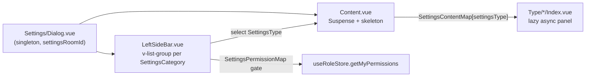

# Room Settings

A Discord-style fullscreen settings dialog for a room, opened from the room list. Its information architecture matches Discord Server Settings: a two-level sidebar of category groups (`v-list-group`) whose items are the panels, with the first category headed by the room name itself and **Delete** kept as a standalone destructive item below the categories.

## Categories and panels

`SettingsCategoryMap` owns the grouping; every `SettingsType` except `Delete` belongs to exactly one category (enforced by the map's co-located test).

| Category                 | Panels                         | Gated panels (permission)                                   |
| ------------------------ | ------------------------------ | ----------------------------------------------------------- |
| _(room name)_            | Overview · Roles · Profile     | —                                                           |
| Integrations             | Webhooks                       | —                                                           |
| Moderation               | Word Filter · Audit Log · Bans | Word Filter + Audit Log (`ManageRoom`), Bans (`BanMembers`) |
| User Management          | Members · Invites              | —                                                           |
| _(below the categories)_ | Delete                         | owner-only inside its confirm dialog                        |

Gating lives in `SettingsPermissionMap` — a panel with an entry is hidden from members lacking that `RoomPermission`; a category with no visible panels disappears entirely. Room owners bypass all checks via `hasPermission`.

**Roles** (previously a combined "Permissions" panel) edits roles and their permission bitfields; **Members** (previously a tab inside it) assigns/revokes member roles; **Invites** manages your invite link — the same manager component (`Invite/Manager.vue`) the header's Add Friends dialog uses.

## How it works

The dialog mirrors the [user settings dialog](/docs/esbabbler/settings) conventions: panels are lazy `defineAsyncComponent`s rendered in `<Suspense :timeout="0">` with the shared `MessageModelSettingsSkeleton` fallback, and the active panel item in the open category group is highlighted by the generic `StyledSlideIndicator` rail (items carry `data-slide-indicator-key`). Unlike the user dialog there is no in-panel section scrollspy — room panels are single-view tools (tables and two-pane editors), so the second nav level selects panels, not scroll sections.

## Key files

| File                                                                  | Role                                                   |
| :-------------------------------------------------------------------- | :----------------------------------------------------- |
| `packages/app/app/models/message/room/SettingsType.ts`                | panel enum (values double as titles)                   |
| `packages/app/app/models/message/room/SettingsCategory.ts`            | sidebar category enum                                  |
| `packages/app/app/services/message/settings/SettingsCategoryMap.ts`   | category → panels grouping                             |
| `packages/app/app/services/message/settings/SettingsListItemMap.ts`   | panel icons/colors                                     |
| `packages/app/app/services/message/settings/SettingsContentMap.ts`    | panel → lazy component                                 |
| `packages/app/app/services/message/settings/SettingsPermissionMap.ts` | panel → required `RoomPermission`                      |
| `packages/app/app/components/Message/Model/Room/Settings/`            | dialog + sidebar + `Type/*` panels                     |
| `packages/app/app/components/Message/Model/Room/Invite/Manager.vue`   | invite-link manager shared with the Add Friends dialog |
