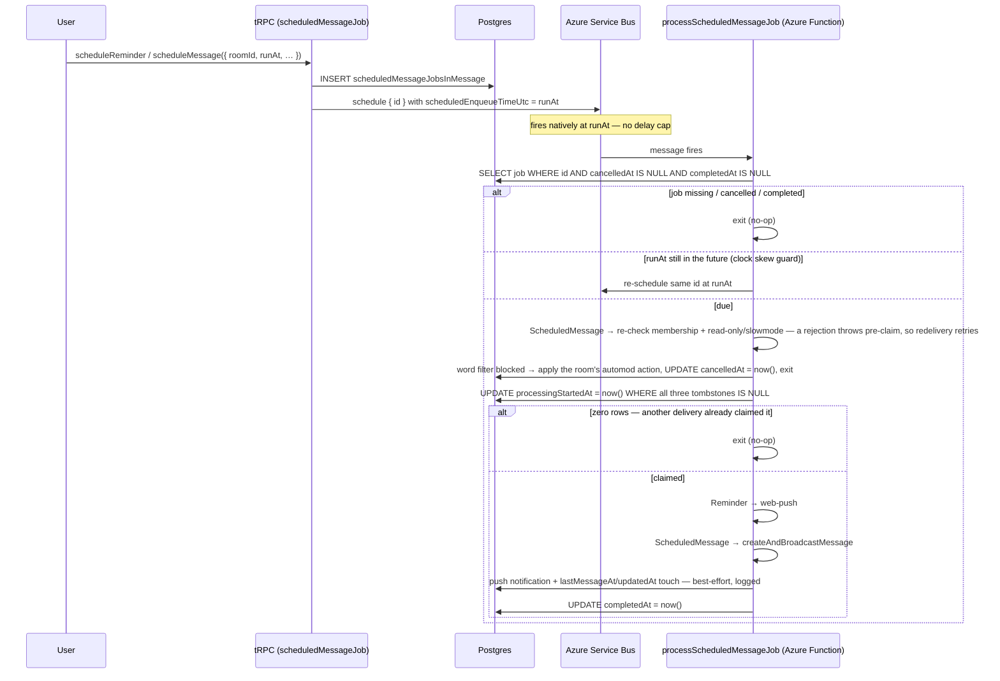

# Scheduled Messages & Reminders

Server-backed `/remind` and `/schedule`: a Postgres job row plus an Azure Service Bus scheduled message, executed by a Service Bus-triggered Azure Function. **Postgres is the source of truth** — the queue message carries only `{ id }`.

## How it works

Failure semantics: the `processingStartedAt` update is a **single-shot claim** — it stamps the job only while `cancelledAt`, `completedAt` and `processingStartedAt` are all still null, so of two concurrent deliveries exactly one proceeds. The claim is what lets `IsIdempotentAzureFunctionMap` mark the handler idempotent: a posted message carries a fresh reverse-ticked `rowKey`, so an unclaimed rerun would duplicate it rather than repair it. The claim also splits retries in two: a failure that throws **before the claim** leaves the job unstamped, so Service Bus redelivers and the job retries — while a failure **after the claim** can no longer be retried at all, since the redelivery it would ask for is skipped by the claim itself. So everything past the message write is best-effort rather than fatal ([persist then notify](/docs/architecture/persist-then-notify)): the push notification and the `lastMessageAt`/`updatedAt` touches are logged through `context.error` and the job still reaches `completedAt`. Only a failure of the delivery itself — the reminder push, the message write, or the `completedAt` stamp — leaves the job stuck mid-delivery, which is the cost of never posting twice. Cancellation is DB-only (tombstone): `cancelScheduledJob` sets `cancelledAt`, the scheduled Service Bus message still fires, and the worker guard skips it.

The same three tombstones gate the owner's side: `cancel`, `reschedule` and `send now` only touch a job the delivery handler has not claimed, so neither path can post the message the other is already sending. Both delivery paths run their guards **before** their claim: `sendScheduledMessageNow` runs every guard before flipping `cancelledAt`, and the worker runs `assertCanCreateMessage` before stamping `processingStartedAt` — so a rejection — read-only room, slowmode, timeout, lost membership — leaves the job unclaimed instead of burning it. On the worker that means Service Bus redelivers and retries, and a job whose retries exhaust stays visible to `cancel`/`reschedule`/`send now`.

**The word filter is the one rejection the worker does not retry.** Its inputs are both stored — the room's word list and the job's own message text — so every redelivery re-reads the same pair and blocks again, and the guard applies the filter's configured automod action (`Warn`/`Timeout`, audited as `AutoMod`) exactly as a live send would. Retrying it would re-apply that action and write another audit row once per delivery, so the worker tombstones the job with `cancelledAt` and returns instead of rethrowing. The scheduled path and the live path therefore share one consequence for one blocked message. Both call the same `executeAutomodAction` core in `@esposter/db`; only the app wrapper adds the in-process `moderationEventEmitter` fan-out, which does not exist in the Function process.

## Data model

Postgres table `scheduledMessageJobsInMessage`:

| Field                 | Notes                                                                                                                                                              |
| --------------------- | ------------------------------------------------------------------------------------------------------------------------------------------------------------------ |
| `id`                  | UUID primary key — the only thing put on the queue                                                                                                                 |
| `userId`              | creator / recipient                                                                                                                                                |
| `roomId`              | required room scope                                                                                                                                                |
| `payload`             | discriminated JSON by `type`: `Reminder` (`text`) or `ScheduledMessage` (`message`)                                                                                |
| `runAt`               | timestamp                                                                                                                                                          |
| `processingStartedAt` | nullable; the delivery handler's single-shot claim, stamped atomically on `IS NULL` — a claimed job is invisible to cancel/reschedule/send-now and to the listings |
| `completedAt`         | nullable; set after success; a pre-claim failure leaves it null so redelivery retries, a post-claim failure leaves the job mid-delivery rather than posting twice  |
| `cancelledAt`         | nullable; set by `cancelScheduledJob`, `rescheduleMessage` (on the old row) and `sendScheduledMessageNow`; workers skip jobs where this is set                     |

## Procedures

All under `message.scheduledMessageJob.`:

| Procedure                                           | Notes                                                                                                                                                                                                                                                     |
| --------------------------------------------------- | --------------------------------------------------------------------------------------------------------------------------------------------------------------------------------------------------------------------------------------------------------- |
| `scheduleReminder({ roomId, runAt, text })`         | self-addressed push at `runAt` → [/docs/esbabbler/push-notifications](/docs/esbabbler/push-notifications)                                                                                                                                                 |
| `scheduleMessage({ roomId, runAt, message })`       | behind `SendMessages` + read-only/slowmode checks at creation **and** execution time                                                                                                                                                                      |
| `cancelScheduledJob({ id })`                        | sets `cancelledAt` tombstone                                                                                                                                                                                                                              |
| `rescheduleMessage({ id, roomId, runAt, message })` | one transaction: tombstones the old row, inserts the replacement, re-enqueues — guards re-checked                                                                                                                                                         |
| `sendScheduledMessageNow({ id })`                   | guards first, then tombstones the job and posts via `createUserMessage` — a guard rejection leaves it scheduled, and a failed send lifts the tombstone and re-enqueues the delivery the tombstone may have already consumed, so the message is never lost |
| `readScheduledJobs({ roomId })`                     | per-room listing                                                                                                                                                                                                                                          |
| `readMyScheduledJobs({ offset, limit })`            | cross-room listing (Scheduled tab → [/docs/esbabbler/drafts-and-sent](/docs/esbabbler/drafts-and-sent))                                                                                                                                                   |
| `readMyScheduledJobsCount()`                        | tab badge count                                                                                                                                                                                                                                           |

## Notes

- **Why Service Bus, not Storage Queue**: the Storage Queue trigger polled the storage account every ~10 s around the clock (the dominant storage cost) and capped visibility delays at 7 days, forcing a re-enqueue loop. Service Bus scheduled messages (`scheduledEnqueueTimeUtc`) deliver natively at `runAt` with no delay cap via a push-style AMQP listener; Basic tier has no base charge.
- Infrastructure: Basic-tier namespaces (`dev-sbns-esposter-001` / `prod-sbns-esposter-001`) with one queue each, `scheduled-message-jobs`. Connection-string auth via `AZURE_SERVICE_BUS_CONNECTION_STRING`, matching the existing key-based auth grain.

## Key files

| File                                                                         | Role                          |
| :--------------------------------------------------------------------------- | :---------------------------- |
| `packages/db-schema/src/schema/scheduledMessageJobsInMessage.ts`             | job table                     |
| `packages/app/server/trpc/routers/message/scheduledMessageJob.ts`            | scheduling/cancel/list router |
| `packages/app/server/composables/azure/serviceBus/useServiceBusSender.ts`    | Service Bus scheduling        |
| `packages/azure-functions/src/functions/processScheduledMessageJob.ts`       | worker trigger                |
| `packages/azure-functions/src/handlers/processScheduledMessageJobHandler.ts` | worker logic + guards         |
