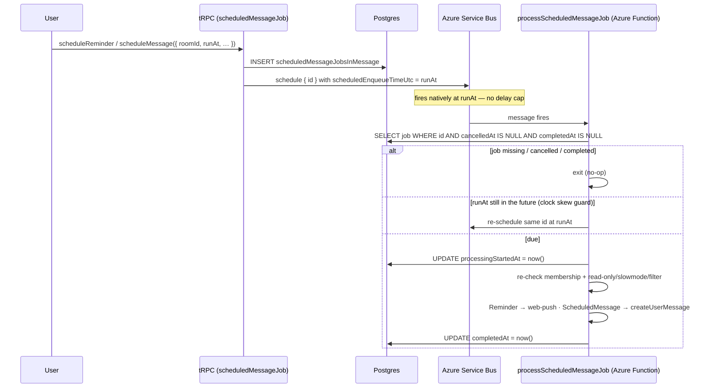

# Scheduled Messages & Reminders

Server-backed `/remind` and `/schedule`: a Postgres job row plus an Azure Service Bus scheduled message, executed by a Service Bus-triggered Azure Function. **Postgres is the source of truth** — the queue message carries only `{ id }`.

## How it works

Failure semantics: on error the function throws, Service Bus redelivers, and the job retries — `completedAt` stays null until success. `processingStartedAt` records the latest attempt for observability; it is **not** a lock. Cancellation is DB-only (tombstone): `cancelScheduledJob` sets `cancelledAt`, the scheduled Service Bus message still fires, and the worker guard skips it.

## Data model

Postgres table `scheduledMessageJobsInMessage`:

| Field                 | Notes                                                                                  |
| --------------------- | -------------------------------------------------------------------------------------- |
| `id`                  | UUID primary key — the only thing put on the queue                                     |
| `userId`              | creator / recipient                                                                    |
| `roomId`              | required room scope                                                                    |
| `payload`             | discriminated JSON by `type`: `Reminder` (`text`) or `ScheduledMessage` (`message`)    |
| `runAt`               | timestamp                                                                              |
| `processingStartedAt` | nullable; latest processing attempt start, for observability (not a lock)              |
| `completedAt`         | nullable; set after success; failure leaves null so the queue retry runs the job again |
| `cancelledAt`         | nullable; user-initiated cancellation; workers skip jobs where this is set             |

## Procedures

All under `message.scheduledMessageJob.`:

| Procedure                                     | Notes                                                                                                     |
| --------------------------------------------- | --------------------------------------------------------------------------------------------------------- |
| `scheduleReminder({ roomId, runAt, text })`   | self-addressed push at `runAt` → [/docs/esbabbler/push-notifications](/docs/esbabbler/push-notifications) |
| `scheduleMessage({ roomId, runAt, message })` | behind `SendMessages` + read-only/slowmode checks at creation **and** execution time                      |
| `cancelScheduledJob({ id })`                  | sets `cancelledAt` tombstone                                                                              |
| `readScheduledJobs({ roomId })`               | per-room listing                                                                                          |
| `readMyScheduledJobs({ offset, limit })`      | cross-room listing (Scheduled tab → [/docs/esbabbler/drafts-and-sent](/docs/esbabbler/drafts-and-sent))   |
| `readMyScheduledJobsCount()`                  | tab badge count                                                                                           |

## Notes

- **Why Service Bus, not Storage Queue**: the Storage Queue trigger polled the storage account every ~10 s around the clock (the dominant storage cost) and capped visibility delays at 7 days, forcing a re-enqueue loop. Service Bus scheduled messages (`scheduledEnqueueTimeUtc`) deliver natively at `runAt` with no delay cap via a push-style AMQP listener; Basic tier has no base charge.
- Infrastructure: Basic-tier namespaces (`dev-sbns-esposter-001` / `prod-sbns-esposter-001`) with one queue each, `scheduled-message-jobs`. Connection-string auth via `AZURE_SERVICE_BUS_CONNECTION_STRING`, matching the existing key-based auth grain.

## Key files

| File                                                                         | Role                          |
| :--------------------------------------------------------------------------- | :---------------------------- |
| `packages/db-schema/src/schema/scheduledMessageJobsInMessage.ts`             | job table                     |
| `packages/app/server/trpc/routers/message/scheduledMessageJob.ts`            | scheduling/cancel/list router |
| `packages/app/server/composables/azure/serviceBus/useServiceBusSender.ts`    | Service Bus scheduling        |
| `packages/azure-functions/src/functions/processScheduledMessageJob.ts`       | worker trigger                |
| `packages/azure-functions/src/handlers/processScheduledMessageJobHandler.ts` | worker logic + guards         |
