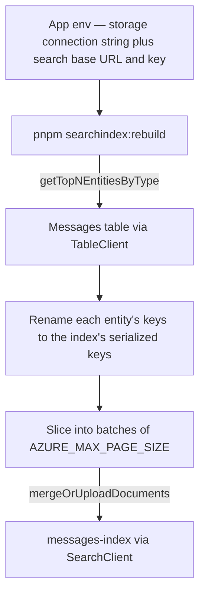

# Search Index Tooling

The `messages-index` Azure AI Search index powers filtered search and the Sent tab, but it is populated by a scheduled Azure Table pull indexer (see [/docs/architecture/azure-services](/docs/architecture/azure-services)) rather than a synchronous write. If that indexer ever falls behind or silently fails, index documents drift below the rows in the `Messages` table and nothing surfaces it. Two internal `packages/app` scripts close that gap: one reports drift, one repairs it.

Both are script-first ops tools — no UI, no owner-gated procedure. A single-operator platform does not warrant more; if operators multiply, promote them to procedures.

## How it works

Run either from `packages/app`, where they read the app's own `.env` for the storage connection string and the search base URL plus key:

```bash
pnpm searchindex:status    # per-room drift report
pnpm searchindex:rebuild   # re-feed messages into the index
```

The rebuild script re-feeds a room's (or every room's) messages from Azure Table Storage back into the index, keyed by document id (`RowKey`), so re-running it is an idempotent upsert:



The status script does the read-only half: for each room it counts rows in the `Messages` table and documents in the index, then prints a per-room drift report (`table − index`). A non-zero drift on a room is the signal to run the rebuild.

Both scripts run outside Nitro, so they cannot call `useTableClient` / `useSearchClient`; they build the same `@azure/data-tables` and `@azure/search-documents` clients from the app's typed `process.env` and then reuse the app's own read, filter, and entity helpers — `getTableClient`, `countEntities`, `getTopNEntitiesByType`, and the `Clause` serializers from `@esposter/db`.

## Key files

| File                                                                 | Role                                                              |
| -------------------------------------------------------------------- | ----------------------------------------------------------------- |
| `packages/app/scripts/messageSearchIndexStatus.ts`                   | Status entry point — prints the per-room drift report             |
| `packages/app/scripts/rebuildMessageSearchIndex.ts`                  | Rebuild entry point — re-feeds messages into the index            |
| `packages/app/scripts/searchIndex/buildDriftReport.ts`               | Pure table-vs-index drift comparison                              |
| `packages/app/scripts/searchIndex/getMessageSearchClient.ts`         | `SearchClient` for `messages-index`, built from the app env       |
| `packages/app/scripts/searchIndex/readScopedRoomIds.ts`              | Resolves `ROOM_IDS`, or every room that has messages              |
| `packages/app/scripts/searchIndex/serializeMessageSearchDocument.ts` | Table entity to search document — the inverse of the deserializer |

## Notes

- The rebuild is idempotent by `RowKey`: `mergeOrUpload` inserts a missing document or refreshes an existing one, so re-running never duplicates.
- Batches cap at `AZURE_MAX_PAGE_SIZE` (1000), matching Azure's per-request document limit and the table page size.
- A room that fails to upload is reported and skipped so the rest of the rebuild still finishes.
- Neither script is run against live Azure from the repo; the pure drift comparison is unit-tested, and the Azure I/O is the untested seam.
- Scope both scripts to specific rooms with the `ROOM_IDS` env var (comma-separated) or omit it to cover every room.
