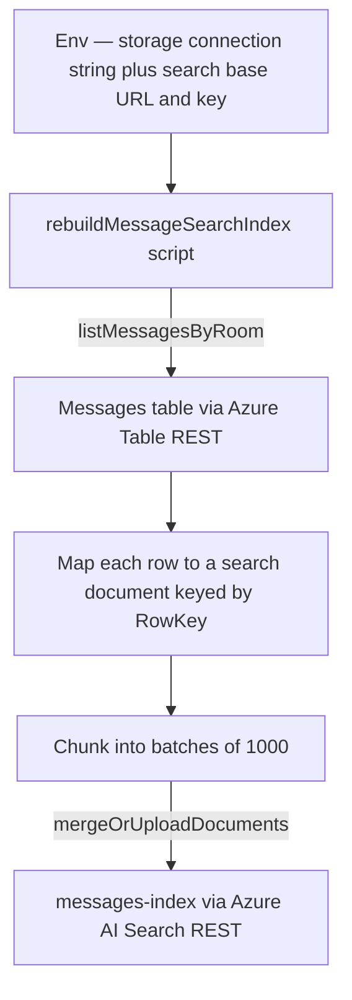

# Search Index Tooling

The `messages-index` Azure AI Search index powers filtered search and the Sent tab, but it is populated by a scheduled Azure Table pull indexer (see [/docs/architecture/azure-services](/docs/architecture/azure-services)) rather than a synchronous write. If that indexer ever falls behind or silently fails, index documents drift below the rows in the `Messages` table and nothing surfaces it. Two internal `@esposter/shared-node` scripts close that gap: one reports drift, one repairs it.

Both are script-first ops tools — no UI, no owner-gated procedure. A single-operator platform does not warrant more; if operators multiply, promote them to procedures.

## How it works

The rebuild script re-feeds a room's (or every room's) messages from Azure Table Storage back into the index, keyed by document id (`RowKey`), so re-running it is an idempotent upsert:

The status script does the read-only half: for each room it counts rows in the `Messages` table and documents in the index, then prints a per-room drift report (`table − index`). A non-zero drift on a room is the signal to run the rebuild.

Both scripts talk to Azure over its REST APIs with Node's built-in `fetch` — `api-key` auth for Search, hand-signed SharedKeyLite auth for Table — because `@esposter/shared-node` deliberately carries no Azure SDK dependency. They mirror the env-driven client construction of `server/composables/azure/search/useSearchClient.ts` (base URL plus key) rather than importing it.

## Key files

| File                                                                                    | Role                                                   |
| --------------------------------------------------------------------------------------- | ------------------------------------------------------ |
| `packages/shared-node/src/scripts/messageSearchIndexStatus.ts`                          | Status entrypoint — prints the per-room drift report   |
| `packages/shared-node/src/scripts/rebuildMessageSearchIndex.ts`                         | Rebuild entrypoint — re-feeds messages into the index  |
| `packages/shared-node/src/services/message/searchIndex/buildDriftReport.ts`             | Pure table-vs-index drift comparison                   |
| `packages/shared-node/src/services/message/searchIndex/searchIndexRestClient.ts`        | Search REST client — count + `mergeOrUpload` documents |
| `packages/shared-node/src/services/message/searchIndex/tableRestClient.ts`              | Table REST client — paginated message reads            |
| `packages/shared-node/src/services/message/searchIndex/signTableSharedKeyLite.ts`       | SharedKeyLite request signer                           |
| `packages/shared-node/src/services/message/searchIndex/parseStorageConnectionString.ts` | Parses the storage connection string into credentials  |
| `packages/shared-node/src/services/message/searchIndex/constants.ts`                    | API versions, index/table names, batch size            |

## Notes

- The rebuild is idempotent by `RowKey`: `mergeOrUpload` inserts a missing document or refreshes an existing one, so re-running never duplicates.
- Batches cap at 1000, matching Azure's per-request document limit and the table page size — the same magnitude the app enforces via `AZURE_MAX_PAGE_SIZE`.
- Neither script is run against live Azure from the repo; the pure drift/signing/parsing logic is unit-tested, and the REST I/O is the untested seam.
- Scope both scripts to specific rooms with the `ROOM_IDS` env var (comma-separated) or omit it to cover every room.
