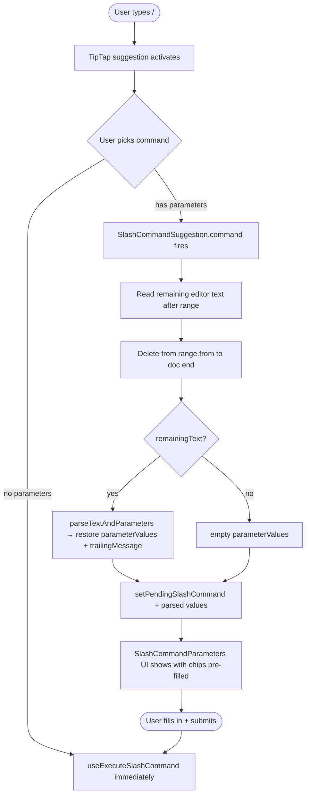

# Slash Commands

Triggered by `/` in the message input. The TipTap suggestion API powers the picker; definitions live in `SlashCommandDefinitionMap`.

## Command reference

| Command      | Kind             | Parameters           | Result                                                                                    |
| ------------ | ---------------- | -------------------- | ----------------------------------------------------------------------------------------- |
| `/flip`      | Immediate client | —                    | Posts `🌝 **Heads**` or `🌚 **Tails**`                                                    |
| `/me`        | Immediate client | `message` (required) | Posts `*message*` (italic emphasis)                                                       |
| `/roll`      | Immediate client | —                    | Posts `🎲 Rolled a **N**` (1–100)                                                         |
| `/shrug`     | Immediate client | `text` (optional)    | Posts `text¯\_(ツ)_/¯`                                                                    |
| `/tableflip` | Immediate client | —                    | Posts `(╯°□°）╯︵ ┻━┻`                                                                    |
| `/unflip`    | Immediate client | —                    | Posts `┬─┬ノ( º _ ºノ)`                                                                   |
| `/topic`     | Immediate tRPC   | `text` (optional)    | Calls `room.updateRoom` to set/clear the topic                                            |
| `/poll`      | Dialog → tRPC    | —                    | Opens the poll dialog; on submit posts a `MessageType.Poll` message                       |
| `/remind`    | Dialog → tRPC    | —                    | Opens the scheduled-job dialog → [scheduled messages](/docs/esbabbler/scheduled-messages) |
| `/schedule`  | Dialog → tRPC    | —                    | Opens the scheduled-job dialog → [scheduled messages](/docs/esbabbler/scheduled-messages) |

## How it works

Adding a command touches three places (per the registry pattern): the `SlashCommandType` enum, its `SlashCommandDefinitionMap` entry (`icon`, `title`, `description`, `parameters[]`, `type`), and an arm in `useExecuteSlashCommand`.

All execution happens in `useExecuteSlashCommand` via a `switch` on `SlashCommandType` — the definition is static metadata only, with no `execute()` method. Three execution paths:

- **Client-only** (`Flip`, `Me`, `Roll`, `Shrug`, `TableFlip`, `Unflip`) — build `createMessageInput` inline and fall through to the normal `storeSendMessage`.
- **Server call** (`Topic`) — call a tRPC mutation directly (`room.updateRoom`), no message posted by the command itself.
- **Dialog** (`Poll`, `Remind`, `Schedule`) — open a dialog that owns its own submit, so richer inputs use normal form controls instead of inline parameter chips.

### Typing a command



### Parameter mode ↔ text serialisation

Collapsing parameter mode back to text (Escape, or Backspace in an empty command/trailing input) rebuilds the input as:

```text
/CommandType parameterName1|value1 parameterName2|value2 trailingMessage
```

`ID_SEPARATOR` (`|`) separates a parameter name from its value; parameters are space-separated; the last parameter's value is greedy; re-parsing uses prefix matching per parameter in definition order. The `RichTextEditor` remounts with the formatted text and focuses at the end.

## Key files

| File                                                                            | Role                                                          |
| :------------------------------------------------------------------------------ | :------------------------------------------------------------ |
| `packages/app/app/models/message/slashCommands/SlashCommandType.ts`             | command enum                                                  |
| `packages/app/app/services/message/slashCommands/SlashCommandDefinitionMap.ts`  | `Record<SlashCommandType, SlashCommand>` — static definitions |
| `packages/app/app/composables/message/slashCommand/useExecuteSlashCommand.ts`   | execution switch                                              |
| `packages/app/app/composables/message/slashCommand/useSlashCommandExtension.ts` | TipTap extension (mirrors `useMentionExtension`)              |
| `packages/app/app/services/message/slashCommands/SlashCommandSuggestion.ts`     | picker suggestion config                                      |
| `packages/app/app/services/message/slashCommands/parseTextAndParameters.ts`     | text → parameterValues re-parsing                             |
| `packages/app/app/store/message/input/slashCommand.ts`                          | pendingCommand + parameterValues + trailingMessage store      |

## Notes

The send pipeline is untouched by commands: `sendMessage`, `RichTextEditor`, and the mention suggestion know nothing about slash commands. Client-only commands go through the same `storeSendMessage` as a hand-typed message.
