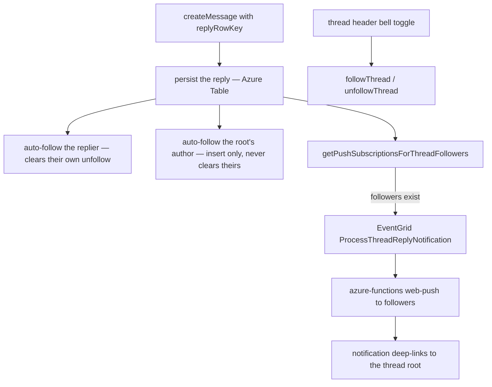

# Thread Follows

Follow a thread and receive a push notification whenever someone replies to it, and open a **Followed Threads** drawer to jump back into any thread you follow. This is Discord's thread-following model scoped to the shipped single-level thread view (a thread is a root message plus every message whose `replyRowKey` points at it).

## How it works

Replying to a message is an implicit follow (Discord behaviour) for the replier **and for the root message's author**, and a bell toggle on the thread header is the explicit follow. All three write a row to `threadFollowsInMessage`. Following the replier alone would leave the one member the thread belongs to as the only one the pipeline never reaches, while anyone who merely replied once keeps being told. When a reply lands, the room's followers of that thread — everyone except the replier and anyone whose room notification preference is `Never` — receive a push notification through the existing web-push pipeline.

### An unfollow outranks somebody else's reply

The root author's auto-follow is the one follow a member does not perform themselves, so it is the one that could undo a decision they did make. `unfollowThread` therefore **records** the unfollow — it sets `isUnfollowed` on the row rather than deleting it — because a deleted row reads exactly like a member who was never followed, and auto-follow would re-subscribe them on the next third-party reply with no way to make the unfollow stick.

Which follows may clear that tombstone is decided by whose action the follow is, the `isSelfInitiated` argument to `createThreadFollow`:

| Follow                           | Self-initiated | Effect on a recorded unfollow |
| :------------------------------- | :------------- | :---------------------------- |
| the thread header bell           | yes            | cleared — the member asked    |
| the replier's own reply          | yes            | cleared — Discord parity      |
| the root author, someone replies | no             | left alone                    |

Both reads — `readFollowedThreadRootRowKeys` (follow state) and `getPushSubscriptionsForThreadFollowers` (the push recipients) — skip unfollowed rows, so a tombstone is neither a follow nor a notification.

A root message with no author at all (a webhook message carries none) contributes no root-author follow: `userId` is `NOT NULL`, so the reply would otherwise fail its insert on every reply to a webhook message.

Auto-follow and the follower notification both sit in the reply's best-effort tail ([persist then notify](/docs/architecture/persist-then-notify)), so a lost follow costs one subscription and a lost push costs one notification. The notification's recipient set is recomputed inside the Azure Function, so it always reflects the live follower list.

## Data model

Postgres table `threadFollowsInMessage`: `userId`, `roomId`, and `threadRootRowKey` (the root message's Azure Table rowKey), with a composite primary key over all three so a follow is idempotent, plus `isUnfollowed` — the member's recorded decision to stop, which is why a row outlives an unfollow. Room deletion cascades the follows away. The drawer resolves the followed roots back to their messages in one batched Azure Table read (`readMessagesByRowKeys`, shared with the procedure of the same name) whose filter drops any root that was deleted, so it never lists a dangling follow. That read is a partition scan, so the drawer lists the roots newest-message-first rather than in the order the follows were recorded, and it returns whichever entity each root actually is — a webhook message can be a thread root like any other.

## Procedures

All under `message.` in `server/trpc/routers/message/index.ts`, member-gated:

| Procedure                                      | Purpose                                                                                                                                                                  |
| ---------------------------------------------- | ------------------------------------------------------------------------------------------------------------------------------------------------------------------------ |
| `followThread({ roomId, threadRootRowKey })`   | explicit follow (idempotent)                                                                                                                                             |
| `unfollowThread({ roomId, threadRootRowKey })` | record the unfollow (idempotent; written even where no follow row exists)                                                                                                |
| `readFollowedThreads({ roomId })`              | `{ threadRootRowKeys, threads }` — every followed root rowKey (including deleted roots, the follow-state source of truth) beside the newest-first roots the drawer lists |

## Key files

| File                                                                             | Role                                   |
| :------------------------------------------------------------------------------- | :------------------------------------- |
| `packages/db-schema/src/schema/threadFollowsInMessage.ts`                        | follow table                           |
| `packages/db/src/services/message/getPushSubscriptionsForThreadFollowers.ts`     | follower push-subscription query       |
| `packages/app/server/services/message/thread/createThreadFollow.ts`              | idempotent follow insert               |
| `packages/app/server/services/message/thread/createThreadUnfollow.ts`            | records the unfollow on the row        |
| `packages/app/server/services/message/thread/notifyThreadReplyFollowers.ts`      | publishes the reply notification event |
| `packages/azure-functions/src/handlers/processThreadReplyNotificationHandler.ts` | web-push worker                        |
| `packages/app/app/store/message/threadFollow.ts`                                 | client follow state + drawer list      |
| `packages/app/app/components/Message/RightSideBar/Threads/`                      | Followed Threads drawer                |
| `packages/app/app/components/Message/RightSideBar/Thread/FollowButton.vue`       | thread-header follow toggle            |
