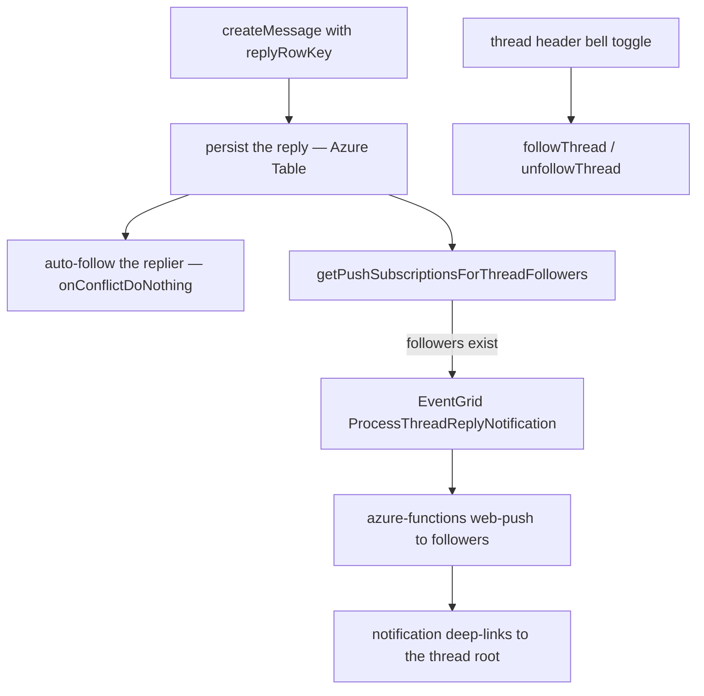

# Thread Follows

Follow a thread and receive a push notification whenever someone replies to it, and open a **Followed Threads** drawer to jump back into any thread you follow. This is Discord's thread-following model scoped to the shipped single-level thread view (a thread is a root message plus every message whose `replyRowKey` points at it).

## How it works

Replying to a message is an implicit follow (Discord behaviour), and a bell toggle on the thread header is the explicit follow. Both write a row to `threadFollowsInMessage`. When a reply lands, the room's followers of that thread — everyone except the replier and anyone whose room notification preference is `Never` — receive a push notification through the existing web-push pipeline.

Auto-follow and the follower notification both sit in the reply's best-effort tail ([persist then notify](/docs/architecture/persist-then-notify)), so a lost follow costs one subscription and a lost push costs one notification. The notification's recipient set is recomputed inside the Azure Function, so it always reflects the live follower list.

## Data model

Postgres table `threadFollowsInMessage`: `userId`, `roomId`, and `threadRootRowKey` (the root message's Azure Table rowKey), with a composite primary key over all three so a follow is idempotent. Room deletion cascades the follows away. The drawer resolves each followed root back to its message from Azure Table and drops any root that was deleted, so it never lists a dangling follow.

## Procedures

All under `message.` in `server/trpc/routers/message/index.ts`, member-gated:

| Procedure                                      | Purpose                                                                               |
| ---------------------------------------------- | ------------------------------------------------------------------------------------- |
| `followThread({ roomId, threadRootRowKey })`   | explicit follow (idempotent)                                                          |
| `unfollowThread({ roomId, threadRootRowKey })` | remove the follow                                                                     |
| `readFollowedThreads({ roomId })`              | the caller's followed thread roots, newest-first                                      |
| `readFollowedThreadRootRowKeys({ roomId })`    | all followed root rowKeys, including deleted roots — the follow-state source of truth |

## Key files

| File                                                                             | Role                                   |
| :------------------------------------------------------------------------------- | :------------------------------------- |
| `packages/db-schema/src/schema/threadFollowsInMessage.ts`                        | follow table                           |
| `packages/db/src/services/message/getPushSubscriptionsForThreadFollowers.ts`     | follower push-subscription query       |
| `packages/app/server/services/message/thread/createThreadFollow.ts`              | idempotent follow insert               |
| `packages/app/server/services/message/thread/notifyThreadReplyFollowers.ts`      | publishes the reply notification event |
| `packages/azure-functions/src/handlers/processThreadReplyNotificationHandler.ts` | web-push worker                        |
| `packages/app/app/store/message/threadFollow.ts`                                 | client follow state + drawer list      |
| `packages/app/app/components/Message/RightSideBar/Threads/`                      | Followed Threads drawer                |
| `packages/app/app/components/Message/RightSideBar/Thread/FollowButton.vue`       | thread-header follow toggle            |
