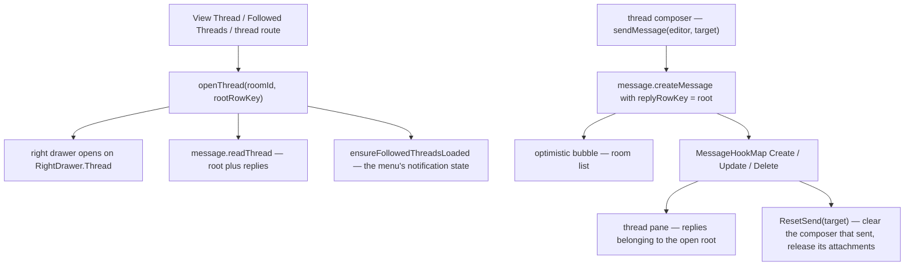

# Threads

A thread is a root message plus every message whose `replyRowKey` points at it. Opening one puts it in the right drawer as a live pane with its own composer, so a conversation about a message is read and replied to in one place instead of being scrolled back to in the room.

**A thread has no table of its own.** Its identity is the pair `(roomId, threadRootRowKey)` — the room it lives in and the rowKey of the message it hangs off — and that pair is what everything thread-scoped keys by: a [follow](/docs/esbabbler/thread-follows), a composer's draft, a call session. Nothing needs creating before a thread exists; the first reply makes one.

## How it works

Opening a thread is one click on a message's **View Thread**, on a row in the Followed Threads drawer, or a visit to the thread's own route. The drawer opens on the click rather than on the response — a read spanning a slow round trip, or failing outright, otherwise leaves the click with no visible effect — and the pane renders skeleton rows until `message.readThread` lands. Every open supersedes the one before it, so a slower earlier read can never land on the thread the user asked for next.

The pane is then a live view rather than the snapshot that read returned: the thread store registers on the message hook registry, so a reply, an edit or a deletion belonging to the open thread updates it as it happens. That is what makes the composer feel like a composer — the sender's own reply arrives through the same optimistic entity the room list holds, so it renders immediately and the server's fields reach the pane through the object it already pushed. A deleted root closes the pane, because the thread it named no longer exists.

## The composer

The pane's composer is the room composer's equal in everything a reply needs: rich text, mentions, emoji, pasted and dropped attachments, and a draft. It differs in what belongs to a room rather than to a conversation — slash commands and the poll and scheduled-message dialogs stay in the room composer, each being a room-level composition with its own dialog state.

Both composers are on screen at once, which is the whole reason composer state is keyed by a **composer target** (`{ roomId, threadRootRowKey }`) rather than by room. The editor's text, its pending attachments and the send-lifecycle hooks all partition on it — the room's own composer keys by its bare room id, so everything written before threads had a composer still reads back under the same key. The blobs an attachment writes stay the room's wherever it was attached, so every server call still names `target.roomId`; only the local partition is per composer.

A file dropped anywhere in the pane attaches to the reply, and one dropped elsewhere to the room's message. That is resolved from the drop's own element by the single document-level drop zone — a second zone nested inside the first would fire for the same drop and upload it twice.

### Drafts

A half-written reply is a draft like the room's: persisted, restored on reload, badged on the room in the sidebar and listed on the [drafts page](/docs/esbabbler/drafts-and-sent), where it can be sent, scheduled or deleted like any other. Sending or scheduling one puts it back in its own thread — the scheduled job carries the reply target on its payload, so a message scheduled from a thread lands in that thread at `runAt`.

## The thread menu

The pane's overflow menu is where everything that acts on the thread as a whole lives:

| Action                                | Effect                                                                                     |
| :------------------------------------ | :----------------------------------------------------------------------------------------- |
| Turn notifications for replies on/off | the [follow](/docs/esbabbler/thread-follows) toggle, worded by the state it is in          |
| Copy link                             | the root message's deep link — a thread is named by its root, so that link is the thread's |
| Start / leave call in thread          | a call scoped to the thread, alongside the room's own                                      |
| Open in split view                    | pins the pane the thread took over beside it, so both are readable at once                 |
| Open in new window                    | opens the thread's own route in a second window                                            |

### A call in a thread

A call in a thread is the room's call machinery addressed by the thread it belongs to. `callSessions.threadRootRowKey` is empty for the room's own call and holds the root rowKey for a thread's, and the unique constraint spans both columns — so a room runs its own call and one per thread at the same time, while a standalone share-link call carries no room at all and stays unconstrained. Everything downstream is keyed by the session id, so the LiveKit room, the participant maps, the subscriptions and the knock lobby are the same code they always were; see [calls](/docs/esbabbler/calls).

The start and summary lines a call writes go into the thread rather than the room, through the same `replyRowKey` the rest of the thread is made of.

### Split view and the thread route

Opening a thread replaces whatever the right drawer was showing. Split view keeps that pane — the member list, a search's results — pinned beside the thread in the same drawer, which then renders at twice its width; both halves share the drawer's resize handle and breakpoint behaviour, where a second drawer would need its own of each and could be dragged out of agreement. Closing the thread closes the split and leaves the pinned pane showing.

`/messages/:roomId/thread/:rowKey` is the thread's own route: it renders the room exactly as the message route does and opens the pane on the thread the url names. That is what makes a thread linkable at all, and it is what **Open in new window** opens — a full app on that thread, rather than a copy of the pane that would have to re-derive every store it reads. The open runs on mounted rather than in setup, because the layout is the page's own child and decides the drawer state for the breakpoint first.

## Key files

| File                                                                  | Role                                                      |
| :-------------------------------------------------------------------- | :-------------------------------------------------------- |
| `packages/app/app/store/message/thread.ts`                            | active thread, the read, and the hooks that keep it live  |
| `packages/app/app/components/Message/RightSideBar/Thread/`            | the pane, its composer and its header                     |
| `packages/app/app/composables/message/thread/useThreadActionItems.ts` | the overflow menu                                         |
| `packages/app/app/models/message/ComposerTarget.ts`                   | which composer a piece of composer state belongs to       |
| `packages/app/app/services/message/composer/getComposerKey.ts`        | the partition key every per-composer map uses             |
| `packages/app/app/store/message/input/index.ts`                       | per-composer text and drafts                              |
| `packages/app/app/store/message/input/uploadFile.ts`                  | per-composer attachments                                  |
| `packages/app/app/pages/messages/[id]/thread/[rowKey].vue`            | the thread route                                          |
| `packages/db-schema/src/schema/callSessionsInMessage.ts`              | `threadRootRowKey` and the one-call-per-thread constraint |
