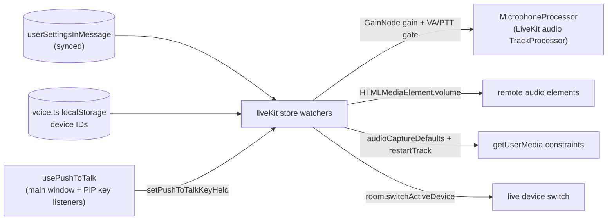

# Voice & Video Settings

The Voice & Video panel of the [user settings dialog](/docs/esbabbler/settings), aligned with Discord's Voice & Video page. Preferences are DB-backed and sync across devices; only the hardware device IDs stay device-local. The LiveKit store reads the settings and applies them on join and on live change (reactive watchers).

## Panel structure (top → bottom)

1. **Devices** — Microphone/Speaker selects two-up; Microphone/Speaker Volume sliders two-up; Camera select; Test Mic button + segmented level meter.
2. **Input Profile** — radio: Voice Isolation / Studio / Custom (`noiseSuppressionMode`).
3. **Input Sensitivity** — a gradient slider (yellow→green): the thumb is the activation **threshold**, a darker overlay shows the **live mic level**; a warning + permission link appears when no input device is granted.
4. **Input Mode** (Voice Activity / Push To Talk + keybind) and **Join Settings** (mute/deafen on join).

## How each setting applies

| Setting                 | Field                             | Applied via                                                                                                                                                                                                          |
| ----------------------- | --------------------------------- | -------------------------------------------------------------------------------------------------------------------------------------------------------------------------------------------------------------------- |
| **Microphone Volume**   | `microphoneVolumePercentage`      | `MicrophoneProcessor` Web Audio `GainNode` on the local mic — supports >100% boost                                                                                                                                   |
| **Speaker Volume**      | `speakerVolumePercentage`         | master output: `HTMLMediaElement.volume` on every remote audio element, multiplied per participant by the in-call [per-user volume](/docs/esbabbler/calls/per-user-volume) (caps at 100%; >100% needs `webAudioMix`) |
| **Input Profile**       | `noiseSuppressionMode`            | browser-native getUserMedia constraints via `getAudioCaptureDefaults` → Room `audioCaptureDefaults` + `restartTrack`                                                                                                 |
| **Input Sensitivity**   | `inputSensitivityDecibels`        | voice-activity gate in `MicrophoneProcessor`: gain → 0 when live dB < threshold (Voice Activity mode only)                                                                                                           |
| **Input mode**          | `voiceInputMode`                  | `VoiceActivity` enables the sensitivity gate; `PushToTalk` gates on the held keybind (see Push-to-talk below)                                                                                                        |
| **Default mute/deafen** | `isMuteOnJoin` / `isDeafenOnJoin` | initial mic/deafen state in the join flow                                                                                                                                                                            |
| **Devices**             | `inputDeviceId` etc. (local)      | join: Room `audio`/`videoCaptureDefaults.deviceId`; mid-call: `room.switchActiveDevice` via store watchers                                                                                                           |

## Device selection — single source of truth

The persisted `useVoiceDeviceSettingsStore` (`voice.ts`, `localStorage`) holds the selected mic/speaker/camera IDs and is the **only** source of truth, so a device picked anywhere is honoured everywhere:

- **Settings panel selects** bind `v-model` directly on the store refs.
- **Mic test** (`useMicrophoneLevel`) and **pre-join preview** (`useCallPreJoinMedia`) build reactive `computed` `useUserMedia` constraints from the IDs — a device change re-requests the right stream immediately.
- **The live call**: `createRoom` seeds `audioCaptureDefaults.deviceId` + `videoCaptureDefaults.deviceId` from the store; the in-call picker (`useCallDeviceSettings`) and the `HealthButton` readout bind the same refs.

`liveKit.ts` keeps no device refs of its own. `setActiveDevice` writes the store; per-kind watchers call `room.switchActiveDevice` to restart the live track mid-call. A guard (`getActiveDevice(kind) === deviceId`) skips no-op switches — including the echo from LiveKit's own `ActiveDeviceChanged` event — so there is no feedback loop.

## Input profile (noise suppression)

Browser-native only — **no Krisp** (paid). `getAudioCaptureDefaults` maps the mode to getUserMedia audio constraints: Voice Isolation = `echoCancellation`/`noiseSuppression`/`autoGainControl` all on; Studio = all off (raw mic); Custom = browser defaults. A true ML denoiser would need Krisp and is out of scope.

## Microphone processing — `MicrophoneProcessor`

`models/message/room/call/MicrophoneProcessor.ts` is a LiveKit audio `TrackProcessor`, so LiveKit owns its lifecycle (init on publish, restart on device switch, destroy on unpublish) — no manual track republish. It builds `source → gainNode → MediaStreamDestination`, taps the source pre-gain with an `AnalyserNode`, and per animation frame computes the live dB level to drive the voice-activity gate and applies `microphoneVolumePercentage / 100` as gain.

There is **no** shared "speaking indicator analyser" to reuse — in-call active-speaker state comes from LiveKit's server-side `RoomEvent.ActiveSpeakersChanged`. Local level analysis (panel meter + processor gate) is its own Web Audio graph; the panel meter uses the separate read-only `useMicrophoneLevel` composable.

## Push-to-talk

`VoiceInputMode.PushToTalk` drives the same `MicrophoneProcessor` gain gate from key state instead of dB level: while the configured key (`pushToTalkKeybind`, captured as an `event.code` under Input Mode) is held, the mic transmits; released, gain gates to 0.

The `usePushToTalk` composable registers `keydown`/`keyup`/`blur` listeners while in a call with Push To Talk selected. It is hosted by the **call store** (not a component) so hold-to-talk survives navigation like the call itself, and the [PiP host](/docs/esbabbler/calls/picture-in-picture) mounts a second instance on the PiP window because key events don't cross documents. Edge rules:

- Keydown in an editable element (the composer) never opens the gate — typing a bound letter must not transmit.
- Keyup and window blur always close the gate, so focus changes and out-of-window key releases can't leave it stuck open.
- Switching input mode away from Push To Talk resets the held state.

Browser limitation: keys only arrive while an app window (main or PiP) is focused — true global OS-level push-to-talk needs a desktop app and is out of scope (same constraint family as [currently-playing activity](/docs/esbabbler/rejected/currently-playing-activity)). The PiP window being focusable mitigates this when presenting.

## Key files

| File                                                                       | Role                                                                               |
| :------------------------------------------------------------------------- | :--------------------------------------------------------------------------------- |
| `packages/db-schema/src/schema/userSettingsInMessage.ts`                   | fields + `NoiseSuppressionMode` enum + check constraints                           |
| `packages/app/app/components/Message/Model/User/Settings/Type/Voice/`      | the panel: `Devices/`, `Volume/`, `MicTest/`, `InputProfile/`, `InputSensitivity/` |
| `packages/app/app/composables/message/user/settings/useMicrophoneLevel.ts` | read-only mic level for the panel meters                                           |
| `packages/app/app/models/message/room/call/MicrophoneProcessor.ts`         | Web Audio gain + voice-activity/push-to-talk gate (LiveKit audio TrackProcessor)   |
| `packages/app/app/composables/message/room/call/usePushToTalk.ts`          | hold-to-talk key listeners (hosted by the call store + PiP host)                   |
| `packages/app/app/services/message/room/call/getAudioCaptureDefaults.ts`   | noise-suppression mode → getUserMedia constraints                                  |
| `packages/app/app/store/message/room/liveKit.ts`                           | speaker volume, noise mode, mic processor; `setActiveDevice` + device watchers     |
| `packages/app/app/composables/message/room/call/useCallPreJoinMedia.ts`    | pre-join preview — reactive constraints from device IDs                            |
| `packages/app/app/composables/message/room/call/useCallDeviceSettings.ts`  | in-call device picker                                                              |

## Not yet built

- **Speaker Volume >100% boost** — needs Room `webAudioMix`; element volume caps at 100% today.
