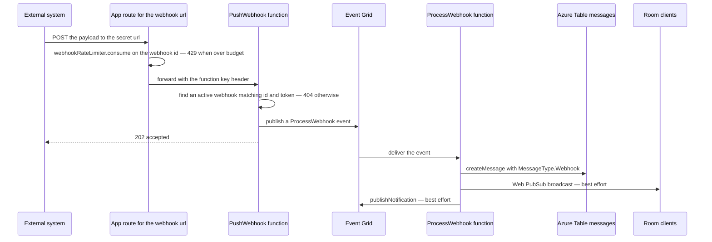

# Webhooks

A webhook lets an external system post a message into a room without a user account. A member with the `ManageWebhooks` permission creates one from room settings, copies the secret url it produces, and anything that can send an HTTP request can then speak in that room. The message arrives under a **bot identity** of its own rather than under the creator's name, and is marked as such in the message list.

This page is about **inbound** webhooks only. Posting room events out to a user-registered endpoint is a separate, unbuilt idea — see [outbound webhooks](/docs/esbabbler/deferred/outbound-webhooks).

## Data model

Two tables, one-to-one. `webhooksInMessage` holds the room membership and the secret: `roomId`, `creatorId` (the member who made it), `token`, an `isActive` switch, a display `name`, and a `userId` that is `unique` and references the second table. `appUsersInMessage` is the bot identity — nothing but `id`, `name` and `image`. Separating them is what lets a webhook message carry an author at all: the identity is a row a message can point at, so rendering does not have to special-case "no user".

The pairing is enforced by construction. `createWebhook` inserts both rows in one transaction, and `deleteWebhook` deletes the app user, which cascades the webhook away with it. A room may hold `WEBHOOK_MAX_LENGTH` webhooks — currently one — checked inside that same transaction.

## Delivery

The url a member copies points at the **app**, not at Azure: `server/api/webhooks/[id]/[token].post.ts` validates the two route parameters against the schema shapes, spends a point from the per-webhook budget described in [rate limiting](/docs/architecture/rate-limiting), and forwards the body to the Function App with the function key. It forwards the **answer** as faithfully as the request: the function's own status and body are passed straight back (`ignoreResponseError`), because the statuses below are its to give and a proxy that turned each of them into a 500 would leave a sender unable to tell a rotated token from an Esposter outage. Keying the budget on the webhook id rather than on a caller is the point — a webhook is a machine identity, and one misconfigured integration should exhaust only its own allowance.

`PushWebhook` is the app's one public Azure Function HTTP trigger, mounted at `webhooks/{id}/{token}` with `authLevel: "function"`. **The token in the url is the credential**: the handler looks for a webhook row whose id and token both match and whose `isActive` is true, and answers 404 when there is none — an inactive webhook and a wrong token are indistinguishable from outside. It then parses the body against `webhookPayloadSchema` (a Discord-shaped `content` / `embeds` / `username` / `avatar_url` payload requiring at least one of content or embeds), publishes an Event Grid event, and answers 202 without waiting for the message to exist. That split is deliberate: the sender gets a fast, cheap acknowledgement, and the work that can fail happens behind a retrying event.

`ProcessWebhook` turns the payload into a `MessageType.Webhook` message — the payload's `username` and `avatar_url` override the stored bot name and image for that message — writes it to Azure Table, broadcasts over Web PubSub, and publishes a [push notification](/docs/esbabbler/push-notifications) event titled with the bot's name. Both of those last two steps are best-effort: the message is already persisted, and Event Grid delivery is at-least-once, so throwing after the write would replay the event and duplicate the message.

## Rendering

`MessageComponentMap` points `MessageType.Webhook` at the ordinary message component — a webhook message is a message, not a distinct surface. What differs is authorship. `WebhookMessageEntity` carries an `appUser` instead of a `userId`, `useCreator` resolves the author from the app-user store merged over the identity embedded in the message, and an "app" badge renders beside the name. Grouping consecutive messages compares the app user's id rather than a user id, and [thread follows](/docs/esbabbler/thread-follows) skip the root-author follow entirely for these messages because there is no user to follow.

## Procedures

All webhook procedures live in the `webhook` router.

| Procedure           | Auth             | Purpose                                                           |
| ------------------- | ---------------- | ----------------------------------------------------------------- |
| `createWebhook`     | `ManageWebhooks` | creates the app user and the webhook together, on the slow budget |
| `readWebhooks`      | `ManageWebhooks` | lists a room's webhooks with their tokens                         |
| `updateWebhook`     | `ManageWebhooks` | renames a webhook or toggles `isActive`                           |
| `rotateToken`       | `ManageWebhooks` | mints a new token, invalidating the old url                       |
| `deleteWebhook`     | `ManageWebhooks` | deletes the app user, cascading the webhook                       |
| `readAppUsersByIds` | room member      | resolves bot identities for rendering the message list            |

`createWebhook` is the one procedure on the slow rate-limit budget, because it is the only one that mints a credential. `readAppUsersByIds` is deliberately open to any member: rendering a room's history requires the identities of everything that has spoken in it, while the tokens stay behind the permission gate.

## UI

The webhook surface is the **Integrations → Webhooks** tab of the [room settings](/docs/esbabbler/room-settings) dialog, permission-gated like every other tab there. **New Webhook** creates the row outright, named `DEFAULT_WEBHOOK_NAME` — Discord's arrangement, and the reason the panel holds no create form: the name is the only thing a create could ask for, and the row it lands on already renames it. Each row is an inline-editable name, a copy button for the full url, rotate and delete buttons, and an active switch. Rotating is the revocation story — the url is a bearer credential, so the answer to a leak is a new token rather than an access list.

## Key files

Paths are relative to `packages/app`; an entry that begins with `packages/` is relative to the repository root instead.

| File                                                                    | Role                                                        |
| ----------------------------------------------------------------------- | ----------------------------------------------------------- |
| `packages/db-schema/src/schema/webhooksInMessage.ts`                    | the webhook row — room, creator, token, active flag         |
| `packages/db-schema/src/schema/appUsersInMessage.ts`                    | the bot identity a webhook message is authored by           |
| `packages/db-schema/src/models/message/webhook/WebhookPayload.ts`       | the accepted request body                                   |
| `packages/db-schema/src/models/message/WebhookMessageEntity.ts`         | message entity carrying `appUser` in place of `userId`      |
| `server/trpc/routers/webhook.ts`                                        | create, read, update, rotate, delete, and identity lookup   |
| `server/api/webhooks/[id]/[token].post.ts`                              | the public url — rate limits, then forwards to the function |
| `packages/azure-functions/src/functions/pushWebhook.ts`                 | the HTTP trigger registration and its route                 |
| `packages/azure-functions/src/handlers/pushWebhookHandler.ts`           | token validation, payload parsing, event publish            |
| `packages/azure-functions/src/handlers/processWebhookHandler.ts`        | message creation, broadcast, push notification              |
| `packages/azure-functions/src/services/getWebhookCreateMessageInput.ts` | payload to `MessageType.Webhook` message input              |
| `app/store/message/room/webhook.ts`                                     | client store for the settings tab                           |
| `app/store/message/user/appUser.ts`                                     | cache of bot identities for the message list                |
| `app/composables/message/room/useCreator.ts`                            | resolves a message's author, app user or user               |
| `app/components/Message/Model/Room/Settings/Type/Webhook/Index.vue`     | the Integrations tab content                                |
| `app/components/Message/Model/Message/AppUserBadge.vue`                 | the "app" badge on a webhook message                        |
