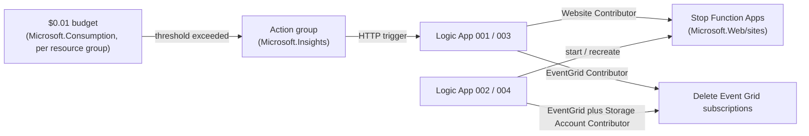

# Cost & Security Posture

Esposter's Azure estate is deliberately minimal: free or near-free SKUs everywhere, with automation that shuts things down rather than letting spend accrue. This page records the durable posture decisions from the infrastructure review — what is kept loose on purpose, and why.

## The budget guard cycle

Each environment's resource group carries `$0.01` budgets. These are guards, not operating limits: the instant any metered spend appears, the budget fires its action group, which invokes a Logic App that turns the metered thing off. A second budget/action-group pair restores service. Per environment, the four workflows are: `001` stops Function Apps, `002` starts them, `003` deletes Event Grid subscriptions, `004` recreates them.

**The guard tears down the metered subscriptions, not every subscription.** `003`/`004` handle `evgs-…-001` (`ProcessWebhook`) and `-002` (`ProcessPushNotification`) — the two highest-volume application paths. The remaining application subscriptions (`-003` friend requests, `-005` thread replies, `-006` blob deletions) are deliberately left alone: they fire once per user action on paths measured in events per day, which at Event Grid's per-operation pricing is indistinguishable from zero, and each one added to the guard is a hand-written PUT body in `004` that can drift from its Pulumi resource. Adding a subscription to `003` without adding it to `004` is the one thing never to do — a budget cycle would then end with it permanently deleted. The Logic App managed identities hold only the scopes their workflow needs — Website Contributor for start/stop, EventGrid Contributor on the custom topic for delete/recreate, and Storage Account Contributor on the environment's storage account for `004` alone.

Two of those are easy to get subtly wrong. **EventGrid Contributor, not EventGrid EventSubscription Contributor**: the narrower role grants the standalone `Microsoft.EventGrid/eventSubscriptions/*` extension type, while a subscription that lives under a topic is the separate `Microsoft.EventGrid/topics/eventSubscriptions` child type — under the narrower role every read of one returns 403. That one applies to `003` and `004` alike — both read the topic-scoped subscription. And **`004` needs the storage scope because a write authorises its linked scopes as well as its target**: the recreated subscription dead-letters to the storage account, so without write there it fails as `LinkedAuthorizationFailed` while holding every permission the topic itself asks for. `003` needs no storage scope of its own, because deleting a subscription validates no destination.

**`evgs-…-004`, the storage system topic behind `ReplayDeadLetterEvent`, is deliberately not in the guard** — even though it is the subscription whose source is the whole storage account, so every blob written anywhere reaches it and its container filter is applied only after ingress. It is the only path by which a dead letter is ever read again, and Event Grid delivers nothing raised while a subscription is absent: tearing it down for the length of a budget cycle turns every event the surviving subscriptions dead-letter in that window into permanent loss, to save delivery attempts bounded by the dead-letter rate. The ingress it is blamed for is charged at the topic and is unaffected by whether this subscription exists ([dead-letter](/docs/infra/eventgrid-dead-letter)).

Logic App HTTP trigger callback URLs are external secrets — rotating them is an operational task, not something Pulumi manages inline.

## Posture decisions

| Area             | Posture                                                                                                                                                  | Why                                                                                                                                                                                                                                                                                   |
| ---------------- | -------------------------------------------------------------------------------------------------------------------------------------------------------- | ------------------------------------------------------------------------------------------------------------------------------------------------------------------------------------------------------------------------------------------------------------------------------------- |
| Storage          | Shared-key access, public blob access, and public network access all enabled; blob versioning disabled; 7-day blob/container soft delete; `Standard_LRS` | App blob clients, SAS generation, and public asset containers still depend on key-based/public access; versioning was unused and paid                                                                                                                                                 |
| Web PubSub       | `Free_F1`, public network, local auth, REST API access all kept                                                                                          | Azure rejects network ACL changes on `Free_F1`; browser clients connect from arbitrary IPs; app/functions use connection-string service clients                                                                                                                                       |
| Function Apps    | Dynamic Y1 consumption plans, public inbound, system-assigned identity                                                                                   | Event Grid triggers and the HTTP webhook endpoint need reachability; identities hold Event Grid Data Sender + Storage Blob/Queue/Table Data Contributor                                                                                                                               |
| Cognitive Search | Free SKU, one replica/partition, local auth kept                                                                                                         | App Search client still uses `AzureKeyCredential`                                                                                                                                                                                                                                     |
| Event Grid       | Topic local auth kept; 10 delivery attempts / 1-hour TTL retry; dead-letter destination on every application subscription                                | App publisher still uses `AzureKeyCredential` (Functions already use `DefaultAzureCredential`); the short window lands a doomed event while it is still relevant, and the blob write push-triggers the automatic replay — see [dead-letter replay](/docs/infra/eventgrid-dead-letter) |
| Observability    | No App Insights or Log Analytics — telemetry is not provisioned in either environment                                                                    | Deliberate free-tier decision: paid ingestion (and the alerting layered on it) bought nothing this estate acts on, so the `$0.01` budget guard is the cost ceiling — see [observability](/docs/infra/observability)                                                                   |
| Budgets          | `$0.01`, identical dev/prod behavior                                                                                                                     | They are automated guards, not operating limits                                                                                                                                                                                                                                       |

## Security constraints

Every deferred hardening step is gated on the app moving off key-based Azure SDK clients — flipping the infra switch first would break production. The blockers, each mapped to the app code path that holds it open, live in `packages/infra/docs/azure/security-constraints.md`:

- Storage shared-key and blob public access stay until blob clients, SAS generation, and public containers migrate.
- Search and Event Grid local auth stay until the app replaces `AzureKeyCredential` with managed identity.
- Web PubSub local auth, REST API access, and public client access stay while clients connect directly and service clients use connection strings.
- Storage network default-deny waits for a complete allowlist, private endpoint, or identity/network migration.

The unblocked versions of these are tracked on the [infra roadmap](/docs/infra/roadmap).

## Review principles

Carried forward for any future infra change: keep `protect: true` on imported resources; prefer reducing exposed surface area before adding recurring cost; review dev and prod separately even though one stack owns both; never delete a resource before checking downstream app, Function, Event Grid, and Logic App references.

## Key files

| File                                                                         | Role                                                                                              |
| ---------------------------------------------------------------------------- | ------------------------------------------------------------------------------------------------- |
| `packages/infra/src/azure/resources/Microsoft.Consumption/budgets/`          | The four `$0.01` guard budgets                                                                    |
| `packages/infra/src/azure/resources/Microsoft.Logic/workflows/`              | Stop/start/delete/recreate guard workflows (`001`–`004` per environment)                          |
| `packages/infra/src/azure/resources/Microsoft.EventGrid/eventSubscriptions/` | Subscriptions for `ProcessWebhook`, `ProcessPushNotification`, `ProcessFriendRequestNotification` |
| `packages/infra/docs/azure/security-constraints.md`                          | Hardening blockers + gating app code paths                                                        |
