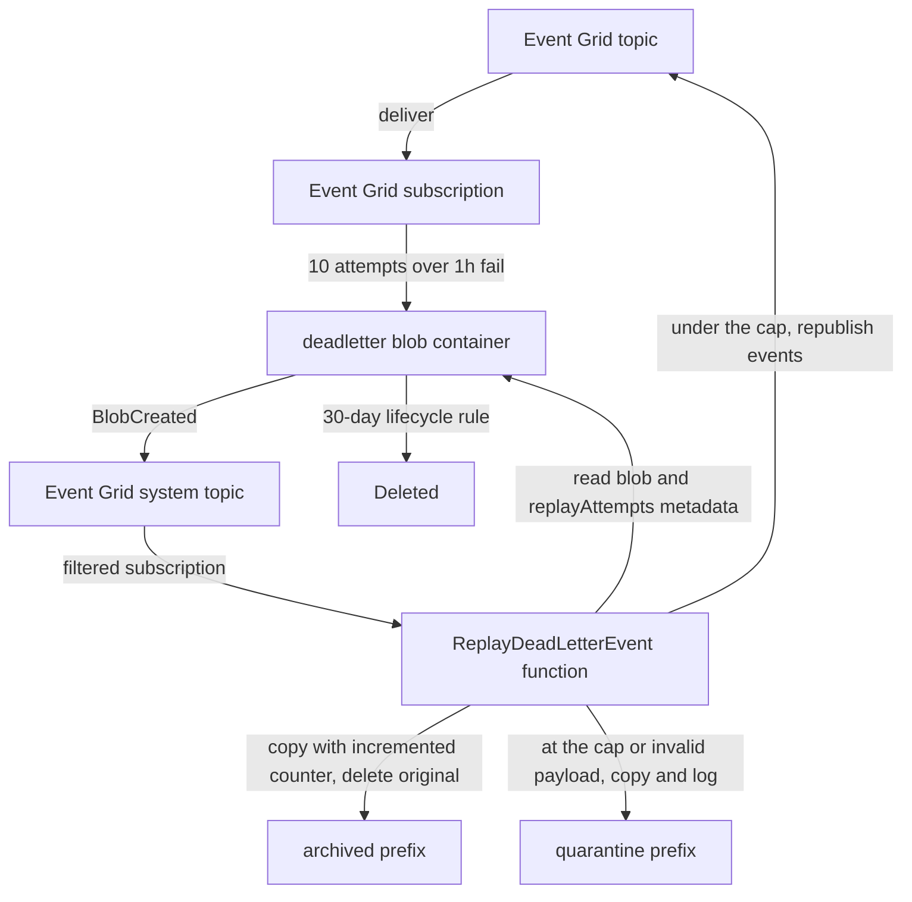

# Event Grid Dead-Letter

When an Event Grid delivery exhausts its retries — a push notification, friend-request notification, or webhook event that the Function App never accepts — the event is written to a `deadletter` blob container instead of being silently dropped. Writing that blob is itself an event, and it drives an Azure Function that republishes the events automatically. Nothing is scheduled and nothing is run by hand.

## How it works

Every Event Grid subscription on the application topic carries a `deadLetterDestination` pointing at the `deadletter` container in the same-environment storage account, alongside a tightened retry policy of ten attempts over a one-hour time-to-live. The shorter window means a permanently failing event lands in the container while it is still relevant, rather than after a full day of doomed retries. Event Grid writes each exhausted delivery as a JSON blob holding the original events.

An Event Grid **system topic** over the storage account turns that write into a `Microsoft.Storage.BlobCreated` event, and a subscription on that system topic delivers it to the `ReplayDeadLetterEvent` function. The subscription is filtered so it fires only for blobs directly under the dead-letter container path, and advanced filters exclude the `archived/` and `quarantine/` prefixes — the replay writes its own copies into that same container, so without those exclusions it would retrigger itself in a loop.

The function downloads the blob, validates it against a Zod schema, and republishes each event through the same Event Grid publisher the Function App already uses. It then copies the blob under `archived/` and deletes the original, so the payload stays inspectable while never being replayable again.

A poison-message guard bounds the whole cycle. Each blob carries a `replayAttempts` metadata value — absent means zero. The function increments it on the blob **before** republishing, so a republish that fails and is redelivered reads the higher count on its next pass. Once the count reaches the cap of two, or if the payload fails schema validation, the blob is copied under `quarantine/` instead, the original is deleted, and the failure is logged through the invocation context with the blob name and attempt count. A quarantined blob is never republished and, because of the advanced filter, never retriggers replay. The copies the function writes carry the counter forward, so a blob an operator restores into the container root resumes where it left off rather than starting over.

The replay subscription deliberately has **no** dead-letter destination of its own: dead-lettering it would write a new blob into the very container it watches. A storage lifecycle rule deletes everything under the dead-letter prefix after 30 days, so live, archived, and quarantined blobs all expire on their own.

Replayed events can double-deliver — Event Grid's at-least-once contract still holds — but the Function App handlers are idempotent-or-tolerant per the Azure Functions error-handling rules, so a resend is safe. Failures split the usual way: everything before the republish is fatal and rethrown so Event Grid retries it, while the archive step afterwards is best-effort and only logged, because rethrowing there would republish events that already went out.

## Key files

| File                                                                                                                 | Role                                                                          |
| :------------------------------------------------------------------------------------------------------------------- | :---------------------------------------------------------------------------- |
| `packages/azure-functions/src/functions/replayDeadLetterEvent.ts`                                                    | Event Grid trigger registration for the replay function                       |
| `packages/azure-functions/src/handlers/replayDeadLetterEventHandler.ts`                                              | Validate, cap, republish, archive or quarantine                               |
| `packages/azure-functions/src/services/moveDeadLetterBlob.ts`                                                        | Copy a blob under a prefix with its attempt counter, then delete the original |
| `packages/azure-functions/src/services/constants.ts`                                                                 | `MAX_DEAD_LETTER_REPLAY_ATTEMPTS` and the metadata key                        |
| `packages/azure-functions/src/models/DeadLetteredEvent.ts`                                                           | Zod schema for the dead-lettered event payload                                |
| `packages/db-schema/src/services/azure/container/constants.ts`                                                       | Subject, `archived/`, and `quarantine/` prefixes shared with the infra code   |
| `packages/infra/src/azure/resources/Microsoft.EventGrid/systemTopics/`                                               | Per-environment system topic over the storage account                         |
| `packages/infra/src/azure/resources/Microsoft.EventGrid/eventSubscriptions/`                                         | Six application subscriptions plus the two filtered replay subscriptions      |
| `packages/infra/src/azure/resources/Microsoft.Storage/storageAccounts/blobContainers/prodstesposter001Deadletter.ts` | `deadletter` container                                                        |
| `packages/infra/src/azure/resources/Microsoft.Storage/storageAccounts/managementPolicies/`                           | 30-day lifecycle delete rule for the dead-letter prefix                       |

## Notes

The container and system topic reuse the existing storage account, and Event Grid system topics carry no standing cost, so the automation adds no new resource spend. The function builds its clients from the same environment the rest of the Function App uses — `AZURE_STORAGE_ACCOUNT_CONNECTION_STRING` for the container and `AZURE_EVENT_GRID_TOPIC_ENDPOINT` with `DefaultAzureCredential` for the publisher.

Quarantined blobs are the alerting surface: they are the only outcome that logs through `context.error` with a blob name, so an App Insights failure query over the `ReplayDeadLetterEvent` function is what surfaces a payload that will never succeed. If the archive step fails after a successful republish, the original blob simply stays in place with its incremented counter and expires with the lifecycle rule.
