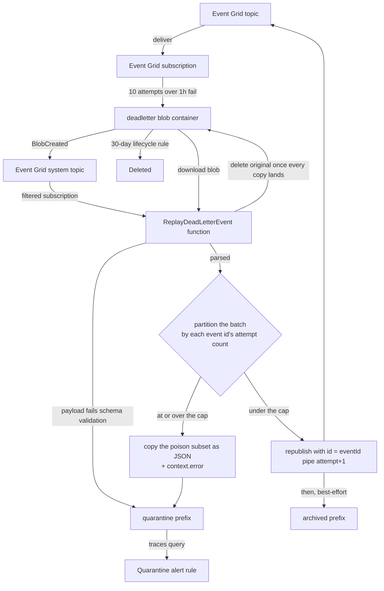

# Event Grid Dead-Letter

When an Event Grid delivery exhausts its retries — a push notification, friend-request notification, or webhook event that the Function App never accepts — the event is written to a `deadletter` blob container instead of being silently dropped. Writing that blob is itself an event, and it drives an Azure Function that republishes the events automatically. Nothing is scheduled and nothing is run by hand.

## How it works

Every Event Grid subscription on the application topic carries a `deadLetterDestination` pointing at the `deadletter` container in the same-environment storage account, alongside a tightened retry policy of ten attempts over a one-hour time-to-live. The shorter window means a permanently failing event lands in the container while it is still relevant, rather than after a full day of doomed retries. Event Grid writes each exhausted delivery as a JSON blob holding the original events.

An Event Grid **system topic** over the storage account turns that write into a `Microsoft.Storage.BlobCreated` event, and a subscription on that system topic delivers it to the `ReplayDeadLetterEvent` function. The subscription is filtered so it fires only for blobs directly under the dead-letter container path, and advanced filters exclude the `archived/` and `quarantine/` prefixes — the replay writes its own copies into that same container, so without those exclusions it would retrigger itself in a loop.

The function downloads the blob and validates it against a Zod schema. A payload that is not an array of dead-lettered events can never become publishable, so it is copied straight under `quarantine/`, the original is deleted, and the parse error is logged — republishing a broken payload would only dead-letter it again.

### The counter rides on the event id

A poison-message guard bounds the cycle, and the attempt counter lives on **each event's `id`**, not on the blob. That is the only place it can live: a replay that fails again is dead-lettered into a **brand-new blob**, so nothing attached to the blob — metadata, name, prefix — survives one round trip, and a blob-scoped counter would restart at zero every cycle. An event id, by contrast, is republished verbatim and Event Grid writes it straight back into the next dead-letter payload.

So a republished event is sent with `id = <originalEventId>|<attempt>`, joined by the shared `ID_SEPARATOR`. `formatReplayId` writes that form (rewriting the suffix rather than appending, so the id stays bounded however many cycles it survives and the original identity stays readable for id-deduping handlers), and `parseReplayId` splits it back apart. An id with no suffix is an event the replay has never touched — attempt zero.

### The cap is per event, not per blob

Event Grid batches whatever expired together, so the handler partitions the parsed batch rather than judging the blob as a whole:

- Events at or over `MAX_DEAD_LETTER_REPLAY_ATTEMPTS` (two) are written as a JSON array under `quarantine/` and logged through `context.error` with the blob name and how many of the batch were quarantined.
- Events under the cap are republished through the same Event Grid publisher the Function App already uses, each carrying the incremented id.

One poison event therefore no longer strands the transient failures batched with it, and the count holds across cycles instead of restarting on every new blob.

`writeDeadLetterBlob` only ever **copies** — it attaches no metadata and deletes nothing, because a single run can write more than one copy (the poison subset under `quarantine/`, the arriving payload under `archived/`) and the source must survive until all of them land. The handler owns the delete. When nothing was replayable the quarantine copy is already the complete record, so the original is simply deleted; otherwise the original content is archived under `archived/` and deleted best-effort, after the republish.

A quarantined blob is never republished and, because of the advanced filter, never retriggers replay. Because the counter travels on the events themselves, a blob an operator restores into the container root resumes where it left off with nothing to keep in sync.

The replay subscription deliberately has **no** dead-letter destination of its own: dead-lettering it would write a new blob into the very container it watches. A storage lifecycle rule deletes everything under the dead-letter prefix after 30 days, so live, archived, and quarantined blobs all expire on their own.

Delivery is at-least-once, and the replay does not pretend otherwise: a `send` that throws part-way through a batch is retried whole by the redelivered blob event, so a handler that already ran can run twice. The Function App handlers are idempotent for exactly this reason, per the Azure Functions error-handling rules. Failures split the usual way — everything up to and including the republish is fatal and rethrown so Event Grid retries it, while the archive afterwards is best-effort and only logged, because rethrowing there would republish events that already went out. An un-archived original merely lingers until the lifecycle rule sweeps it; it cannot retrigger a replay, since only a `BlobCreated` event does that.

## Key files

| File                                                                                                                 | Role                                                                        |
| :------------------------------------------------------------------------------------------------------------------- | :-------------------------------------------------------------------------- |
| `packages/azure-functions/src/functions/replayDeadLetterEvent.ts`                                                    | Event Grid trigger registration for the replay function                     |
| `packages/azure-functions/src/handlers/replayDeadLetterEventHandler.ts`                                              | Validate, partition the batch by attempt, republish, archive or quarantine  |
| `packages/azure-functions/src/services/writeDeadLetterBlob.ts`                                                       | Copy a payload under a prefix — copy only, the handler owns the delete      |
| `packages/azure-functions/src/services/parseReplayId.ts`                                                             | Split an event id into its original identity and replay count               |
| `packages/azure-functions/src/services/formatReplayId.ts`                                                            | Write the `<eventId>\|<attempt>` id a republished event is sent with        |
| `packages/azure-functions/src/services/constants.ts`                                                                 | `MAX_DEAD_LETTER_REPLAY_ATTEMPTS`                                           |
| `packages/azure-functions/src/models/ReplayId.ts`                                                                    | The parsed `{ eventId, replayAttempts }` pair                               |
| `packages/db-schema/src/models/azure/eventGrid/EventGridEventInput.ts`                                               | The shared event envelope and its `createEventGridEventSchema` factory      |
| `packages/db-schema/src/services/azure/container/constants.ts`                                                       | Subject, `archived/`, and `quarantine/` prefixes shared with the infra code |
| `packages/infra/src/azure/resources/Microsoft.EventGrid/systemTopics/`                                               | Per-environment system topic over the storage account                       |
| `packages/infra/src/azure/resources/Microsoft.EventGrid/eventSubscriptions/`                                         | Six application subscriptions plus the two filtered replay subscriptions    |
| `packages/infra/src/azure/resources/Microsoft.Storage/storageAccounts/blobContainers/prodstesposter001Deadletter.ts` | `deadletter` container                                                      |
| `packages/infra/src/azure/resources/Microsoft.Storage/storageAccounts/managementPolicies/`                           | 30-day lifecycle delete rule for the dead-letter prefix                     |
| `packages/infra/src/azure/resources/Microsoft.Insights/scheduledQueryRules/`                                         | Per-environment quarantine alert rule over the App Insights `traces` table  |

## Notes

The container and system topic reuse the existing storage account, and Event Grid system topics carry no standing cost, so the automation adds no new resource spend. The function builds its clients from the same environment the rest of the Function App uses — `AZURE_STORAGE_ACCOUNT_CONNECTION_STRING` for the container and `AZURE_EVENT_GRID_TOPIC_ENDPOINT` with `DefaultAzureCredential` for the publisher.

Quarantine is the alerting surface, and the alert is infrastructure rather than an operator's saved query: a scheduled query rule per environment (`sqr…002`) runs hourly over the App Insights `traces` table for the `ReplayDeadLetterEvent quarantined` prefix and notifies the action group whenever the count exceeds zero. Quarantine is the only outcome that logs through `context.error` with that prefix, so an event that will never succeed pages a human exactly once and nothing else does. Adaptive sampling excludes `Trace` telemetry precisely so this query cannot miss one — see /docs/infra/observability-caps.

If the archive step fails after a successful republish, the original blob simply stays in place and expires with the lifecycle rule. Because the counter travels on the republished events rather than the blob, that lingering original costs nothing: it is inert unless an operator re-creates it, and even then its events resume at the count they had reached.
