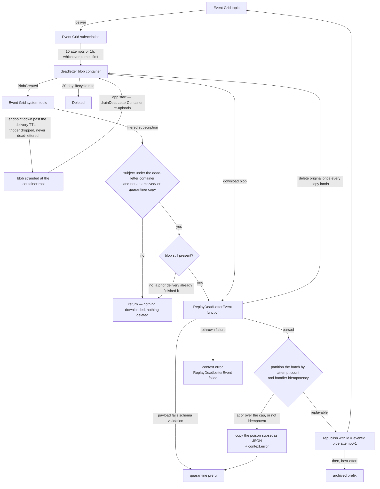
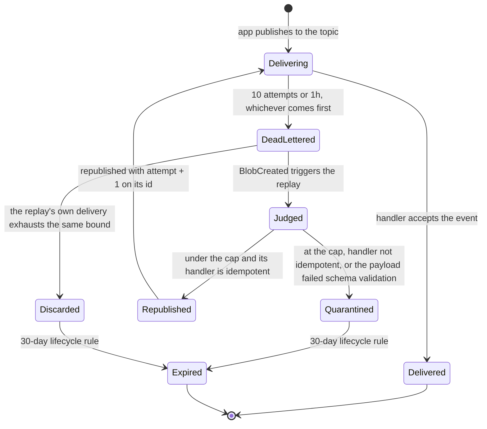

# Event Grid Dead-Letter

When an Event Grid delivery exhausts its retries — a push notification, friend-request or thread-reply notification, webhook event, or blob-deletion cleanup that the Function App never accepts — the event is written to a `deadletter` blob container instead of being silently dropped. Writing that blob is itself an event, and it drives an Azure Function that republishes the events automatically. Nothing is scheduled and nothing is run by hand.

## How it works

Every Event Grid subscription on the application topic carries a `deadLetterDestination` pointing at the `deadletter` container in the same-environment storage account, alongside a tightened retry policy of ten attempts over a one-hour time-to-live. The shorter window means a permanently failing event lands in the container while it is still relevant, rather than after a full day of doomed retries. Event Grid writes each exhausted delivery as a JSON blob holding the original events.

An Event Grid **system topic** over the storage account turns that write into a `Microsoft.Storage.BlobCreated` event, and a subscription on that system topic delivers it to the `ReplayDeadLetterEvent` function. The subscription is filtered so it fires only for blobs directly under the dead-letter container path, and advanced filters exclude the `archived/` and `quarantine/` prefixes — the replay writes its own copies into that same container, so without those exclusions it would retrigger itself in a loop.

The handler repeats those two prefix exclusions itself, so a hand-fired or mis-scoped event naming one of its own copies cannot make the replay consume — and delete — the record it wrote.

### The replay subscription outlives the budget guard, deliberately

Event Grid delivers only events raised **while a subscription exists**, and nothing re-enumerates the container behind it. A dead letter written while the replay subscription is gone is therefore stranded permanently — recreating the subscription replays no backlog.

So the budget guard leaves this subscription alone, and that is load-bearing rather than an oversight. The guard stops the Function App and deletes the two highest-volume **application** subscriptions; the ones it leaves alive (friend requests, thread replies, blob deletions) keep dead-lettering into the container while the app is down, so their payloads survive as blobs rather than being dropped. Deleting the replay subscription for the duration would lose even that, in trade for the delivery attempts it would have made against a stopped endpoint: a per-operation charge bounded by the dead-letter rate, and orders of magnitude below the account-wide ingress described in the notes below, which no subscription change affects.

### A living subscription is not a delivered trigger

Surviving as a blob is **not** the same as being replayed once the app is back, and the difference is the whole reason the drain below exists. The replay is triggered by an ordinary Event Grid delivery, and that delivery is aimed at the very Function App that is down: ten attempts over `EVENT_GRID_DELIVERY_TTL_MINUTES`, all refused. The replay subscription deliberately carries no `deadLetterDestination` of its own — one would write into the container it watches — so when those attempts run out the trigger is **dropped**, not preserved. The blob then sits at the container root with nothing left to notice it.

So the stranding window is not only the one above, where the subscription is torn down. It opens whenever the **endpoint** is unavailable for longer than the delivery window, with the subscription alive and correct throughout — which is what the guard's own `/stop` does on every activation that outlasts an hour, and what any full outage of the app does. The container's lifecycle rule deletes dead letters after 30 days, so a stranded blob is recoverable until then and lost afterwards.

### The drain closes it at app start

There is still no timer sweeping the container, because a schedule is the wrong signal: nothing can be replayed until the app is running, and **the app starting is itself the event that says it is**. So `appStart.ts` registers an `app.hook.appStart` hook that runs `drainDeadLetterContainer` once per worker start, listing the container and re-uploading whatever is stranded. The re-upload raises a fresh `BlobCreated` — the same one-move remediation an operator would perform by hand, made automatic at the one moment it is known to work.

Three rules keep it from doing anything else:

- The `archived/` and `quarantine/` prefixes are skipped, exactly as the subscription's advanced filter skips them. Re-uploading one would retrigger nothing and would only rewrite a record an operator reads.
- A blob younger than `EVENT_GRID_DELIVERY_TTL_MS` is skipped, because its own trigger still has attempts left. Without that bound, every cold start of a busy app would race the deliveries already coming and publish those batches twice. Past the window, no delivery of that trigger can still arrive, which is what makes the blob provably stranded rather than merely recent. A re-upload dates the blob, so it falls back inside the window it was just given and a second start does not repeat the work.
- It can never reject. A start hook that throws is one that can stop the app registering its functions — the exact failure the drain exists to recover from — so a container that cannot be read leaves the app starting normally and the blobs for the next start.

Nothing about the cap is reset by this: the attempt counter rides on each event's `id` rather than on the blob, so a drained payload resumes where it left off and a poison one still quarantines on schedule.

The function downloads the blob and validates it against a Zod schema. A payload that is not an array of dead-lettered events can never become publishable, so it is copied straight under `quarantine/`, the original is deleted, and the parse error is logged — republishing a broken payload would only dead-letter it again. The schema deliberately allows a repeated event id: delivery is at-least-once, so a send retried whole after a partial failure puts two copies of one id on the topic, and rejecting the array over that would quarantine every replayable event batched alongside them.

### The counter rides on the event id

A poison-message guard bounds the cycle, and the attempt counter lives on **each event's `id`**, not on the blob. That is the only place it can live: a replay that fails again is dead-lettered into a **brand-new blob**, so nothing attached to the blob — metadata, name, prefix — survives one round trip, and a blob-scoped counter would restart at zero every cycle. An event id, by contrast, is republished verbatim and Event Grid writes it straight back into the next dead-letter payload.

So a republished event is sent with `id = <originalEventId>|<attempt>`, joined by the shared `ID_SEPARATOR`. `formatReplayId` writes that form (rewriting the suffix rather than appending, so the id stays bounded however many cycles it survives and the original identity stays readable for id-deduping handlers), and `parseReplayId` splits it back apart. An id with no suffix is an event the replay has never touched — attempt zero.

### The judgement is per event, not per blob

Event Grid batches whatever expired together, so the handler partitions the parsed batch rather than judging the blob as a whole. `checkIsReplayable` applies both bars:

- Events at or over `MAX_DEAD_LETTER_REPLAY_ATTEMPTS` (two) are written as a JSON array under `quarantine/` and logged through `context.error` with the blob name and how many of the batch were quarantined.
- Events whose handler is **not idempotent** are quarantined the same way, whatever their count — republishing one does not retry the work, it duplicates it. `AzureFunctionIsIdempotentMap` in `packages/db-schema` is the register, exhaustive over `AzureFunction` so a new function has to state its answer rather than inherit a replayable default. `ProcessWebhook` is the case that matters: `createMessage` mints a fresh reverse-ticked `rowKey` per call, so a rerun posts a second, indistinguishable message into the room instead of repairing the first. `ProcessBlobDeletion` is the mirror image and the shape to copy — it deletes with `deleteIfExists`, so a replayed batch converges on the same empty state rather than failing on the blobs the first attempt already removed. Idempotency is a property a handler is _written_ to have, not one its subject grants it. And it is only half the question: a handler whose write depends on _when_ its event happened needs the event's own ordering value too, because Event Grid orders nothing — replaying a stale event is idempotent and still wrong ([conditional writes](/docs/architecture/conditional-writes)).
- Events raised by a **system-topic** subscription are quarantined on the same bar, because their `eventType` is storage's own (`Microsoft.Storage.BlobCreated`) and no `AzureFunction` claims it. That is the whole class rather than an oversight: the republish goes to the custom topic, where nothing subscribes to a storage event type, and a system topic cannot be published to at all — so there is no destination a replay could use. `ReconcileStorageLedgerEntry` is the one such handler today, and what its quarantine costs is written down with the feature ([storage quotas](/docs/platform/storage-quotas)). The restore-by-moving remediation below does not apply to these: the event type is still not an `AzureFunction` on the next pass, so a restored copy is re-quarantined on sight.
- Everything else is republished through the same Event Grid publisher the Function App already uses, each carrying the incremented id — **chunked against `MAX_EVENT_GRID_PUBLISH_BYTES` _and_ `MAX_EVENT_GRID_PUBLISH_EVENT_COUNT`, never sent as one request**. Event Grid caps a publish request at 1 MB independently of the per-event cap, and it batches whatever expired together into one blob up to that same 1 MB, so a full blob is by definition more than one request may carry. Neither bound implies the other, which is why both are passed: a blob of many tiny events (a bare subject and an empty `data` serialize to a couple of hundred bytes) stays under the byte budget the whole way and still crosses the 5,000-event limit, which is rejected exactly as loudly. Sent whole it is rejected, the redelivered blob resends the identical oversized batch, and since the replay subscription has no dead-letter destination of its own every event in that blob is discarded silently. The chunks go out sequentially, so a chunk that throws stops the ones behind it and the retry replays the batch from the start — every event that already landed is a duplicate the idempotency bar above admits.

One poison event therefore does not strand the transient failures batched with it, and the count holds across cycles instead of restarting on every new blob.

`writeDeadLetterBlob` only ever **copies** — it attaches no metadata and deletes nothing, because a single run can write more than one copy (the poison subset under `quarantine/`, the arriving payload under `archived/`) and the source must survive until all of them land. The handler owns the delete. When nothing was replayable the quarantine copy is already the complete record, so the original is simply deleted; otherwise the original content is archived under `archived/` and deleted best-effort, after the republish.

A quarantined blob is never republished and, because of the advanced filter, never retriggers replay. The quarantine copy is written from the **raw** dead-letter objects, not the parsed envelope, so Event Grid's diagnostics (`deadLetterReason`, `deliveryAttempts`, `lastDeliveryOutcome`) survive into the copy an operator opens — the parsed form keeps only the five fields a republish needs, which would leave the record with no statement of _why_ the payload is here.

Getting a quarantined event moving again is therefore an operator action, and it is one move: copy the blob back to the live dead-letter prefix under a new name and delete the quarantined copy. The write is a `BlobCreated` event like any other, so the replay picks it up on its own — there is no command to run and nothing to re-enqueue by hand. It only helps the events the **attempt cap** stopped, though: a payload that failed the schema is still unparseable, and a system-topic event or one whose handler is not idempotent fails the same bar on the next pass and is re-quarantined on sight.

Each event's id is written back into the quarantine copy **without** its replay count, which is what makes that move actually resume the event: an id still carrying the cap is re-quarantined on sight and the restored copy deleted under the operator, so the remediation would silently no-op. Resetting the count only clears the **cap** — events whose handler is not idempotent are quarantined on that second bar regardless, and restoring them replays nothing by design.

The replay subscription deliberately has **no** dead-letter destination of its own: dead-lettering it would write a new blob into the very container it watches. That makes a persistently failing replay the one path where events are discarded for good — after Event Grid stops retrying — typically around seven attempts rather than the configured ten, because the backoff schedule (10s, 30s, 1m, 5m, 10m, 30m, 1h) exhausts the 60-minute `eventTimeToLiveInMinutes` first — Event Grid applies it best-effort and may randomise or skip a retry, so the exact count is not one to depend on — the `BlobCreated` event is gone, and the blob it pointed at sits inert until the lifecycle rule deletes it. That discard is silent: an alert on it would be a scheduled query over App Insights, which this estate does not provision ([observability](/docs/infra/observability)) — so it is found by inspecting the container rather than by a page. A storage lifecycle rule deletes everything under the dead-letter prefix after 30 days, so live, archived, and quarantined blobs all expire on their own.

Delivery is at-least-once, and the replay does not pretend otherwise. It shows up twice. A `send` that throws part-way through a batch is retried whole by the redelivered blob event, so a handler that already ran can run twice — which is why only the handlers `AzureFunctionIsIdempotentMap` marks idempotent are ever republished. And a redelivery of a blob a prior delivery already finished with finds nothing: every handler-completed path attempts to delete the blob it handled, so the handler treats a missing blob as a completed replay and returns. That delete is best-effort like every step after the quarantine copy, so a throttled DELETE leaves the original in place — and so does a replay whose own delivery exhausts, where the blob is never handled at all. Either way it lingers until the lifecycle rule sweeps it. Downloading it anyway would 404 into `logAndRethrow` and spend every remaining delivery attempt logging errors for work that already succeeded. Failures split the usual way — everything up to and including the republish is fatal and rethrown so Event Grid retries it, while the archive afterward is best-effort and only logged, because rethrowing there would republish events that already went out. An un-archived original merely lingers until the lifecycle rule sweeps it; it cannot retrigger a replay, since only a `BlobCreated` event does that.

That flowchart is one pass over one blob. Across passes the unit that matters is the single event, because the counter rides on its id — so an event loops between delivery and dead-letter until one of the three terminal outcomes claims it:

`Delivered` is the only outcome that needs nobody. `Quarantined` needs a human to inspect the `deadletter` container and move the blob back to the container root to resume it, and `Discarded` — the replay subscription failing persistently, the one path with no dead-letter destination of its own — leaves an inert blob no event points at any more. Neither raises an alert ([observability](/docs/infra/observability)), so both are found by inspecting the container.

## Key files

| File                                                                                                                 | Role                                                                        |
| :------------------------------------------------------------------------------------------------------------------- | :-------------------------------------------------------------------------- |
| `packages/azure-functions/src/functions/replayDeadLetterEvent.ts`                                                    | Event Grid trigger registration for the replay function                     |
| `packages/azure-functions/src/handlers/replayDeadLetterEventHandler.ts`                                              | Validate, partition the batch, republish in chunks, archive or quarantine   |
| `packages/shared/src/util/array/chunkBySerializedSize.ts`                                                            | Greedy chunking against a serialized-JSON byte budget and an event count    |
| `packages/azure-functions/src/services/checkIsReplayable.ts`                                                         | The replay cap and handler-idempotency bars a dead-lettered event must pass |
| `packages/azure-functions/src/services/deleteReplayedBlob.ts`                                                        | Best-effort delete of a handled original, logged rather than rethrown       |
| `packages/db-schema/src/models/azure/function/AzureFunctionIsIdempotentMap.ts`                                       | Which handlers a replay may safely rerun                                    |
| `packages/azure-functions/src/services/writeDeadLetterBlob.ts`                                                       | Copy a payload under a prefix — copy only, the handler owns the delete      |
| `packages/azure-functions/src/services/parseReplayId.ts`                                                             | Split an event id into its original identity and replay count               |
| `packages/azure-functions/src/services/formatReplayId.ts`                                                            | Write the `<eventId>\|<attempt>` id a republished event is sent with        |
| `packages/azure-functions/src/services/constants.ts`                                                                 | `MAX_DEAD_LETTER_REPLAY_ATTEMPTS`                                           |
| `packages/azure-functions/src/models/ReplayId.ts`                                                                    | The parsed `{ eventId, replayAttempts }` pair                               |
| `packages/db-schema/src/models/azure/eventGrid/EventGridEventInput.ts`                                               | The shared event envelope and its `createEventGridEventSchema` factory      |
| `packages/db-schema/src/services/azure/container/constants.ts`                                                       | Subject, `archived/`, and `quarantine/` prefixes shared with the infra code |
| `packages/infra/src/azure/resources/Microsoft.EventGrid/systemTopics/`                                               | Per-environment system topic over the storage account                       |
| `packages/infra/src/azure/resources/Microsoft.EventGrid/eventSubscriptions/`                                         | Ten application subscriptions plus the two filtered replay subscriptions    |
| `packages/infra/src/azure/resources/Microsoft.Storage/storageAccounts/blobContainers/prodstesposter001Deadletter.ts` | `deadletter` container                                                      |
| `packages/infra/src/azure/resources/Microsoft.Storage/storageAccounts/managementPolicies/`                           | 30-day lifecycle delete rule for the dead-letter prefix                     |

## Notes

The container and system topic reuse the existing storage account, and an Event Grid system topic carries no standing hourly cost — but it is **not** free per event. A Storage system topic can only be sourced at the whole account (`source: <account>.id`); there is no container-scoped form, and the `subjectBeginsWith` filter that narrows the replay subscription to the `deadletter` container is applied by Event Grid **after** ingress. So every blob written anywhere in the account — `message-assets`, `resource-assets`, `public-user-assets`, the deploy container — is a billed Event Grid ingress operation once the monthly free operation grant is spent.

That matters here because the estate's only cost control is the `$0.01` budget whose Logic App stop-triggers the Function App as soon as spend registers ([observability](/docs/infra/observability)). A large upload burst is therefore capable of tripping that guard and halting push notifications, webhook delivery, scheduled messages and blob deletion. Nothing in this design prevents it — the account-level source is the only shape Azure offers, so the mitigation is the budget alert itself, not the topic. The budget guard does **not** tear this subscription down, for the reason above: it is the only path by which a dead letter is ever read again, and events raised while it is absent reach nobody. The guard's teardown is limited to the two application subscriptions on the custom topic, which is also why the Logic Apps' `EventGrid Contributor` assignments are scoped to that topic alone — a system topic is a distinct resource, and nothing in the guard needs to reach it. The function builds its clients from the same environment the rest of the Function App uses — `AZURE_STORAGE_ACCOUNT_CONNECTION_STRING` for the container and `AZURE_EVENT_GRID_TOPIC_ENDPOINT` with `DefaultAzureCredential` for the publisher.

Two outcomes emit a distinct `context.error` log rather than an alert — the scheduled-query rules that watched them were removed with App Insights ([observability](/docs/infra/observability)), so these logs now surface only in the Functions live log stream and are not paged on:

- Quarantine logs the `ReplayDeadLetterEvent quarantined` prefix. The quarantine copy and its log deliberately precede the fatal republish — a poison payload must be out of the resend batch before anything is resent — so a republish failure re-runs the whole prefix on redelivery. `writeDeadLetterBlob` therefore reports whether _this_ delivery created the copy, and the log is gated on that: one poison payload logs exactly once, however many times its batch is redelivered. The copy is written with `ifNoneMatch: "*"` so that report is decided by the service, not by a preceding existence check — two deliveries running concurrently would both read "not there yet" and both claim the copy, the one way the log could still double for a single payload.
- The replay's own failure path logs the `ReplayDeadLetterEvent failed:` prefix (a trailing space then the error follow it) — the message `logAndRethrow` writes, and the only one with that exact prefix, so the handler's best-effort logs (`failed to archive`, `left … undeleted`) are distinguishable from it. This is where the subscription has no dead-letter destination and the events are discarded once its ten attempts run out.

The replay subscription can only be created after the environment's Function App already hosts `ReplayDeadLetterEvent`: Event Grid validates the endpoint at create time and rejects an unknown function with `Webhook endpoint validation failed … StatusCode: NotFound`. So the order per environment is deploy the Function App release first, then `pulumi up` the subscription — the dev subscription exists because dev runs `develop`, and the prod one lands only once this change is released to prod.

If the archive step fails after a successful republish, the original blob simply stays in place and expires with the lifecycle rule. Because the counter travels on the republished events rather than the blob, that lingering original costs nothing: it is inert unless an operator re-creates it, and even then its events resume at the count they had reached.
