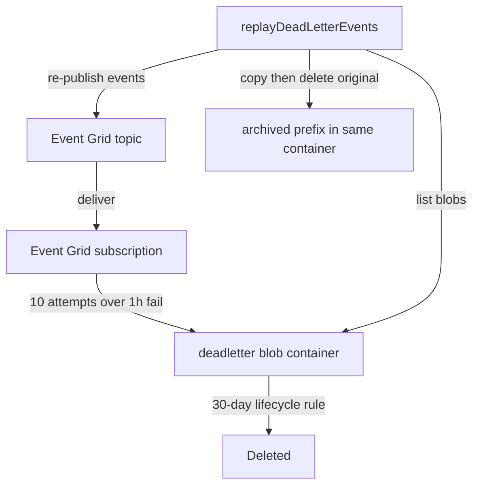

# Event Grid Dead-Letter

When an Event Grid delivery exhausts its retries — a push notification, friend-request notification, or webhook event that the Function App never accepts — the event is written to a `deadletter` blob container instead of being silently dropped. A replay script later re-publishes those events and archives the blobs it processed.

## How it works

Every Event Grid subscription carries a `deadLetterDestination` pointing at the `deadletter` container in the same-environment storage account, alongside a tightened retry policy of ten attempts over a one-hour time-to-live. The shorter window means a permanently failing event lands in the container while it is still relevant, rather than after a full day of doomed retries. Event Grid writes each exhausted delivery as a JSON blob holding the original events.

The replay script `replayDeadLetterEvents` lists the container, re-publishes each blob's events through the same key-authenticated Event Grid publisher the app uses, then copies the blob under an `archived/` prefix and deletes the original so a rerun never processes it twice. It is a manual operations tool run against a resource group's storage and Event Grid credentials — script-first, no UI, the same posture as the search index tooling. A storage lifecycle rule deletes everything under the dead-letter prefix after 30 days, so both live and archived blobs expire on their own.

Replayed events can double-deliver — Event Grid's at-least-once contract still holds — but the Function App handlers are idempotent-or-tolerant per the Azure Functions error-handling rules, so a resend is safe.

## Key files

| File                                                                                                                 | Role                                                                      |
| :------------------------------------------------------------------------------------------------------------------- | :------------------------------------------------------------------------ |
| `packages/infra/src/azure/resources/Microsoft.Storage/storageAccounts/blobContainers/devstesposter001Deadletter.ts`  | Dev `deadletter` container                                                |
| `packages/infra/src/azure/resources/Microsoft.Storage/storageAccounts/blobContainers/prodstesposter001Deadletter.ts` | Prod `deadletter` container                                               |
| `packages/infra/src/azure/resources/Microsoft.EventGrid/eventSubscriptions/`                                         | Six subscriptions: `deadLetterDestination` + 10-attempt / 1h retry policy |
| `packages/infra/src/azure/resources/Microsoft.Storage/storageAccounts/managementPolicies/`                           | 30-day lifecycle delete rule for the dead-letter prefix                   |
| `packages/shared-node/src/services/replayDeadLetterEvents.ts`                                                        | List, re-publish, and archive dead-lettered events                        |

## Notes

The container reuses the existing storage account (no new resource cost). The replay script constructs its clients from the same environment variables the Function App uses — `AZURE_STORAGE_ACCOUNT_CONNECTION_STRING` for the blob container and `AZURE_EVENT_GRID_TOPIC_ENDPOINT` / `AZURE_EVENT_GRID_TOPIC_KEY` for the publisher.
