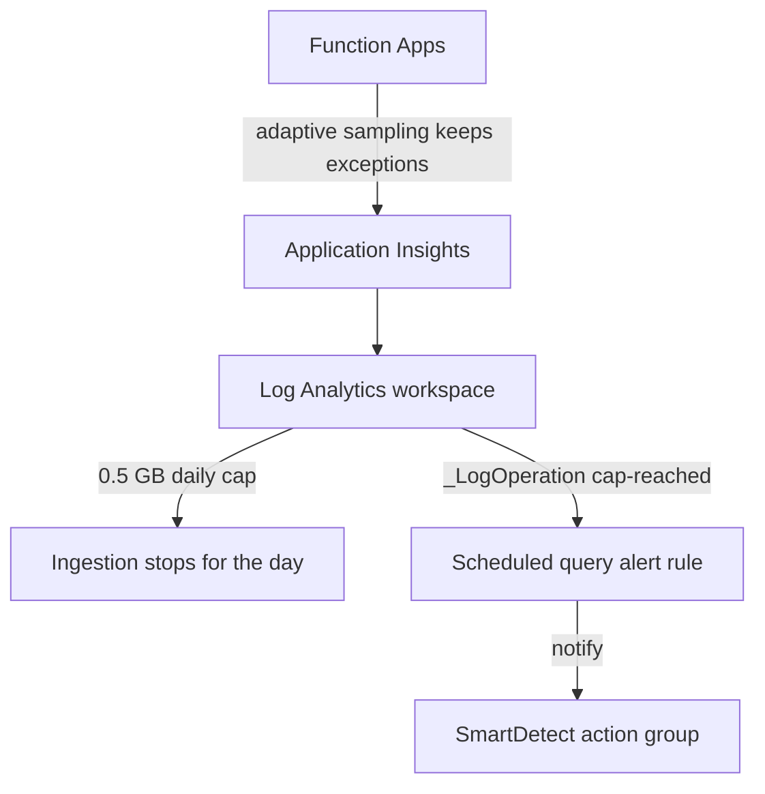

# Observability Caps

Log Analytics and Application Insights are the one place a telemetry burst could outrun the `$0.01` budget guard before the Logic App reacts. Two controls bound that risk: a daily ingestion cap on each Log Analytics workspace, and adaptive sampling on the Function Apps' App Insights telemetry.

## How it works

Each Log Analytics workspace sets `workspaceCapping.dailyQuotaGb` to a conservative `0.5` GB (previously uncapped at `-1`). When a workspace hits its cap it stops ingesting for the rest of the UTC day and drops telemetry silently — acceptable by design, since this estate prefers losing logs to paying for them. A `sqr` scheduled-query alert rule on each workspace queries `_LogOperation` for the daily-cap-reached signal and, when it fires, notifies the SmartDetect action group so the drop is at least visible.

The Function Apps' `host.json` enables App Insights adaptive sampling with `excludedTypes: Exception`, so high-volume request and trace telemetry is thinned under load while exceptions are always kept — errors survive the cap even when everything else is being sampled away.

## Key files

| File                                                                           | Role                                                    |
| :----------------------------------------------------------------------------- | :------------------------------------------------------ |
| `packages/infra/src/azure/resources/Microsoft.OperationalInsights/workspaces/` | `dailyQuotaGb: 0.5` on the dev and prod workspaces      |
| `packages/infra/src/azure/resources/Microsoft.Insights/scheduledQueryRules/`   | Cap-reached alert rule on `_LogOperation` per workspace |
| `packages/azure-functions/host.json`                                           | Adaptive sampling with exceptions excluded              |

## Notes

The `0.5` GB quota is a conservative starting point — expected ingestion is well under 1 GB/day. The real baseline should be measured with a week of `Usage | summarize IngestedGB` per table and source, then the cap set to a small multiple of that baseline. Because the cap silently drops telemetry once reached, the alert rule is what makes the event observable.
