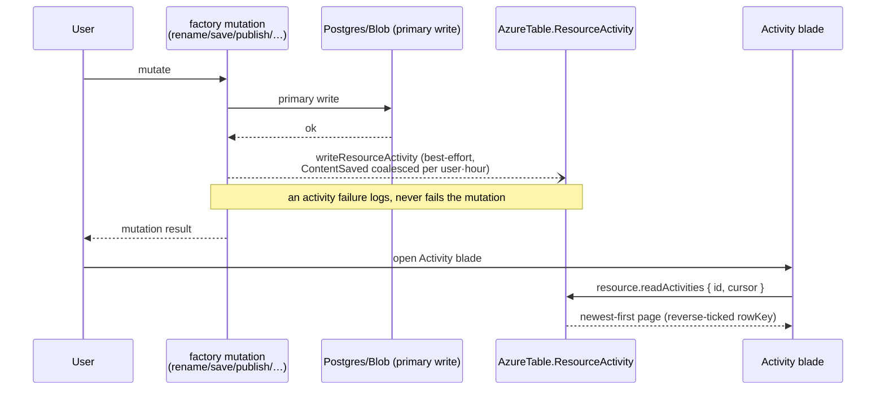

# Activity Log

Every resource has an **Activity** blade: created, renamed, saved, published, unpublished, duplicated, restored — what happened to this resource, and when.

## How it works

A publish or a rename used to leave no trace. Activity events are message-shaped — high write volume, time-ordered, no joins — so per the storage split they belong in Azure Table Storage. No Postgres migration, no new Azure service.

Events are emitted inside the `createResourceProcedures` mutations, in the best-effort tail after the primary write ([persist then notify](/docs/architecture/persist-then-notify)). Losing an audit line is bad; losing someone's save because an audit line failed is worse.

`ContentSaved` is coalesced, or autosave would flood the partition with one entry per keystroke burst. The rule is "this user already has a `ContentSaved` inside the last hour" — an existence question, asked with a filter, rather than an inspection of the newest entry. Phrasing it that way makes the answer independent of the order entities come back in.

## Data model

`AzureTable.ResourceActivity` partitions by `resourceId`, with `rowKey = getReverseTickedTimestamp()` so a plain partition scan returns newest-first without a sort — the existing convention.

`ResourceActivityEntity` carries `activityType` (`Created | Renamed | ContentSaved | Published | Unpublished | Imported | Duplicated | Restored`), `userId`, and per-type payload fields (`oldName`/`newName`, `publishVersion`, `format`). Every payload field is optional: Azure Table is schemaless per row, and a `Renamed` has nothing to say about `publishVersion`.

### Cleanup

Azure Table has no partition-drop, so clearing a resource's history means enumerating its partition and batch-deleting in transactions of up to 100 — all within one partition, which the batch API requires anyway. Already-gone entities are the success case, so a retry is safe.

Soft delete leaves the partition intact: history survives the [recycle bin](/docs/platform/recycle-bin) window and a restore appends `Restored` to it. The sweep runs at purge time, before the Postgres row is deleted, so a failed sweep is re-driven by the surviving row on the next pass.

## Procedures

| Procedure                 | Auth                | Input             | Purpose                                       |
| ------------------------- | ------------------- | ----------------- | --------------------------------------------- |
| `resource.readActivities` | `getOwnerProcedure` | `{ id, cursor? }` | Cursor-paginated partition read, newest first |

## Key files

| File                                                                | Role                                         |
| ------------------------------------------------------------------- | -------------------------------------------- |
| `packages/db-schema/src/models/resource/ResourceActivityEntity.ts`  | The entity + its schema                      |
| `packages/db-schema/src/models/azure/table/AzureTable.ts`           | `ResourceActivity` table key                 |
| `packages/app/server/services/resource/writeResourceActivity.ts`    | Best-effort emit + `ContentSaved` coalescing |
| `packages/db/src/services/resource/deleteTablePartitionEntities.ts` | Purge-time partition sweep                   |
| `packages/app/app/components/Resource/ActivityLog.vue`              | The blade timeline                           |

## Notes

- Resources are single-owner and every procedure is owner-scoped, so every actor on a resource's trail is its owner. The blade therefore shows no actor column — it would say the same name on every line.
- Icons are severity-neutral. An activity trail records what happened; it does not judge it.
- Activity is the durable trail; the [notifications bell](/docs/platform/notifications) is ephemeral session feedback. They share event sources but never storage.
- No cross-resource feed (the portal's subscription-level log) — per-resource only until something needs more.
- Rows live until the resource is purged. If partitions ever grow uncomfortable, add a timer sweep in the same shape as message retention rather than capping writes.
