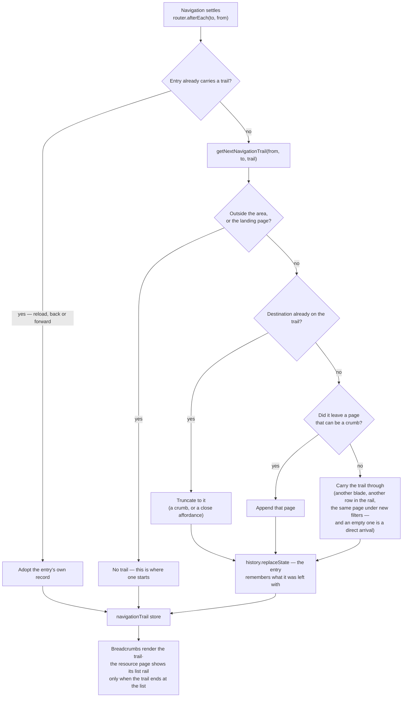

# Breadcrumb Trail

The breadcrumb answers **"how did I get here, and how do I get back"** — not "where does this url sit in the route tree". Azure Portal is the reference, and it is worth being exact about what the portal derives its crumbs from, because it decides what is worth copying.

**Azure's breadcrumb is two things at once.** The containment part comes out of the url: an ARM resource id is a path — subscription → resource group → provider → resource — so that much is reconstructible from the address, identical for everyone, stable across a refresh. The **browse** part is not. Opening the same resource from the App Services list or from its resource group produces the identical url and a different crumb, so that context lives in the portal's client state — and it is gone the moment you refresh.

We have neither half for free. Our resources have no container (a resource is not _inside_ `/resources/all`, which is a list view), so deriving crumbs from the route tree would invent an ancestor and stamp `Resources › All` onto every resource, including one opened from a link. And putting the click path in the url would make two addresses for one resource — worse for sharing, bookmarks and analytics than the thing it buys, and editable by anyone who types.

So the trail is **state of the history entry**: not in the url, not in app storage, not recomputed. The browser already keeps entry state across a reload and restores each entry's own on back and forward, which is exactly the lifetime a trail wants.

Four rules follow:

1. **The current page is the title, never a crumb.** A disabled leaf repeating the title is a second copy of the same string, and on a narrow viewport it is the copy that pushes the real trail off the row.
2. **A crumb exists only for a page you actually navigated through.** Reaching a resource from the list makes the list a crumb; reaching it directly does not, because there is nothing to go back up to that the visitor ever had open.
3. **No trail, no breadcrumb row.** There is no standing "Home" crumb. The explorer landing is where a trail starts, so it renders nothing and becomes a crumb only once you navigate out of it.
4. **One writer.** A router hook resolves the trail after every navigation and records it on the entry. Links stay plain — a trail appended by hand at each drill-down is one the next link silently drops, and a page that lost it looks exactly like a page nobody drilled into.

**The same fact drives the two-pane view.** The resource page shows the list rail beside the blade only when the trail ends at the list — the state where both pages really are open, and the only one where the collapse caret peeling back to the list means anything. Opened from a link, the resource takes the full width.

## How it works



The url stays the canonical address of the page and nothing else:

```text
/resources                    entry state: —                        no crumb          title: Resources
/resources/all                entry state: [resources]              Resources         title: All
/resources/8f2e…              entry state: [resources, all]         Resources › All   title: Q3 Report   + list rail
/resources/8f2e…              entry state: —                        no crumb          title: Q3 Report
```

The last two rows are the same address: what differs is the entry the visitor is standing on, which is precisely the thing the url should not be claiming.

Four pieces implement it:

- **`NavigationTrailPage`** with **`NavigationTrailPageMap`** — the slugs a trail may contain and what each renders as. A page absent from the map can be navigated _from_ without ever becoming a crumb, which is how a page opts out.
- **`getNextNavigationTrail`** — the rules above as one pure function: truncate, append, or carry. Being pure is what makes the model testable without a browser.
- **`navigationTrail.client.ts`** — the router hook. It adopts an entry's recorded trail when there is one (a reload or a back/forward lands on an entry that already knows its own trail) and otherwise resolves and records.
- **`navigationTrail` store** — what components read. The plugin is the only writer.

## What each surface shows

| Arrived at                        | By                             | Breadcrumb        | Title     | List rail |
| --------------------------------- | ------------------------------ | ----------------- | --------- | --------- |
| `/resources`                      | launcher, logo, direct         | none              | Resources | —         |
| `/resources/all`                  | Resources → See all            | `Resources`       | All       | —         |
| `/resources/all`                  | direct link                    | none              | All       | —         |
| `/resources/all`                  | search, sort or page change    | unchanged         | All       | —         |
| `/resources/[id]`                 | Resources → All → row click    | `Resources › All` | {name}    | shown     |
| `/resources/[id]`                 | row click, All opened directly | `All`             | {name}    | shown     |
| `/resources/[id]`                 | row click in the list rail     | unchanged         | {name}    | shown     |
| `/resources/[id]`                 | favourite, search, shared link | none              | {name}    | hidden    |
| `/resources/[id]` (another blade) | blade nav inside the page      | unchanged         | {name}    | unchanged |

A link you send someone lands them on the direct view: they did not walk your path, and the address never claimed they did.

## Key files

| File                                            | Role                                                                   |
| ----------------------------------------------- | ---------------------------------------------------------------------- |
| `app/plugins/navigationTrail.client.ts`         | the only writer — resolves after each navigation, records on the entry |
| `app/services/shared/getNextNavigationTrail.ts` | the rules, as a pure function                                          |
| `app/services/shared/NavigationTrailPageMap.ts` | slug → path + crumb title                                              |
| `app/models/shared/NavigationTrailPage.ts`      | the slugs a trail may contain                                          |
| `app/store/navigationTrail.ts`                  | what components read                                                   |
| `app/components/App/Breadcrumbs.vue`            | renders the crumbs, nothing when the trail is empty                    |
| `app/components/Styled/PageHeader.vue`          | owns the title beside the trail                                        |
| `app/components/Resource/Explorer/Index.vue`    | shows the list rail only when the trail ends at the list               |

## Notes

- Adding a page to the model is one map entry; adding a page that should never be a crumb is nothing at all.
- **Leaving the area is the only reset**, and everything short of a real drill-in carries the trail untouched. A direct arrival is therefore not a case the resolver detects — it is the empty trail that navigating out of the area already left behind. The consequence is the one worth stating: a rule that instead reset on "did not come from a crumb page" empties the trail on the second row clicked in the list rail, and one that appends without checking the navigation left the page turns a filter change on the list into a crumb linking to the page already open.
- A trail read back off an entry is validated against the map before it renders — an entry written by an older release, or edited in devtools, is filtered down to slugs that still exist rather than rendering a crumb to nowhere.
- A crumb is a real link; the title is plain text. Anything not navigable is not a crumb, which is why the current page cannot be one.
- Pasting a url into the address bar is a direct arrival even in a tab that was on the list: it is a new entry with no trail, which is the honest reading of typing an address.
- An earlier iteration let a page hardcode its ancestor (the recycle bin offering "All") — the route-tree model wearing the trail's clothes, since it offered a way back to a list the visitor may never have had open.
