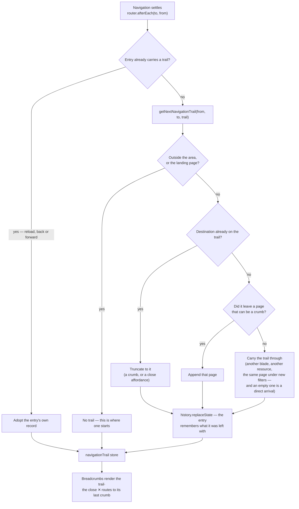

# Breadcrumb Trail

The breadcrumb answers **"how did I get here, and how do I get back"** — not "where does this url sit in the route tree". Azure Portal is the reference, and it is worth being exact about what the portal derives its crumbs from, because it decides what is worth copying.

**Azure's breadcrumb is two things at once.** The containment part comes out of the url: an ARM resource id is a path — subscription → resource group → provider → resource — so that much is reconstructible from the address, identical for everyone, stable across a refresh. The **browse** part is not. Opening the same resource from the App Services list or from its resource group produces the identical url and a different crumb, so that context lives in the portal's client state — and it is gone the moment you refresh.

We have neither half for free. Our resources have no container (a resource is not _inside_ `/resource-explorer/all`, which is a list view), so deriving crumbs from the route tree would invent an ancestor and stamp `Resource Explorer › All` onto every resource, including one opened from a link. And putting the click path in the url would make two addresses for one resource — worse for sharing, bookmarks and analytics than the thing it buys, and editable by anyone who types.

So the trail is **state of the history entry**: not in the url, not in app storage, not recomputed. The browser already keeps entry state across a reload and restores each entry's own on back and forward, which is exactly the lifetime a trail wants.

Four rules follow:

1. **The current page is the title, never a crumb.** A disabled leaf repeating the title is a second copy of the same string, and on a narrow viewport it is the copy that pushes the real trail off the row.
2. **A crumb exists only for a page you actually navigated through.** Reaching a resource from the list makes the list a crumb; reaching it directly does not, because there is nothing to go back up to that the visitor ever had open.
3. **The hub leads every trail.** The portal keeps a root crumb on every blade, and so do we: `Resource Explorer` claims no ancestry — it is the one page everything in the area genuinely sits under — so a resource opened from a link still has a way out and the header does not change shape between that and a drilled-in one. A visitor who came through the hub already carries it, so it is never doubled; the hub itself renders no crumb at all, because rule 1 outranks this one. **Home is not a crumb** — the logo is that link on every route, and a second one would spend the row on a control the chrome already has.
4. **One writer.** A router hook resolves the trail after every navigation and records it on the entry. Links stay plain — a trail appended by hand at each drill-down is one the next link silently drops, and a page that lost it looks exactly like a page nobody drilled into.

**The trail also decides where a close ✕ goes.** The store exposes the last crumb as `closeTo`, so the ✕ on the list page and the one in a resource's command bar both peel back exactly one layer — to the page the visitor came through, or to the hub when they arrived directly. Closing and clicking the last crumb are one move, and neither needs a destination hardcoded at its call site.

## How it works



The url stays the canonical address of the page and nothing else:

```text
/resource-explorer                    entry state: —                        no crumb            title: Resource Explorer
/resource-explorer/all                entry state: [resources]              Resource Explorer          title: All
/resource-explorer/8f2e…              entry state: [resources, all]         Resource Explorer › All    — (blade names it)
/resource-explorer/8f2e…              entry state: —                        Resource Explorer          — (blade names it)
```

The last two rows are the same address: what differs is the entry the visitor is standing on, which is precisely the thing the url should not be claiming.

Four pieces implement it:

- **`NavigationTrailPage`** with **`NavigationTrailPageMap`** — the slugs a trail may contain and what each renders as. A page absent from the map can be navigated _from_ without ever becoming a crumb, which is how a page opts out.
- **`getNextNavigationTrail`** — the rules above as one pure function: reset, truncate, append, or carry. Being pure is what makes the model testable without a browser.
- **`navigationTrail.client.ts`** — the router hook. It adopts an entry's recorded trail when there is one (a reload or a back/forward lands on an entry that already knows its own trail) and otherwise resolves and records.
- **`navigationTrail` store** — what components read. The plugin is the only writer.

## What each surface shows

The resource page passes no title at all — its blade header already names the resource and the blade — so `Title` below is the header's title where there is one.

| Arrived at                                | By                                  | Breadcrumb                | Title             | Close ✕ goes to          |
| ----------------------------------------- | ----------------------------------- | ------------------------- | ----------------- | ------------------------ |
| `/resource-explorer`                      | launcher, logo, direct              | none — it is here         | Resource Explorer | —                        |
| `/resource-explorer/all`                  | Resource Explorer → See all         | `Resource Explorer`       | All               | `/resource-explorer`     |
| `/resource-explorer/all`                  | direct link                         | `Resource Explorer`       | All               | `/resource-explorer`     |
| `/resource-explorer/all`                  | search, sort or page change         | unchanged                 | All               | unchanged                |
| `/resource-explorer/[id]`                 | Resource Explorer → All → row click | `Resource Explorer › All` | —                 | `/resource-explorer/all` |
| `/resource-explorer/[id]`                 | row click, All opened directly      | `Resource Explorer › All` | —                 | `/resource-explorer/all` |
| `/resource-explorer/[id]`                 | favourite, search, shared link      | `Resource Explorer`       | —                 | `/resource-explorer`     |
| `/resource-explorer/[id]` (another blade) | blade nav inside the page           | unchanged                 | —                 | unchanged                |

A link you send someone lands them on the direct view: they did not walk your path, and the address never claimed they did.

## Key files

| File                                            | Role                                                                   |
| ----------------------------------------------- | ---------------------------------------------------------------------- |
| `app/plugins/navigationTrail.client.ts`         | the only writer — resolves after each navigation, records on the entry |
| `app/services/shared/getNextNavigationTrail.ts` | the rules, as a pure function                                          |
| `app/services/shared/NavigationTrailPageMap.ts` | slug → path + crumb title                                              |
| `app/models/shared/NavigationTrailPage.ts`      | the slugs a trail may contain                                          |
| `app/store/navigationTrail.ts`                  | what components read                                                   |
| `app/components/App/Breadcrumbs.vue`            | renders the hub crumb, then the trail, never the page it is on         |
| `app/components/Styled/PageHeader.vue`          | owns the title beside the trail                                        |
| `app/store/navigationTrail.ts`                  | also derives `closeTo` — the last crumb a ✕ peels back to              |

## Notes

- Adding a page to the model is one map entry; adding a page that should never be a crumb is nothing at all.
- **Leaving the area or landing back on `/resource-explorer` is the only reset**, and everything short of a real drill-in carries the trail untouched. A direct arrival is therefore not a case the resolver detects — it is the empty trail that navigating out of the area already left behind. The consequence is the one worth stating: a rule that instead reset on "did not come from a crumb page" empties the trail on the second resource opened in a row, and one that appends without checking the navigation left the page turns a filter change on the list into a crumb linking to the page already open.
- A trail read back off an entry is validated against the map before it renders — an entry written by an older release, or edited in devtools, is filtered down to slugs that still exist rather than rendering a crumb to nowhere.
- A crumb is a real link; the title is plain text. Anything not navigable is not a crumb, which is why the current page cannot be one.
- Pasting a url into the address bar is a direct arrival even in a tab that was on the list: it is a new entry with no trail, which is the honest reading of typing an address.
- **A page never hardcodes its own ancestor.** Giving the recycle bin a fixed `All` crumb is the route-tree model wearing the trail's clothes: it offers a way back to a list the visitor may never have had open.
