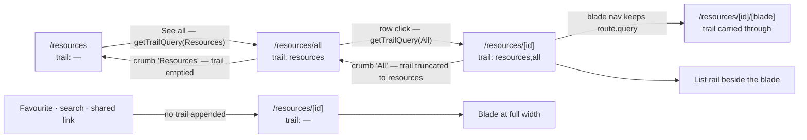

# Breadcrumb Trail

The breadcrumb answers **"how did I get here, and how do I get back"** — not "where does this url sit in the route tree". Azure Portal is the reference, and the difference shows immediately: opening a survey from the survey list gives you the list as a crumb, while opening the same survey from a link, a favourite or search gives you none. The survey's own name never appears in the trail — it is the page title.

Four rules produce that, and everything else follows from them:

1. **The current page is the title, never a crumb.** A disabled leaf repeating the title is a second copy of the same string, and on a narrow viewport it is the copy that pushes the real trail off the row.
2. **A crumb exists only for a page you actually navigated through.** Reaching a resource from the list makes the list a crumb; reaching it directly does not, because there is nothing to go back up to that the visitor ever had open.
3. **No trail, no breadcrumb row.** There is no standing "Home" crumb. The explorer landing is where a trail starts, so it renders nothing, and becomes a crumb only once you navigate out of it.
4. **The trail lives in the url.** A `trail` query parameter carries it, so a refresh, a restored tab, a bookmark and a shared link all rebuild the same breadcrumb from the address alone. Nothing is stored in the browser, and no state is remembered between navigations.

**The same fact drives the two-pane view.** The resource page shows the list rail beside the blade only when the trail ends at the list — the state where both pages really are open, and the only one where the collapse caret peeling back to the list means anything. Opened from a link, the resource takes the full width.

## How it works

A link out of a page appends that page to the trail it was itself reached with, so the parameter grows one slug per drill-down:

```text
/resources                              → no crumb                    title: Resources
/resources/all?trail=resources          → Resources                   title: All
/resources/8f2…?trail=resources,all     → Resources › All             title: Q3 Report   + list rail
/resources/8f2…                         → no crumb                    title: Q3 Report
```



Three pieces implement it, and nothing else participates:

- **`NavigationTrailPage`** — the slugs a trail may contain (`resources`, `all`), with `NavigationTrailPageMap` giving each its path and title. Slugs rather than paths, because a path would have to be escaped into the query, and titles stay out of the url so renaming a crumb does not invalidate links already sent around.
- **`useNavigationTrail`** — parses the parameter into crumbs, dropping any slug the map does not know (the value is visitor-editable and a crumb is a link we are about to offer), and exposes `getTrailQuery` for links that continue the trail. Each crumb links back with the ancestors that led to _it_, so going up truncates instead of dropping the visitor onto a page that has forgotten how they got there.
- **The links themselves** — only a link that is genuinely a drill-down calls `getTrailQuery`: Home's "See all", and a row in the resource list. Everything else (favourites, recents, search results, the blueprint deploy dialog) links plainly, which is exactly why those arrivals show no crumb. Blade links carry `route.query` through, because a blade is a view of the resource already open.

## What each surface shows

| Arrived at                        | By                             | Breadcrumb        | Title     | List rail |
| --------------------------------- | ------------------------------ | ----------------- | --------- | --------- |
| `/resources`                      | launcher, logo, direct         | none              | Resources | —         |
| `/resources/all`                  | Resources → See all            | `Resources`       | All       | —         |
| `/resources/all`                  | direct link                    | none              | All       | —         |
| `/resources/[id]`                 | Resources → All → row click    | `Resources › All` | {name}    | shown     |
| `/resources/[id]`                 | row click, All opened directly | `All`             | {name}    | shown     |
| `/resources/[id]`                 | favourite, search, shared link | none              | {name}    | hidden    |
| `/resources/[id]` (another blade) | blade nav inside the page      | unchanged         | {name}    | unchanged |

A shared link therefore reproduces exactly what the sender saw, including whether the list rail was open — the url is the whole state.

## Key files

| File                                                 | Role                                                       |
| ---------------------------------------------------- | ---------------------------------------------------------- |
| `app/models/shared/NavigationTrailPage.ts`           | the slugs a trail may contain                              |
| `app/services/shared/NavigationTrailPageMap.ts`      | slug → path + crumb title                                  |
| `app/composables/shared/route/useNavigationTrail.ts` | parse the query, build crumbs, extend the trail for a link |
| `app/components/App/Breadcrumbs.vue`                 | renders the crumbs, nothing when the trail is empty        |
| `app/components/Styled/PageHeader.vue`               | owns the title beside the trail                            |
| `app/components/Resource/Explorer.vue`               | shows the list rail only when the trail ends at the list   |
| `app/components/Resource/ListView.vue`               | the row link that appends the list to the trail            |
| `app/components/Resource/BladeNav.vue`               | blade links that carry the query through                   |

## Notes

- Nothing walks the route tree to invent ancestors, so a page joins the model by being linked to with `getTrailQuery` — and no page can claim a parent the visitor never opened.
- A crumb is a real link; the title is plain text. Anything not navigable is not a crumb, which is why the current page cannot be one.
- Pasting a resource url into the address bar of a tab that was on the list still shows no crumb, because the trail travels in the url rather than in the tab's history. That is the intended reading: the address is the whole claim.
- An earlier iteration let a page hardcode its ancestor (the recycle bin offering "All") — the route-tree model wearing the trail's clothes, since it offered a way back to a list the visitor may never have had open.
