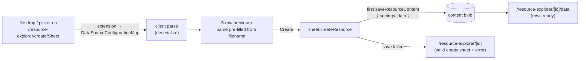

# Create From File

Creating a [Sheet](/docs/platform/sheet-resource) from a file you already have is one step. Drop or pick a CSV, JSON, or XLSX on `/resource-explorer/create/Sheet` and you arrive at a resource whose Data blade already holds the parsed rows — instead of creating an empty sheet, opening the Data blade, and running Import as a second act.

The file input is **optional**: name-only create works exactly as before, and every other resource type is untouched.

## How it works

There is no new machinery here. The parse is the same client-side deserializer the Data blade's Import command uses, and the write is the same first `saveResourceContent` the blade would have done — the form just puts them in one submit.

- **The format comes from the file, not a picker.** The drop zone accepts every extension in `DataSourceConfigurationMap`, and `getDataSourceTypeByFileName` resolves the format from the name — so a new portable format needs no change to the create form. An unsupported extension blocks Create with a message naming what is accepted.
- **The filename is the name you never have to type.** It pre-fills the name field (extension stripped, through `normalizeString`), and stays editable.
- **A parse failure blocks Create**, surfaced on the file field itself. The form is not partly valid: you cannot create a sheet from a file that did not parse.
- **A save failure after create is not a half-written resource.** `createResource` writes no blob, so the save is the first write, exactly as it is from the Data blade. If it fails you keep a valid, empty Sheet and see the error — never a corrupt blob.
- **Success lands on the Data blade, not Overview.** You came to see your rows.

## Key files

| File                                                                    | Role                                                   |
| ----------------------------------------------------------------------- | ------------------------------------------------------ |
| `app/pages/resource-explorer/create/[type].vue`                         | the Sheet branch, submit, and blade routing            |
| `app/components/Resource/Create/SheetFile.vue`                          | drop zone, picker, parse, preview                      |
| `app/services/resource/sheet/dataSource/getDataSourceTypeByFileName.ts` | extension → format, from the format map's own `accept` |
| `app/services/resource/sheet/dataSource/DataSourceConfigurationMap.ts`  | the reused `accept` + `deserialize`                    |

## Notes

- Client-side parse only, same as Import — there is no upload path, and the [1000-row dataset cap](/docs/platform/dataset-row-cap-warning) realities are identical to the Import command's.
- **Only Sheet opts in.** This is a per-type branch on the create form, which is the "type-specific initial settings" affordance the form already reserved — not a new framework. If more types ever want rich create forms, that is the [create wizard tabs](/docs/platform/deferred/create-wizard-tabs) revisit trigger.
- The Home quick-create tile and the gallery tile for Sheet are unchanged — they lead to this same form; the drop zone is simply on it.
