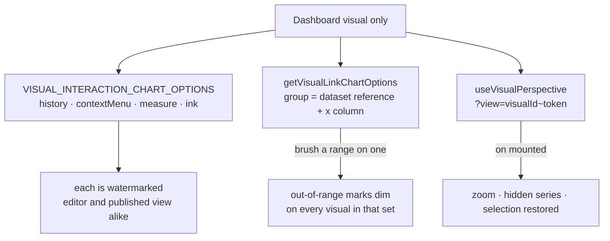

# Dashboard Chart Interaction

A dashboard tile is something a reader interrogates, not only a picture they look at. ApexCharts v6 supplies that surface as configuration rather than code, so the whole of it lives in one constant — `VISUAL_INTERACTION_CHART_OPTIONS` — plus two features that need the app to hold state for them: which visuals move together, and what a shared link carries.

## What is on

On dashboard visuals only:

- **Undo / redo** (`history`) — Ctrl+Z over zooms, series toggles and annotation edits.
- **Context menu** (`contextMenu`) — right-click a point for actions that operate at that point.
- **Ruler** (`measure`) — hold and drag to read the change, percent and slope between two points.
- **Annotation authoring** (`ink`) — drag, resize and restyle annotations, wired into undo. Annotations are not persisted: they are the reader's working marks, and a dashboard's saved content holds visuals, not notes.
- **Linked highlighting** — `getVisualLinkChartOptions` groups visuals **by the dataset reference and the `query.xColumn` they categorise it by**, not by the dashboard they sit on. Both halves are load-bearing: the reference is what makes two charts describe the same rows, and the x column is what makes one chart's axis mean the same thing as another's. One sheet grouped by month and the same sheet grouped by region share every row and no axis at all, so linking them would dim each other's marks by coincidence of position. A visual with no binding renders demo data and joins no group, and a chart type with no x axis to brush (pie, donut, polar area, radar, radial bar, treemap) is left out.
- **Shareable view state** — `useVisualPerspective` captures a visual's zoom window, hidden series and selection into a token and puts it in the url as `?view=<visualId>~<token>`. The parameter repeats, so a link carries the state of every chart its sender touched, and a token that no longer decodes opens the dashboard unfiltered rather than failing.

## Every feature here is registered where it is configured

ApexCharts v7 ships these as **opt-in modules**: the default bundle registers only the baseline set, and a feature that has not been imported is not present. The failure mode is the dangerous kind — an unregistered feature makes its option a config key nothing reads, so the chart renders perfectly and does nothing new, with no error and no warning anywhere.

So the `import "apexcharts/features/…"` sits beside the option that needs it rather than in one setup file:

| Registration                                         | Declared by                                                   |
| ---------------------------------------------------- | ------------------------------------------------------------- |
| `features/history`, `context-menu`, `ink`, `measure` | `services/dashboard/chart/constants.ts`                       |
| `features/link`                                      | `getVisualLinkChartOptions` — `chart.link` and the group      |
| `features/perspectives`                              | `useVisualPerspective` — `chart.perspectives` on the instance |

Importing the module that builds an option is what makes that option real, so a new consumer of any of them cannot pick up the config without the feature. Adding an option from a module not listed above means adding its import next to it — the v7 upgrade turned every one of these off silently, which is why they are colocated rather than gathered.

## The watermark

`history`, `contextMenu`, `measure`, `ink`, linked highlighting and perspectives are gated by the vendor. They work as documented above, and every chart carrying one renders a repeating "APEXCHARTS" watermark over it — on the editor and on the published `/view/Dashboard/[id]` page alike.

**That is accepted, not overlooked.** No key is configured and no code reads one: the features are worth their watermark, and a key would be a purchase rather than a setting. There is deliberately nothing to switch on here — adding an environment variable for a key nobody holds would be config that never has a value.

The consequence for editing this page's features is that they move as a set: they are enabled together in `VISUAL_INTERACTION_CHART_OPTIONS`, and backing out of the watermark means deleting entries there rather than weighing them one at a time.

## What is deliberately off

- **Crossfilter FILTER mode** — the mode where clicking a bucket re-aggregates every linked chart. It asks each chart for one `dimension` and one `reduce`, which is a single derived series; a visual here declares `query.series[]` and can carry several. Expressing a multi-series visual through it is not possible, and running it alongside `computeDatasetVisualPropsData` would put two aggregation engines in the same tile. HIGHLIGHT mode, above, needs no aggregation change and is what ships.
- **Canvas rendering** (`chart.renderer`, `features/renderer-canvas`) — on while v6 bundled it for free, and removed when v7 priced it. It is a 10.9 KB gzipped module on every surface that draws a chart, and it is unreachable: `rendererThreshold` defaults to 8000 points, a dataset read caps at 1000 rows, and a visual aggregates those rows into categories, so a series cannot approach the threshold. Add the module back when the row cap rises, not before.
- **The lean core bundle** (`apexcharts/core` plus per-type registration) — measured rather than assumed. The sixteen chart-type entries this app needs come to 285 KB gzipped against the full bundle's 219 KB, because the entries overlap heavily: every line-family type carries the same 16.7 KB and every pie-family type the same 14.5 KB. Lean pays for a surface drawing two or three types and costs about 66 KB here.
- **OS-aware themes** (`theme.follow`) — Vuetify owns the theme, and `StyledApexChart` pins the mode to it deliberately. Following the OS instead would fight the app's own switch.
- **Streaming** (`chart.streaming`) — bounds memory for `appendData` on a live feed. Datasets are read and refreshed, never appended to; there is no feed to bound.
- **Scrollytelling** (`chart.storyboard`) — pairs prose sections with saved chart views. Nothing in the app puts a chart inside prose.
- **The plugin platform, custom series types and pluggable easing** — each needs a specific plugin, series or curve to be worth registering. None exists to register.

Coherent data transitions and the touch gestures are on by default in v6 and need no configuration.

## Key files

| File                                                                     | Role                                                   |
| ------------------------------------------------------------------------ | ------------------------------------------------------ |
| `packages/app/app/components/Styled/ApexChart.vue`                       | theme pinning, canvas renderer, instance getter        |
| `packages/app/app/services/dashboard/chart/constants.ts`                 | the gated interaction switch and the view url format   |
| `packages/app/app/services/dashboard/chart/getVisualLinkChartOptions.ts` | which visuals move together when one is brushed        |
| `packages/app/app/composables/dashboard/useVisualPerspective.ts`         | capture and restore a visual's view state from the url |
