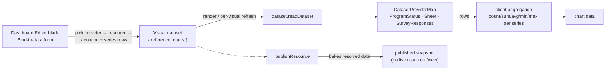

# Dashboard Data Binding

A dashboard visual can bind to a `DatasetReference` (survey responses, a Sheet resource) instead of only embedding static chart data — the marquee cross-product integration, applying the [datasets standard](/docs/architecture/datasets) to the dashboard product. A bound visual resolves its chart data from `dataset.readDataset` at render time; static visuals work unchanged — binding is additive.

## How it works



## Data model

`Visual.dataset?: VisualDatasetBinding` — stored inside the dashboard content blob, no DB columns:

```ts
// packages/app/shared/models/dashboard/data/VisualDatasetBinding.ts
interface VisualDatasetBinding {
  reference: DatasetReference;
  query: DatasetQuery; // { xColumn, series: { column, aggregation: DatasetAggregationType }[] }
  snapshot?: Dataset; // baked in at publish time, so public viewers never resolve references
}
```

## Behavior

- **Bind-to-data form** (in the Dashboard Editor blade): pick a provider → pick a resource via the shared `DatasetReferencePicker` → pick the x column and edit multiple series rows (column + aggregation, add/remove).
- **Render**: a resolver computes chart data from the fetched `Dataset` per bound visual, with loading and error states per visual and a manual refresh action.
- **Publish**: published dashboards bake the resolved data into the snapshot ([/docs/architecture/publishing](/docs/architecture/publishing)) — the public view never issues live dataset reads.

## Key files

| File                                                   | Role                                                                       |
| ------------------------------------------------------ | -------------------------------------------------------------------------- |
| `shared/models/dashboard/data/VisualDatasetBinding.ts` | binding shape — reference + query, plus the optional publish-time snapshot |
| `shared/models/dataset/DatasetQuery.ts`                | x column + aggregated series                                               |
| `app/components/Resource/Dashboard/Editor.vue`         | canvas incl. bind-to-data flow                                             |
| `app/components/Resource/Dashboard/View.vue`           | published renderer over baked data                                         |
| `app/components/Dataset/ReferencePicker.vue`           | shared provider/resource picker                                            |

## Notes

- Aggregation runs client-side over the row-capped dataset — no server query language. Revisit only if the row cap becomes a real limit ([dataset row cap](/docs/platform/deferred/dataset-row-cap-pagination)).
- Fetch on dashboard load + manual refresh; live updates are deferred ([realtime dataset refresh](/docs/platform/deferred/realtime-dataset-refresh)).
- A bound visual with a deleted/unreadable source renders an error state, never breaks the dashboard.
