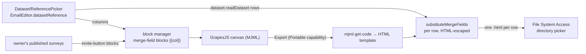

# Email Personalization

The email editor joins the data flow: merge-field blocks bound to a `DatasetReference`, survey invite blocks, and per-row personalized HTML export — applying the [datasets standard](/docs/architecture/datasets) to the email product. Actually sending email is deferred ([email sending](/docs/platform/deferred/email-sending)).

## How it works

An email optionally binds one dataset (`EmailEditor.datasetReference`, stored inside the content blob — every GrapesJS save carries it over since project data doesn't know about it). The bound dataset's columns appear in the block manager as drag-in merge-field blocks (`{{columnName}}`), and the owner's published surveys appear as styled invite-button blocks ([survey invite blocks](/docs/platform/webpage-survey-invite-blocks), shared with the webpage editor). Export compiles the current MJML to HTML once (`mjml-get-code`), then writes one personalized `.html` per dataset row with merge fields substituted.

## Key files

| File                                                 | Role                                                                            |
| ---------------------------------------------------- | ------------------------------------------------------------------------------- |
| `app/services/emailEditor/toMergeField.ts`           | canonical `{{columnName}}` token                                                |
| `app/services/emailEditor/substituteMergeFields.ts`  | per-row substitution, HTML-escaped                                              |
| `app/services/emailEditor/getEmailHtml.ts`           | the one MJML compile, shared with the [web view](/docs/platform/email-web-view) |
| `app/services/emailEditor/exportPersonalizedHtml.ts` | readDataset → one personalized `.html` per row                                  |
| `app/services/grapesjs/setBlocks.ts`                 | wholesale block-category re-sync in the block manager                           |
| `app/composables/grapesjs/useGrapesJsEditor.ts`      | shared GrapesJS init + resource storage adapter (email/webpage)                 |
| `app/components/Resource/Email/Editor.vue`           | inline Editor blade bridging the live editor onto the email store               |

## Notes

- Export surfaces through the **Portable** capability (`PortableFormatMap[Email]` personalized-HTML `export()`), rendered as Import/Export entries in the resource command bar — the live GrapesJS editor is bridged onto the email store so the command-bar export can reach it.
- Merge-field and survey-invite block categories re-sync wholesale whenever their reactive source changes (bound dataset columns, published surveys) — no per-block bookkeeping.
- Substituted values are HTML-escaped: merge fields personalize text, never inject markup. Tokens are inserted escaped and substitution matches both raw and escaped token forms, since the canvas entity-encodes special characters (e.g. a "P&L" column) on serialization.
- Export is fully client-side; a zip dependency was rejected in favour of the File System Access directory picker.
- Exported files keep app-origin asset urls (`/api/resource-assets/…`), which resolve only for a request carrying the owner's session cookie — images are blank in a file opened straight off disk. Durable public asset urls come with [email sending](/docs/platform/deferred/email-sending).
- The `EmailEditor` content class name is frozen (registered in `JSONClassMap` — renaming breaks superjson deserialization of persisted blobs).
