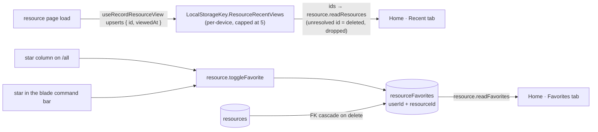

# Favorites & Recents

Home opens on two tabs: **Recent**, the resources you actually opened, and **Favorites**, the ones you starred. Both answer "take me back to what I was working on" — the question Home exists to answer.

## How it works

Favorites and recents deliberately use different storage, because they fail differently. A star that vanishes on another device reads as data loss, so favorites are a Postgres table from day one. A recent that differs per device is merely a bit untidy, so views live in `localStorage` — no table, no write on every page load.

Recent means recently _viewed_. Home previously approximated it with `updatedAt` desc, which is wrong the moment anything autosaves: a resource you never opened jumps to the top because a background save touched it. Opening a resource page now records `{ id, name, type, viewedAt }` through `useRecordResourceView`, capped at five entries. It watches the resource's **identity**, not the object — autosave, rename and tag edits each replace the object, and re-recording on those would order Recent by last autosave, which is the behaviour this replaced.

Those entries are ids, not data. Home resolves them back through `readResources` with an `ids` filter, so a resource renamed or deleted elsewhere shows its current name or drops out entirely rather than lingering as a stale row. The `localStorage` order is what orders the card — the server has no opinion on when _this_ device last looked at something. Until a device has opened anything, Recent falls back to `updatedAt` desc, so the card is never empty for someone who already has resources.

## Data model

`resourceFavorites` carries nothing but the relationship: a `userId` + `resourceId` composite primary key and the inherited `createdAt`, which doubles as the Favorites tab's sort key (most recently starred first). Both columns cascade, so deleting a user or purging a resource cleans up its stars without a sweep.

A star is a toggle, and `toggleFavorite` implements it as a delete-then-insert rather than a read-then-branch: the delete's own `returning()` reports whether the star was set, so the toggle cannot race with itself and report the wrong new state. The client takes that answer as authoritative rather than keeping its optimistic flip — a list that went stale (another tab starred the same row first) flips the wrong way, and nothing else would ever reconcile it.

## Procedures

| Procedure                 | Auth   | Input    | Purpose                                            |
| ------------------------- | ------ | -------- | -------------------------------------------------- |
| `resource.toggleFavorite` | owner  | `{ id }` | Insert/delete the favorite row, returns new state  |
| `resource.readFavorites`  | authed | —        | Favorites joined to live resources, newest starred |

`resource.readResources` gained an `ids` filter for the recents hydration; it is owner-scoped like every other read.

## Key files

| File                                                 | Role                                     |
| ---------------------------------------------------- | ---------------------------------------- |
| `packages/db-schema/src/schema/resourceFavorites.ts` | Favorites table                          |
| `server/trpc/routers/resource.ts`                    | Toggle/read procedures, `ids` filter     |
| `app/store/resource/favorite.ts`                     | Favorites store + optimistic toggle      |
| `app/components/Resource/FavoriteToggle.vue`         | The star, shared by `/all` and the blade |
| `app/composables/resource/useReadRecentResources.ts` | Views → live rows, with the fallback     |
| `app/pages/resource-explorer/index.vue`              | Home Recent/Favorites tabs               |

## Notes

- The `/all` star renders always rather than on hover, which the design originally called for: hover does not exist on touch, and a star you cannot find is a star you do not use.
- Favorites are read once per list rather than once per row — every row asks "am I starred?", so the store exposes a `Set` of ids and the rows read it. The set itself is read once per session, not once per mount: the workbench list mounts inside the blade, so concurrent mounts share the in-flight query instead of each running the same joined read, and a delete invalidates it because only the server knows which stars still resolve.
- Soft-deleted resources are filtered out of `readFavorites`, so a starred resource sitting in the [recycle bin](/docs/platform/recycle-bin) disappears from Favorites and returns when restored — the star itself is never lost.
- A cross-device `resourceViews` table is the obvious next step, but nothing yet suggests anyone wants their recents to follow them between machines. The `localStorage` shape already carries `viewedAt`, so that upgrade is a table plus an upsert, not a redesign.
