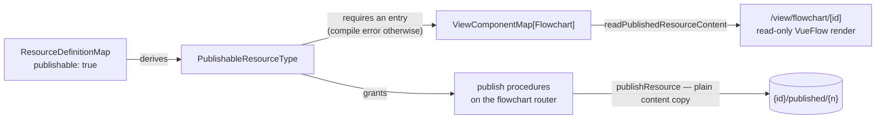

# Flowchart Publish

Flowchart opts into the **Publishable** capability, giving a diagram the same share unit as Dashboard, Webpage and Email: a public read-only render at `/view/flowchart/[id]`. Before this, a diagram was visible only to its logged-in owner inside the editor, and sharing one meant taking a screenshot.

This is the **minimal Publishable adoption** and the reference template for future types: a capability flag plus one view component. The publish procedures, the Publish and Unpublish commands, snapshotting and OG meta all arrive from the existing capability machinery — no bespoke code.

## How it works

Flowchart content references no other resources and no binary assets, so the publish snapshot is the plain content copy: neither `transformPublishedContent` nor `transformReadContent` is needed ([/docs/architecture/publishing](/docs/architecture/publishing)).

- **View component** — a VueFlow instance over the snapshot's nodes and edges with editing locked down: no dragging, no connecting, no selection. Pan and zoom stay on, since a large diagram is unreadable without them. Rendered under `<ClientOnly>` like the editor blade, because VueFlow reads the DOM at mount and cannot server-render.
- The view reuses the editor's `NodeTypeMap`, so a published diagram renders every node type exactly as the editor does.

## Key files

| File                                                             | Role                             |
| ---------------------------------------------------------------- | -------------------------------- |
| `packages/app/shared/services/resource/ResourceDefinitionMap.ts` | `publishable: true` on Flowchart |
| `packages/app/app/components/Resource/Flowchart/View.vue`        | read-only VueFlow renderer       |
| `packages/app/app/services/resource/ViewComponentMap.ts`         | Flowchart entry                  |

## Notes

- Sheet and TodoList are now the only non-publishable types, and stay that way on purpose: sharing data rows is the dataset and export path, and a todo list is personal working state. The type system guaranteeing the _absence_ of publish endpoints there is a feature of the capability model, not a gap.
- Image export of a diagram (PNG or SVG through the Portable capability) is a natural sibling but a separate decision — it needs a client-side rasterization dependency, so it is not bundled here.
