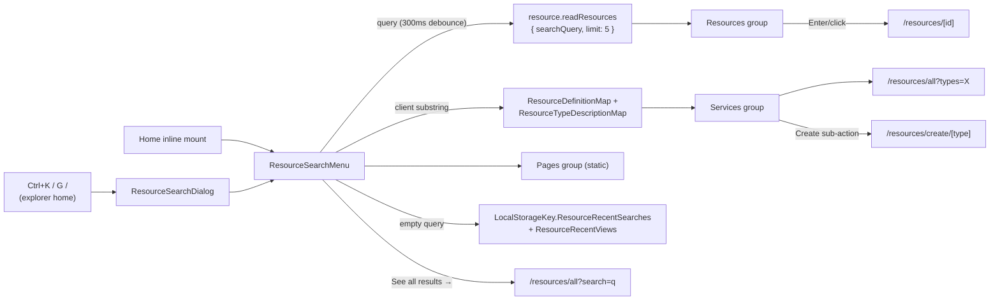

# Global Search

Azure-portal-faithful search over the resource platform: one `ResourceSearchMenu` combobox with an as-you-type dropdown grouped into Resources / Services / Pages, mounted inline on Home (portal landing parity) and as a `Ctrl+K` command-palette dialog, both from the explorer home page (`pages/resources/index.vue`) — the app bar is cross-product chrome (messaging, posts, games), so it carries no resource-search entry. No new backend — the Resources group rides `resource.readResources`, which ranks prefix matches first.

## How it works

With a query set the dropdown shows three groups plus a footer:

| Group     | Source                                                               | Row                                     | Target                                                        |
| --------- | -------------------------------------------------------------------- | --------------------------------------- | ------------------------------------------------------------- |
| Resources | debounced (300ms) `resource.readResources { searchQuery, limit: 5 }` | type icon · name · type caption         | `RoutePath.Resource(id)`                                      |
| Services  | client-side match over type titles + descriptions                    | type icon · title · "Create" sub-action | `/resources/all?types=X`; Create → `/resources/create/[type]` |
| Pages     | static `PageSearchItems`                                             | page icon · title                       | Home, All resources, Create a resource                        |
| footer    | always when a query is set                                           | "See all results →"                     | `/resources/all?search={q}`                                   |

- **Empty query**: two groups instead — recent searches (`LocalStorageKey.ResourceRecentSearches`, capped at 5, pushed on submit/pick) and recently viewed (`LocalStorageKey.ResourceRecentViews`, recorded by the resource page via `useRecordResourceView`). Both are per-device by design (localStorage).
- **Match highlight**: the matched substring is bolded in row titles (`ResourceSearchHighlightedTitle` over `getHighlightParts`).
- **No results**: a single "No resources found for '{q}'" row plus the See-all footer.
- `/resources/all` reads `?search=` and `?types=` on load, so the footer and Services rows deep-link into a pre-filtered list.

## Keyboard

- `Ctrl+K` opens the dialog mount on the explorer home page; `Esc` closes; `↑`/`↓` move through a flat list across groups (the See-all footer is the last option); `Enter` activates the selection, falling back to See-all when nothing is selected. The dialog mount traps focus (Vuetify dialog); the inline Home mount keeps normal document tab order.
- ARIA: the field is `role="combobox"` with `aria-expanded`/`aria-activedescendant`; the panel is `role="listbox"` with `role="option"` rows.
- Azure `G`-chords via `useResourceKeyboardShortcuts` (registered from the explorer home page): `G /` focuses search (opens the palette), `G A` → `/resources/all`. Chords are suppressed while focus is in an input/editor (`checkIsEditableTarget`).
- `?` opens `ResourceShortcutsOverlay`, a `StyledKeyboardShortcutsDialog` listing all bindings (`ResourceKeyboardShortcutList`).
- The messaging area keeps its own `Ctrl+K` room palette and `Shift+?` dialog; because the resource handlers only exist on the explorer home page, no route carve-out is needed.

## Relevance

`readResources` ranks prefix matches first, the remaining substring matches after, newest-first within each tier — `orderBy(desc(ilike(resources.name, prefix)), desc(resources.updatedAt))`, where `prefix` is the escaped search value with `%` appended, bound through the query builder. `createResourcesWhere` stays the single filter source. Typo tolerance via `pg_trgm` is open work ([proposal](/docs/proposals/platform/global-search-relevance)); Azure AI Search stays [deferred](/docs/platform/deferred/azure-ai-search).

## Key files

| File                                                        | Role                                                                                   |
| ----------------------------------------------------------- | -------------------------------------------------------------------------------------- |
| `app/components/Resource/Search/Menu.vue`                   | the combobox + panel (single source for both mounts); keyboard nav, select bookkeeping |
| `app/components/Resource/Search/ResultList.vue`             | grouped listbox rows, Create sub-action, See-all footer                                |
| `app/components/Resource/Search/HighlightedTitle.vue`       | bolds the matched substring in row titles                                              |
| `app/components/Resource/Search/Dialog.vue`                 | `Ctrl+K` overlay mount (`v-dialog` bound to `useSearchDialogStore`)                    |
| `app/components/Resource/ShortcutsOverlay.vue`              | `?` shortcuts help dialog                                                              |
| `app/pages/resources/index.vue`                             | explorer home — inline mount plus the dialog/overlay mounts and keyboard chords        |
| `app/composables/resource/search/useResourceSearchItems.ts` | debounce, grouping, recent-search persistence                                          |
| `app/composables/resource/search/useRecordResourceView.ts`  | records recently viewed resources from the resource page                               |
| `app/composables/resource/useResourceKeyboardShortcuts.ts`  | `Ctrl+K`, `G`-chords, `?` — keydown listener mounted with the explorer home page       |
| `app/services/resource/search/`                             | pure grouping/highlight/recents helpers (`getServiceSearchItems`, `pushRecent`, …)     |
| `server/trpc/routers/resource.ts`                           | prefix-match ranking in `readResources`                                                |

## Notes

- One component, two mounts — never two search implementations (Home vs overlay).
- Explorer-scoped, not app chrome — the app bar spans every product area, so it carries no resource-search button; each area owns its own palette (messaging precedent).
- The Services group answers "search matches type names" client-side ("survey" surfaces the Survey service row) — pushing type-title matching into the server `where` was rejected; the client already knows `ResourceDefinitionMap`. Seven types don't justify a fuzzy library; if the Pages/actions list ever grows, add `fuse.js`/`minisearch` (tiny, client-only) rather than server work.
- Recent searches/views are per-device by design (localStorage); server-side history is not worth a table.
- `G N` opens the [notifications](/docs/platform/notifications) bell panel — registered with the other `G`-chords.
