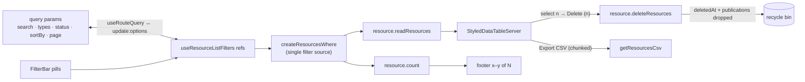

# List Filters & Views

Azure "All resources" parity for `/resources/all`: a filter-pill row, checkbox multi-select with bulk commands, a Manage-view column chooser, group-by-type, CSV export, and a refresh button — all state deep-linkable via query params. Everything is frontend + procedures on the existing `resource` router — no schema changes. The blade page's compact list box reuses the same `ResourceListView` with the workbench turned off (`:is-searchable="false"`).

## Filters

- **Filter-pill row** (`ResourceListFilterBar`): each active filter renders as a `v-chip` pill opening a `v-menu` editor; `+ Add filter` offers the remaining filters. A pill stays visible while empty ("all") until its ✕ removes it; a deep-linked value surfaces its pill automatically.
  - **Type** — multi-select over `ResourceDefinitionMap` (icon + title), bound to the `types` ref `useReadResources` accepts.
  - **Status** — Published/Draft; `isPublished?: boolean` on `resourceFilterInputSchema`, implemented as an `exists`/`notExists` on `resource_publications` inside `createResourcesWhere` (the one filter source for both `count` and `readResources`).
  - **Updated** — date-range presets (24h / 7d / 30d / custom), `gte`/`lte` on `updatedAt`, resolved at fetch time (`getResourceUpdatedRange`) so relative presets stay anchored to "now".
  - **Tag** — name + optional value ([tags](/docs/platform/tags)): a value pins the tag through jsonb containment, a name alone matches any value through key-existence.
- **URL state** (`useResourceListFilters`): `search`, `types`, `status`, `sortBy`, `page` mirror to query params via `useRouteQuery` (defaults drop out of the URL); `?search=` from Home stays the entry point. `sortBy` serializes to `key:order,…`. Named saved views are [deferred](/docs/platform/deferred/saved-views).

## Bulk operations

- `show-select` checkbox column; a selection toolbar replaces the filter row while items are selected (`n selected · Delete (n) · Export CSV · Save as blueprint · Clear`). `useResourceSelection` remembers full rows selected on other pages, since Vuetify's selection model only carries ids.
- `resource.deleteResources`: owner-scoped `inArray` soft delete returning the deleted rows, stamping `deletedAt` and dropping their publication rows — blobs stay put until purge ([recycle bin](/docs/platform/recycle-bin)). One confirm dialog listing the names, guarded by the [type-the-name guard](/docs/platform/resource-page-parity): a single selection types that resource's own name, and past one no single name identifies the set, so the phrase becomes `Delete {n} resources`.

## Views

- **Column chooser** ("Manage view"): checkbox `v-menu` over `ResourceHeaders`, hidden set persisted to `LocalStorageKey.ResourceListHiddenColumns`; the name column can never be hidden.
- **Group by type**: toolbar toggle mapping to the data table's `group-by`, section headers = type icon + title + count.
- **Footer parity**: "Showing x–y of N records" + page-size select (`items-per-page-options`).
- **Summary view**: a toolbar toggle swapping the table for per-type count cards over the same filters — see [summary view](/docs/platform/summary-view).

## Rows

- **Row click** is the single affordance for opening a resource — the name cell is plain text, not a competing link ([resource explorer](/docs/platform/resource-explorer)).
- **Context menu** on right-click (positioned `v-menu`, singleton), the same command list as the row `⋮` menu: Open in new tab, Copy link, Save as blueprint, Rename, Delete — the rename/delete dialogs are store-driven singletons (`useListDialogStore`). A plain **Open** command is deliberately absent, since clicking the row already does that.
- **Export CSV**: serializes the current filtered result via `getResourcesCsv`, re-querying the same filter in page-sized chunks up to `MAX_CSV_EXPORT_ROWS` — never a single query with the full count as its limit; hitting the cap truncates the export with a warning notification. Bulk-selection export uses the selected rows.
- **Refresh** re-runs `readResources` with the last options the table asked for.
- **Empty states**: filters active → "No resources match your filters" + Clear-filters action; otherwise the no-resources `StyledEmptyState`; load failure → error state with Retry (an inline alert when stale rows are still showing). Loading renders `StyledSkeleton` table rows; Home recents shows a list skeleton the same way.

## Flow

One filter state, mirrored to the URL, consumed by count + list:

## Procedures

| Procedure                                   | Auth                          | Input                                                         | Purpose                                           |
| ------------------------------------------- | ----------------------------- | ------------------------------------------------------------- | ------------------------------------------------- |
| `resource.readResources` / `resource.count` | authed                        | `isPublished?: boolean`, `updatedAfter?/updatedBefore?: Date` | status + date filters via `createResourcesWhere`  |
| `resource.deleteResources`                  | authed (owner-scoped `where`) | `ids: string[]` (unique, bounded)                             | bulk soft delete — `deletedAt` + publication rows |

## Key files

| File                                                    | Role                                                                     |
| ------------------------------------------------------- | ------------------------------------------------------------------------ |
| `app/components/Resource/List/View.vue`                 | the workbench orchestrator: toolbar, pills, selection, table, singletons |
| `app/components/Resource/List/FilterBar.vue`            | pill row + `+ Add filter` menu                                           |
| `app/components/Resource/List/SelectionToolbar.vue`     | `n selected · Delete (n) · Export CSV · Save as blueprint · Clear`       |
| `app/composables/resource/useResourceListFilters.ts`    | URL-synced filter state                                                  |
| `app/composables/resource/useReadResources.ts`          | filter input, chunked page reader for CSV export                         |
| `app/composables/resource/list/useReadResourcesPage.ts` | the shared paged reader: stale guard + filter-keyed count                |
| `app/composables/resource/list/useDebouncedFilter.ts`   | field ↔ filter bridge that debounces typing                              |
| `app/composables/resource/useExportResourcesCsv.ts`     | selected-rows + chunked full export with truncation warning              |
| `server/trpc/routers/resource.ts`                       | filter schema, `createResourcesWhere`, bulk delete                       |

## Notes

- Publish **status stays off the default columns** (the consolidation decision) — it appears only as an opt-in filter pill, not a column.
- One filter source: every filter lands in `createResourcesWhere` so `count` and `readResources` can never disagree.
- All filters funnel through the data table's `search` prop (a JSON key of the filter state) so Vuetify resets to page 1 and refires `update:options` on any change. That is also why every text filter — the search box and a tag pill's name and value — writes through `useDebouncedFilter` instead of per keystroke: a raw binding would reset to page 1 and re-run both queries on every character.
- `update:options` also fires for a page turn, a page-size change and a sort change, none of which move the total, so the count is keyed to the filter the user picked (`getResourceFilterKey`) and reused until that changes (or a mutation refreshes). The key is deliberately built from the **selection**, not from the input the queries send: a relative Updated preset anchors its boundary to the current time, so a key holding that resolved date would never repeat and every page turn would re-run the count. For the same reason `useReadResourcesPage` resolves the filter input once per read and hands the same one to both queries, so the total and the rows always describe the same window. The list and the [recycle bin](/docs/platform/recycle-bin) share that composable, which owns the keying and the latest-wins stale guard that keeps a slower earlier read from overwriting a fresher one.
