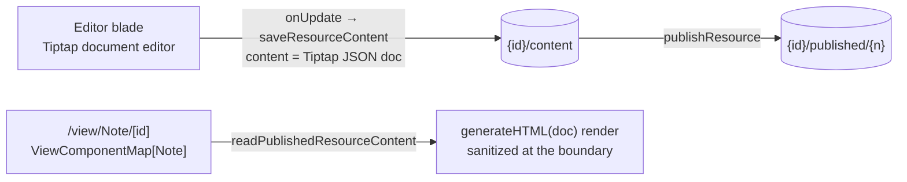

# Note resource

A Note is the platform's plain **document**: meeting notes, a spec, a README-style page — authored in Tiptap (already a dependency, powering the messaging editor) and shareable through the standard publish flow. It fills the gap between the spreadsheet (Sheet), the form (Survey), the site builder (Webpage), the BI canvas (Dashboard), the diagram (Flowchart), and the email — the everyday page of formatted text none of those were for.

## How it works

- **Content schema** — `{ doc: <Tiptap JSON document> }`. The ProseMirror JSON document, not HTML, is the source of truth at rest (structured, diffable later, no sanitization ambiguity when stored). The doc is validated as an open-ended recursive object per the resource content-schema standard, so any node a future Tiptap extension emits still round-trips.
- **Editor blade** — a Tiptap instance with the standard writing kit: headings, bullet and ordered lists, bold, italic, inline code, blockquote, and links. This is a superset of the messaging composer's marks; the two share the StarterKit extension set (`getNoteExtensions`) but stay separate editors — the messaging editor is a one-line composer with mentions, emoji, and a file handler, and forcing one shared editor would violate same-level abstraction. Edits autosave through `saveResourceContent` on the shared resource autosave cadence.
- **Published view** — Note is `publishable`. The public `/view/Note/[id]` page reads the published snapshot and renders `generateHTML(doc, extensions)` output with app typography. `generateHTML` comes from `@tiptap/html`, which serializes without a browser DOM, so the render is SSR-safe and SEO-friendly, and its HTML is sanitized with `sanitizeTextHtml` at the render boundary — the one place HTML ever exists for a Note.
- **Create form** is name-only. Everything else — explorer listing, create tile, blades, command bar, publish, search — arrives from the resource shell for free.

## Data model

Note owns no tables. It is one `ResourceType` enum value (`Note`, added to the `resource_type` Postgres enum by migration `20260717000000_add_note_resource_type`) and one `ResourceDefinitionMap` entry (`icon`, `title`, `contentSchema`, `capabilities: { publishable: true }`). Its working copy lives at `{id}/content` and its publish snapshots at `{id}/published/{n}` in the shared `ResourceAssets` blob container, exactly like every other resource — see [/docs/architecture/resources](/docs/architecture/resources).

## Key files

| File                                                                       | Role                                                    |
| -------------------------------------------------------------------------- | ------------------------------------------------------- |
| `packages/db-schema/src/models/resource/ResourceType.ts`                   | `Note` enum value                                       |
| `packages/app/server/db/migrations/20260717000000_add_note_resource_type/` | pg enum `ADD VALUE 'Note'` migration                    |
| `packages/app/shared/models/resource/note/NoteResource.ts`                 | `{ doc }` content schema + empty-document default       |
| `packages/app/shared/services/resource/ResourceDefinitionMap.ts`           | Note definition entry                                   |
| `packages/app/app/services/resource/note/getNoteExtensions.ts`             | shared Tiptap extension set (editor + published render) |
| `packages/app/app/components/Resource/Note/Editor.vue`                     | Tiptap editor blade                                     |
| `packages/app/app/components/Resource/Note/EditorMenuBar.vue`              | writing-kit toolbar                                     |
| `packages/app/app/components/Resource/Note/View.vue`                       | published `generateHTML` render                         |
| `packages/app/app/store/resource/note/index.ts`                            | blade-scoped load/save store                            |
| `packages/app/server/trpc/routers/note.ts`                                 | `createResourceProcedures(Note)` router                 |

## Notes

- **Naming is Note, never Document.** "Document" was the old pre-consolidation umbrella term for all editor resources and would be actively confusing here. The identifier is singular like every `ResourceType` value; a pluralized display title is a UX decision deferred to `ResourceDefinitionMap` across all types at once, never an identifier change.
- **JSON at rest, HTML only at render.** The editor stores `editor.getJSON()`; the view is the sole place HTML is produced, and it is sanitized there. No sanitization happens on the save path because nothing HTML is ever stored.
- **Extensibility cost.** Note landed as a live test of the one-`ResourceType`-plus-one-`ResourceDefinitionMap`-entry extensibility claim, and the claim is understated. Beyond the enum value, the definition entry, the editor component, and the view component, a new type also needs, one per file: a per-type tRPC router (`note.ts`) plus its registration in the root router, and a `[ResourceType.Note]: []` entry in the exhaustive `ResourceBladeDefinitionMap`. Making the type creatable from the explorer adds two more hand-maintained lists: `CreatableResourceTypes` and `ResourceTypeDescriptionMap`. None of these are the definition map — they are the router-per-type topology, the honest friction the test was meant to surface. The dispatch half has since been derived rather than listed: `useCreateResource` reaches the type's `createResource` through `useResourceRouter` and the type's own name, so no list of create procedures exists to keep in step.
- Collaboration, comments, and version history remain platform-wide deferrals ([collaboration](/docs/platform/deferred/document-collaboration), [comments](/docs/platform/deferred/resource-comments), [draft history](/docs/platform/deferred/draft-version-history)); Note rides whatever the platform decides. Markdown export (the Portable capability) is a natural follow-on, not bundled.
- Cost: one pg enum migration, one new dependency (`@tiptap/html` for the SSR-safe published render), zero new services.
