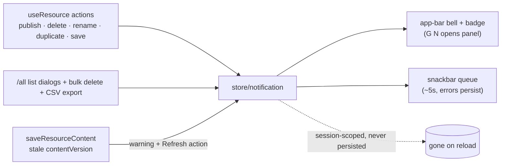

# Notifications Bell

Azure-portal notifications parity: resource operation outcomes (duplicated, published, deleted, save conflicts, mutation errors) land as toasts and accumulate in an app-bar bell panel. Client-only — a Pinia store, an app-bar bell with an unread badge, and one snackbar queue. No backend, no persistence (the portal's bell is effectively session-scoped too).

## Model

`AppNotification` (client model): `id`, `severity` (`success | info | warning | error`), `title`, `message?`, `action?` (`{ title, to? , handler? }`), `createdAt`, `isRead`.

Sources (fired from `useResource` and the `/all` list dialogs):

- duplicated → success + **Go to resource** action
- published v{n} / unpublished → success, with **Copy public link** action on publish
- deleted (single + bulk "n resources deleted") and CSV export completed/truncated
- save conflict (stale `contentVersion`) → warning with **Refresh** action ([resource page parity](/docs/platform/resource-page-parity))
- any mutation error → error severity with the message

## Flow

## UI

- **Bell** (`AppNotificationBell`, app bar, authed sessions): `v-badge` unread count, click opens a `v-menu` panel — newest first, severity icon, relative time, per-item dismiss, "Dismiss all", per-notification action button. Closing the panel marks everything read. Empty state: "No notifications".
- **Toasts** (`AppNotificationSnackbar`): one `v-snackbar` rendering the store's queue head (~5s, dismissible); errors persist until dismissed. One snackbar queue, never stacked ad-hoc snackbars.
- `G N` opens the panel ([global search](/docs/platform/global-search) chords).

## Key files

| File                                          | Role                                                 |
| --------------------------------------------- | ---------------------------------------------------- |
| `app/store/notification.ts`                   | session-scoped notification list + snackbar queue    |
| `app/components/App/NotificationBell.vue`     | app-bar bell + panel                                 |
| `app/components/App/NotificationSnackbar.vue` | single snackbar queue rendering the store head       |
| `app/components/App/NotificationBellItem.vue` | one panel row (severity icon, time, action, dismiss) |
| `app/models/notification/AppNotification.ts`  | client model                                         |

## Notes

- Deliberately not persisted (no table, no localStorage) — the value is immediate feedback + a session trail; durable history is the activity log's job ([activity log](/docs/platform/activity-log)).
- The store no-ops on the server (`getIsServer`) so SSR renders never enqueue toasts.
