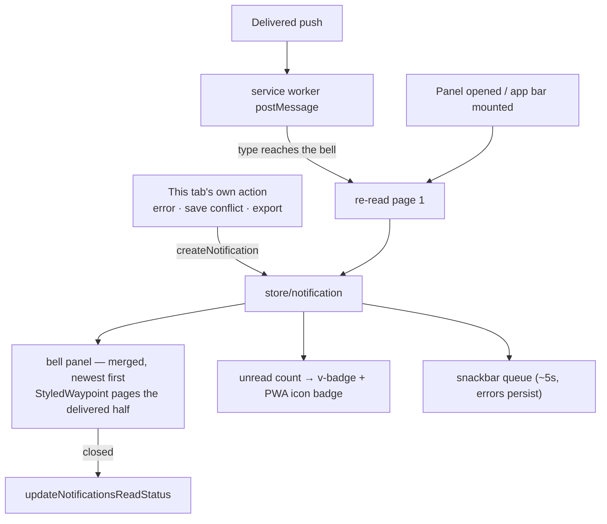

# Notifications Bell

Azure-portal notifications parity: an app-bar bell with an unread badge, one snackbar queue, and a panel of what has happened recently. It renders **two kinds of entry**, and the difference between them is the whole design:

- **Delivered** — a row the server wrote for this user through the one notification pipeline ([notifications](/docs/architecture/notifications)). It reached every device that was subscribed, it survives the reload, and it is paged in like any other list.
- **Local** — feedback about what this tab just did: a mutation error, a save conflict, an export that finished here. Nothing on another device could act on it and nothing needs it after the reload, so it is never written down.

Both render through one `AppNotification` shape, so the panel and the snackbar never branch on where an entry came from. Only the store knows, and only where it has to: dismissing a delivered entry is a mutation, dismissing a local one is a filter.

## Model

`AppNotification` (client model): `id`, `severity` (`NotificationSeverity`), `title`, `body`, `path`, `createdAt`, `isRead`, `action?`.

`severity` is taken straight off the `notifications` column, so the stored value and the rendered one cannot drift, and its values are Vuetify's own type tokens — a severity is handed to `v-icon` without a translation table.

`path` is the in-app route the row opens, and it is what a delivered notification carries instead of a button: the whole row is the link. `action` is the local half's affordance — an `isSingleUse` action (undo-style mutations, e.g. the delete toast's **Restore**) is consumed on success by `consumeNotificationAction`, stripping the button while keeping the entry as history, because a second fire from the panel would target state the first fire already changed. Repeatable actions (navigation links, **Copy public link**) stay clickable.

Local sources (fired from `useResourceStore` and the `/all` list dialogs) are the feedback the server has no business repeating:

- save conflict (stale `contentVersion`) → warning with **Refresh** action ([resource page parity](/docs/platform/resource-page-parity))
- any mutation error → error severity with the message
- CSV export completed/truncated, and the file exports that produce a local artifact

Resource operations — published, unpublished, duplicated, deleted, restored, purged — are both: the acting tab shows its toast synchronously with its undo action, and the same operation is published so the owner's other devices hear about it. One wording, `ResourceOperationTitleMap`, is what keeps the two from drifting.

## Flow

The service worker has always posted every delivered push to each open tab before showing the OS notification; the tab end of that wire is `plugins/pushNotification.client.ts`. It **re-reads** rather than rendering the payload it was handed — the row the Function wrote is the one the panel dismisses and marks read, so adopting the wire copy would put an entry in the list with an id the server would not recognise. Pushes whose type never asked for the bell are ignored there, which is what stops a query per chat message received.

## UI

- **Bell** (`AppNotificationBell`, app bar, authed sessions): `v-badge` unread count — rendered through VAvatar's `badge` **slot**, because the `badge` prop forces `dot` on whenever that slot is absent and a dot drops the number it was handed — click opens a `v-menu` panel — newest first, severity icon, relative time, per-item dismiss, "Dismiss all". Closing the panel marks everything read. The delivered half is cursor-paginated, with a `StyledWaypoint` at the foot of the list paging the next page in. Empty state: "No notifications".
- **Toasts** (`AppNotificationSnackbar`): one `v-snackbar` rendering the store's queue head (~5s, dismissible); errors persist until dismissed. One snackbar queue, never stacked ad-hoc snackbars.
- `G N` opens the panel ([global search](/docs/platform/global-search) chords).
- **App icon badge**: the same unread count is mirrored onto the installed PWA's icon through the Badging API, so an install that is not in the foreground still shows what is waiting. Best-effort — the write is feature-detected and its rejection is logged, never surfaced. It is now the honest count rather than the tab's guess: a push delivered while the app was closed is a row, and the next load counts it.

## Key files

| File                                                   | Role                                                    |
| ------------------------------------------------------ | ------------------------------------------------------- |
| `app/store/notification.ts`                            | the merged list, the snackbar queue, the two dismissals |
| `app/composables/notification/useReadNotifications.ts` | the paged read of the delivered half                    |
| `server/trpc/routers/notification.ts`                  | read page, dismiss one, dismiss all, mark all read      |
| `app/components/App/Notification/Bell.vue`             | app-bar bell + panel                                    |
| `app/components/App/Notification/Snackbar.vue`         | single snackbar queue rendering the store head          |
| `app/components/App/Notification/BellItem.vue`         | one panel row (severity icon, time, action, dismiss)    |
| `app/models/notification/AppNotification.ts`           | client model                                            |
| `app/plugins/pushNotification.client.ts`               | service-worker bridge into the running tab              |
| `app/plugins/appBadge.client.ts`                       | mirrors the unread count onto the PWA icon badge        |

## Notes

- The delivered half is bounded by retention rather than by the session ([notifications](/docs/architecture/notifications)); a durable audit trail is still the activity log's job ([activity log](/docs/platform/activity-log)).
- The store no-ops local notifications on the server (`getIsServer`) so SSR renders never enqueue toasts.
