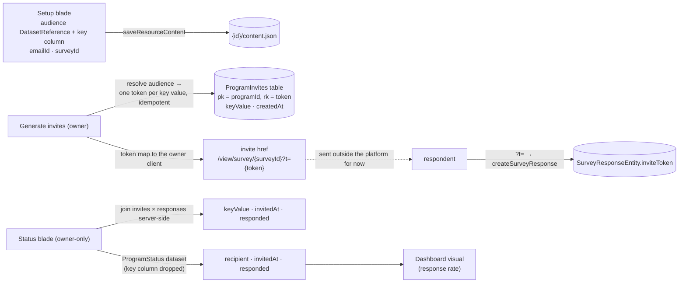

# Program Resource

A **Program** is the resource that orchestrates the end-to-end distribution loop the other resources deliberately don't know about. It binds an **audience** dataset (a Sheet of recipients), an **Email**, and a **Survey**; issues one opaque invite token per recipient; and joins those tokens back to responses into a per-recipient **status** — served through the standard dataset contract, so a dashboard can chart the funnel like any other data.

The shape is Logic-Apps-_positioned_ (orchestration is its own resource, the orchestrated resources stay pure) but deliberately not Logic-Apps-_shaped_: no trigger/action graph, no expression language — one domain, three bindings, one background-free run model. Extensibility lives in the content schema, not in a workflow engine.

## How it works

- **Content blob** — `{ audience: DatasetReference | null; emailId: string; keyColumn: string; surveyId: string }`. Bare ids like every cross-resource link, re-resolved on read and failing soft when a binding is deleted. `keyColumn` names the audience column identifying a recipient (an email address, a customer id) — a display and dedupe key that never leaves the server or the owner client.
- **Invite tokens** — `AzureTable.ProgramInvites`, partitionKey = program id, rowKey = token (a UUID), storing the recipient's key value and `createdAt`. **Generate invites** resolves the audience dataset and creates one entity per distinct key value, idempotently: re-running after the audience grows issues only the missing tokens and never rotates an existing one, because a rotated token would dead-link an invite already sent. Tokens are meaningless outside this table, resolution is owner-gated, and respondents present them without ever decoding them.
- **Status** — invites × responses, joined server-side, on two surfaces with deliberately different shapes:
  - the **Status blade** — owner-only, never a dataset; columns `keyValue · invitedAt · responded`, so the owner can see _who_ hasn't answered.
  - the **`ProgramStatus` dataset provider** — columns `recipient · invitedAt · responded`, where `recipient` is the opaque invite token, never `keyValue`. A dataset flows into dashboards, and a dashboard is publishable, so its snapshot is a public read. Putting the key column into the dataset would make publishing a funnel chart leak the recipient list, so it never enters the dataset at all. Response-rate charting needs counts and dates, not identities; anything genuinely per-recipient is blade work, not chart work.
- **Blades** — Overview, Setup (the three pickers, reusing `DatasetReferencePicker`), and Status. There is no Editor blade: a program has no canvas.
- **Lifecycle** — standard resource create/save/delete; `deleteResource` also clears the program's invite partition, declared through `ResourceOwnedTablesMap`. Deleting the bound survey leaves status readable — invites persist, responses are gone — the same fail-soft posture as every dangling reference.

## Procedures

| Procedure                | Auth  | Input    | Purpose                                                           |
| ------------------------ | ----- | -------- | ----------------------------------------------------------------- |
| `generateProgramInvites` | owner | `{ id }` | resolve the audience, issue missing tokens, return the token map  |
| `readProgramStatus`      | owner | `{ id }` | joined invited × responded rows (also backs the dataset provider) |

Plus the full `createResourceProcedures(ResourceType.Program)` set. Token _validation_ on response writes lives in the survey router ([response modes](/docs/platform/survey-response-modes)) — the program is the issuer, the survey is the gate.

## Key files

| File                                                                             | Role                               |
| -------------------------------------------------------------------------------- | ---------------------------------- |
| `packages/db-schema/src/models/resource/ResourceType.ts`                         | the `Program` type value           |
| `packages/db-schema/src/models/program/ProgramInviteEntity.ts`                   | the invite entity                  |
| `packages/app/shared/models/resource/program/ProgramResource.ts`                 | audience/key/email/survey bindings |
| `packages/app/server/trpc/routers/program.ts`                                    | factory + invites + status         |
| `packages/app/server/services/program/generateProgramInvites.ts`                 | idempotent token issuance          |
| `packages/app/server/services/dataset/programStatus/readProgramStatusDataset.ts` | the `ProgramStatus` provider       |
| `packages/app/app/components/Resource/Program/Setup.vue`                         | the bindings blade                 |
| `packages/app/app/components/Resource/Program/Status.vue`                        | the funnel blade                   |

## Notes

- **Naming.** _Program_ — generic enough to stay honest when it later orchestrates more than one email-and-survey wave, specific enough to read as "a thing that runs a plan". Considered and set aside: **Campaign** (marketing-suite connotation, ties the type to one use case), **Flow** (collides with the Flowchart resource), **Workflow**/**Automation** (promise a trigger/action engine this deliberately isn't), **Journey** (jargon).
- **Deliberately not a workflow engine.** A general trigger/condition/action resource would need an event bus ([rejected](/docs/platform/rejected/generic-event-bus)), background execution, and retry semantics — for one current domain. The program's content schema is the extension seam: reminder emails to non-responders, send scheduling, and the actual send run (when [email sending](/docs/platform/deferred/email-sending) un-defers, the program is its unit of execution) all extend this schema without a new platform layer.
- Sending remains outside the platform: the program produces correct tokened links, and delivery is manual. That keeps the whole feature free of new Azure services while building the exact foundation sending needs.
- The canonical "responses × audience" join is purpose-built rather than routed through a generic join engine, which keeps [dataset joins](/docs/platform/deferred/dataset-joins) deferred.
- One program per send-wave: re-running against a grown audience extends the same program; a genuinely new wave (new email, same audience) is a new program — Duplicate covers the setup copy.
