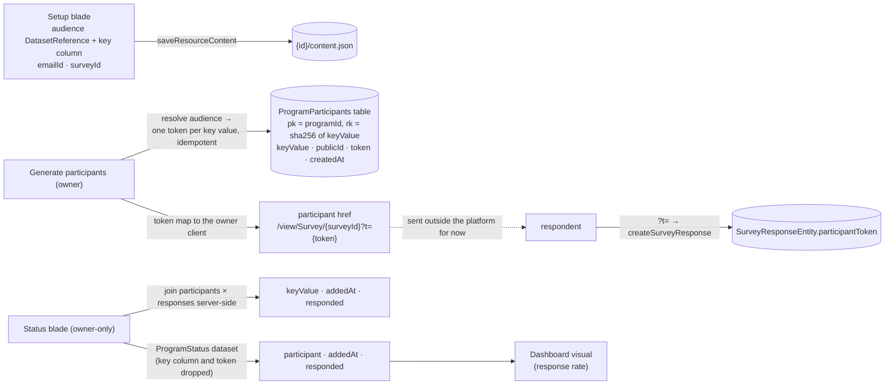

# Program Resource

A **Program** is the resource that orchestrates the end-to-end distribution loop the other resources deliberately don't know about. It binds an **audience** dataset (a Sheet of people), an **Email**, and a **Survey**; issues one opaque token per **participant**; and joins those tokens back to responses into a per-participant **status** — served through the standard dataset contract, so a dashboard can chart the funnel like any other data.

The shape is Logic-Apps-_positioned_ (orchestration is its own resource, the orchestrated resources stay pure) but deliberately not Logic-Apps-_shaped_: no trigger/action graph, no expression language — one domain, three bindings, one background-free run model. Extensibility lives in the content schema, not in a workflow engine.

## How it works

- **Content blob** — `{ audience: DatasetReference | null; emailId: string; keyColumn: string; surveyId: string }`. Bare ids like every cross-resource link, re-resolved on read and failing soft when a binding is deleted. `keyColumn` names the audience column identifying a participant (an email address, a customer id) — a display and dedupe key that never leaves the server or the owner client.
- **Participants** — `AzureTable.ProgramParticipants`, partitionKey = program id, rowKey = the sha256 of the key value, storing that `keyValue`, a `publicId`, the `token`, and `createdAt`. **Generate participants** resolves the audience dataset and creates one entity per distinct key value, idempotently: re-running after the audience grows issues only the missing tokens and never rotates an existing one, because a rotated token would dead-link a link already sent.
- **Why the key is the key value, not the token** — one person can hold only one token, and only storage can enforce that. Deriving the rowKey from the key value makes the insert itself the uniqueness check: a concurrent second generate loses with a 409 and adopts the winner's token instead of minting a rival. A random rowKey cannot do this — every racing write would be a distinct row, and no read-then-write above it can close the gap. The token stays a UUID in its own column precisely because it must be unguessable, and a key the caller cannot predict is a key storage cannot deduplicate on. The hash leaks nothing the row does not already store in plain text; it exists only because a rowKey cannot hold an arbitrary email address. Resolving a token back to a participant is therefore a single-partition scan rather than a point read — the identity owns the key, and only one of the two can.
- **Status** — participants × responses, joined server-side. The join itself matches on the `token` and carries the `publicId`, and **neither ever leaves the server**: each of the two surfaces projects only the columns it renders, so a participant identifier reaches a client only where that client displays it.
  - the **Status blade** — owner-only, never a dataset; columns `keyValue · addedAt · responded`, so the owner can see _who_ hasn't answered. The owner is entitled to the tokens, but the blade renders none of them and a credential nothing displays is a credential the response has no reason to carry.
  - the **`ProgramStatus` dataset provider** — columns `participant · addedAt · responded`, where `participant` is the non-secret `publicId`, never `keyValue` and never the token. A dataset flows into dashboards, and a dashboard is publishable, so its snapshot is a public read. Putting the key column into the dataset would make publishing a funnel chart leak the participant list; publishing the token would hand every viewer the ability to respond as that participant. Response-rate charting needs counts and dates, not identities; anything genuinely per-participant is blade work, not chart work.
- **Blades** — Overview, Setup (the three pickers, reusing `DatasetReferencePicker`), and Status. There is no Editor blade: a program has no canvas.
- **Lifecycle** — standard resource create/save/delete; the program's participant partition is declared through `ResourceOwnedTablesMap`, which is what `purgeResource` reads to clear it — a delete is soft and leaves the partition intact for the [recycle bin](/docs/platform/recycle-bin) window, so a restored program still knows its participants. Deleting the bound survey leaves status readable — participants persist, responses are gone — the same fail-soft posture as every dangling reference.

## Procedures

| Procedure                     | Auth  | Input    | Purpose                                                              |
| ----------------------------- | ----- | -------- | -------------------------------------------------------------------- |
| `generateProgramParticipants` | owner | `{ id }` | resolve the audience, issue missing tokens, return the token map     |
| `readProgramStatus`           | owner | `{ id }` | joined `keyValue · addedAt · responded` rows — no token, no publicId |

Plus the full `createResourceProcedures(ResourceType.Program)` set. Token _validation_ on response writes lives in the survey router ([response modes](/docs/platform/survey-response-modes)) — the program is the issuer, the survey is the gate.

## Key files

| File                                                                             | Role                                          |
| -------------------------------------------------------------------------------- | --------------------------------------------- |
| `packages/db-schema/src/models/resource/ResourceType.ts`                         | the `Program` type value                      |
| `packages/db-schema/src/models/program/ProgramParticipantEntity.ts`              | the participant entity + its key              |
| `packages/app/shared/models/resource/program/ProgramResource.ts`                 | audience/key/email/survey bindings            |
| `packages/app/server/trpc/routers/program.ts`                                    | factory + participants + status               |
| `packages/app/server/services/program/generateProgramParticipants.ts`            | idempotent token issuance                     |
| `packages/app/server/services/program/getProgramParticipantId.ts`                | the key value → rowKey derivation             |
| `packages/app/server/services/program/readProgramStatusRows.ts`                  | the server-only participants × responses join |
| `packages/app/server/services/dataset/programStatus/readProgramStatusDataset.ts` | the `ProgramStatus` provider                  |
| `packages/app/app/components/Resource/Program/Setup.vue`                         | the bindings blade                            |
| `packages/app/app/components/Resource/Program/Status.vue`                        | the funnel blade                              |

## Notes

- **Naming.** _Program_ — generic enough to stay honest when it later orchestrates more than one email-and-survey wave, specific enough to read as "a thing that runs a plan". Considered and set aside: **Campaign** (marketing-suite connotation, ties the type to one use case), **Flow** (collides with the Flowchart resource), **Workflow**/**Automation** (promise a trigger/action engine this deliberately isn't), **Journey** (jargon).
- **Naming.** _Participant_ — the row is a person in the audience holding a credential, and it exists whether or not anything was ever sent to them. It was called an _invite_, which named it after a message that does not exist yet: when [email sending](/docs/platform/deferred/email-sending) un-defers, the invite is the thing delivered _to_ a participant, and the word has to be free for it. _Invite_ was already the room-invite code in messaging, too. Considered and set aside: **Recipient** (presumes a send, drifting back to the same collision), **Enrollment** (accurate but formal, and the verb pair buys nothing here).
- **Deliberately not a workflow engine.** A general trigger/condition/action resource would need an event bus ([rejected](/docs/platform/rejected/generic-event-bus)), background execution, and retry semantics — for one current domain. The program's content schema is the extension seam: reminder emails to non-responders, send scheduling, and the actual send run (when [email sending](/docs/platform/deferred/email-sending) un-defers, the program is its unit of execution) all extend this schema without a new platform layer.
- Sending remains outside the platform: the program produces correct tokened links, and delivery is manual. That keeps the whole feature free of new Azure services while building the exact foundation sending needs.
- The canonical "responses × audience" join is purpose-built rather than routed through a generic join engine, which keeps [dataset joins](/docs/platform/deferred/dataset-joins) deferred.
- One program per send-wave: re-running against a grown audience extends the same program; a genuinely new wave (new email, same audience) is a new program — Duplicate covers the setup copy.
