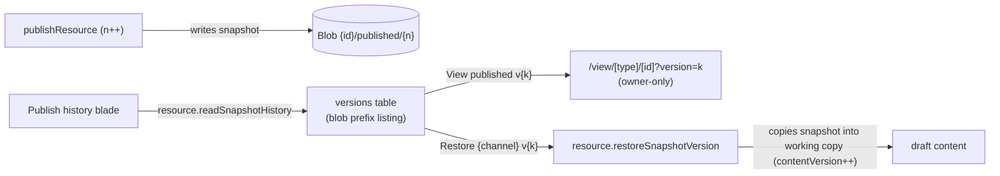

# Publish history

Every publishable resource gets a **Publish history** blade: a table of the resource's retained snapshots with when each was taken, a command to open a published version's public render, and a command to restore any version's content into the current draft. The table holds both [snapshot channels](/docs/proposals/platform/resource-snapshots) — published versions and the revisions taken of the working copy — so a row says which channel it belongs to rather than leaving its ordinal to imply it. It is the first capability-conditional built-in blade — it appears only for [publishable](/docs/architecture/publishing) resource types.

## How it works

Publishing already writes an immutable snapshot to `{id}/published/{publishVersion}` and bumps `publishVersion` on the `resource_publications` row ([publishing](/docs/architecture/publishing)). Prior snapshots are never deleted on re-publish — only unpublish (which clears the whole `{id}/published` subtree) and delete remove them — so the retained blobs are already a complete history, and the blade needs no extra table.

- **One list, two address spaces** — the endpoint reads each channel's prefix and merges them newest-first **by time**, never by number: the channels number independently, so an ordinal says nothing about where a row belongs once they share a list. A row is therefore chosen by its channel title, its label and its time, and every command it offers is qualified by its channel — a version alone names one snapshot per channel, and a command keyed on the number alone acts on whichever of them a map happened to keep. Only a published row offers **View**: a revision is a point to return to and has no rendered form of its own.
- **List** — `resource.readSnapshotHistory` enumerates a channel's `{id}/{channel}/{n}.json` blobs under its own prefix as a hierarchy listing, so the per-publish asset subdirectories beside the published ones are skipped. Each row carries the version number, the snapshot timestamp from the blob `lastModified`, and a "current" badge on the version the `resource_publications` row names as live. The badge is never derived from the listing: unpublish drops the row and sweeps the prefix through a best-effort event, so a republish moments later restarts numbering at 1 while snapshots 1..n are still on disk — "highest version wins" would then badge a retired snapshot as live while the public route served the new version 1. No row means nothing is published, so nothing is current.
- **View a version** — the public view route gains an optional `version` query param. When it is present the renderer loads `{id}/published/{k}` through an owner-only read; the snapshot's stable asset urls resolve through `/api/resource-assets` without any content rewriting. Which of that endpoint's two published-asset paths answers depends on the resource, not on the version being viewed: while a publication row exists every `{id}/published/…` asset is served anonymously, retained snapshots included, and only once the resource is unpublished does the owner fallback carry them — and then only for a direct request, since the sandboxed `srcdoc` iframe a published view renders in sends no cookies. Anonymous visitors never pass the param and always get the latest publish, so public behaviour is unchanged, and a non-owner passing one is rejected server-side.
- **Restore** — `resource.restoreSnapshotVersion` takes the channel alongside the version, copies that snapshot's content into the working copy and bumps `contentVersion` in one transaction, then lands the owner in the Editor blade. It never re-points the publication — a restore produces a draft to review and re-publish, mirroring the [recycle bin](/docs/platform/recycle-bin) restore-returns-a-Draft rule.
- **A restore is a content write like any other**, so it goes through the shared `saveResourceContent` service ([resources](/docs/architecture/resources)): the `contentVersion` bump and the blob write land in one transaction, the type's after-save hook re-derives what the restored content declares, and the [activity](/docs/platform/activity-log) trail records a `Restored` entry, as the recycle bin's own restore does. **No open editor adopts the restored content**, though. The `onSaveResourceContent` event the service emits is filtered to the owner's _other_ devices, so no tab of the session that restored ever sees it, and no publishable type subscribes to that stream client-side anyway — TodoList is the only subscriber and it is not publishable. An editor left open on the resource therefore keeps the pre-restore draft and the version it cached, and its next autosave is rejected as stale until it reloads. Closing that gap means a publishable type subscribing, not a change to the restore path.
- A published snapshot's **assets are cloned back into the working copy**, not referenced where they sit (`cloneContentAssets(content, id)` — the same call the duplicate path makes). A published snapshot embeds `{id}/published/{publishId}/…` urls, and unpublish wipes that whole prefix ([blob lifecycle](/docs/architecture/blob-lifecycle)): restoring the blob verbatim would hand the draft urls a later unpublish deletes, and re-publishing that draft would ship the same dead urls with re-uploading every asset as the only recovery. A revision is cloned back from nothing, because it never cloned anything: its urls already name the live `{id}/files/…` the working copy points at, so a clone would mint a second copy of every asset the resource already holds and charge its owner for it on every restore.

Retention stays "keep everything" — there is no prune step. A prune command would be a separate decision.

## Procedures

| Procedure                            | Auth                | Input                      | Purpose                                            |
| ------------------------------------ | ------------------- | -------------------------- | -------------------------------------------------- |
| `resource.readSnapshotHistory`       | `getOwnerProcedure` | `{ id }`                   | list snapshot versions from a blob prefix listing  |
| `resource.restoreSnapshotVersion`    | `getOwnerProcedure` | `{ channel, id, version }` | copy a snapshot's content into the working copy    |
| `{type}.readPublishedVersionContent` | `getOwnerProcedure` | `{ id, version }`          | owner-only read of one snapshot for the view route |

## Key files

| File                                                         | Role                                               |
| ------------------------------------------------------------ | -------------------------------------------------- |
| `app/components/Resource/PublishHistory/Index.vue`           | blade — versions table with View and Restore       |
| `app/components/Resource/PublishHistory/RestoreDialog.vue`   | restore confirmation dialog                        |
| `server/services/resource/snapshot/readSnapshotHistory.ts`   | blob prefix enumeration into version rows          |
| `server/trpc/routers/resource.ts`                            | `readSnapshotHistory` and `restoreSnapshotVersion` |
| `server/trpc/procedure/resource/createResourceProcedures.ts` | `readPublishedVersionContent` (publishable types)  |
| `app/pages/view/[type]/[id].vue`                             | owner-only `version` query param                   |

## Notes

- The blade is registered as `ResourceBladeType.PublishHistory` and rendered only for `PublishableResourceType`, so `BladeNav` gates it with the same `hasCapability(type, "publishable")` check the command bar uses for its Publish command.
- After an unpublish the version numbering restarts at 1, because unpublish deletes the publication row and publishes the snapshot prefix for deletion. That sweep is best-effort and asynchronous, so a republish can land while the old snapshots are still present — which is exactly why the live version is read from the publication row rather than inferred from which snapshots exist.
