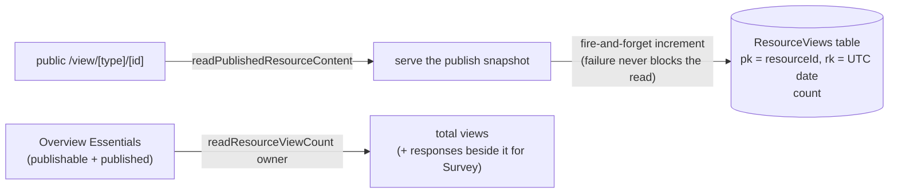

# Published View Analytics

A published link is otherwise a one-way door: an owner exports fifty invites and the only signal back is whichever respondents finish. A best-effort view counter on `readPublishedResourceContent`, surfaced on the Overview blade, makes the middle of the funnel visible for **every** publishable type — how many opened the dashboard, the webpage, the survey. For surveys, views against responses is the completion rate.

This is explicitly **not** an analytics product: no unique-visitor identification (no cookies, no IP storage), no referrer capture, no time-series UI. A total plus a per-day bucket, so a future chart is possible without rework. Deliberately approximate.

## How it works

- **Storage** — `AzureTable.ResourceViews`, partitionKey = resource id, rowKey = the UTC date, with a single `count` property. Daily buckets keep entities small and make "views this week" a partition range scan later.
- **Increment** — an optimistic read-modify-write with a bounded retry. Every failure, including exhausting the retries under concurrency, drops the count: the read path must never fail or slow because of telemetry. Counting happens only after the read is guaranteed to succeed, so a 404 never lands in the buckets. Rate limiting on the public read already bounds write volume.
- **Read** — `readResourceViewCount({ id })`, owner-gated, sums the partition over a capped scan. Magnitudes matter more than precision.
- **Surface** — Overview Essentials gains a **Views** row for published resources. The Survey Overview places it beside the response count ([response management](/docs/platform/survey-response-management)) — the funnel in two numbers.
- **Delete and unpublish** — the partition is cleared by `purgeResource`, not by delete: a soft-deleted resource keeps its counts for the whole [recycle bin](/docs/platform/recycle-bin) window, so a restore restores the history too. Unpublishing leaves history intact as well, so re-publishing continues the same counter. The count is the resource's audience, not the version's.

## Procedures

| Procedure               | Auth  | Input    | Purpose           |
| ----------------------- | ----- | -------- | ----------------- |
| `readResourceViewCount` | owner | `{ id }` | summed view count |

The increment is internal to the public read, not a procedure.

## Key files

| File                                                                      | Role                                               |
| ------------------------------------------------------------------------- | -------------------------------------------------- |
| `packages/db-schema/src/models/resource/ResourceViewEntity.ts`            | the day-bucket entity                              |
| `packages/app/server/services/resource/incrementResourceViewCount.ts`     | the fire-and-forget increment                      |
| `packages/app/server/services/resource/readResourceViewCount.ts`          | the summed read                                    |
| `packages/app/server/trpc/procedure/resource/createResourceProcedures.ts` | increment on the public read + the count procedure |
| `packages/app/app/components/Resource/Overview.vue`                       | the Views row                                      |

## Notes

- Riding `createResourceProcedures` makes this automatic for every current and future publishable type — no per-type wiring, consistent with the capability model. It is gated by the same `publishable` seam as the publish procedures: a type with no public URL has no views to count.
- It counts views of the _content read_, so SSR/proxy prefetches and one person refreshing five times all count. The UI says "views", never "visitors". Precision is not the point; direction and magnitude are.
- This is platform-side counting, not client analytics — no script on the view page, nothing for ad-blockers to eat, and it works for OG-unfurl bots too (which is fine at this fidelity).
- Per-version stats are out of scope; they would belong to [publish history](/docs/platform/publish-history) if ever needed.
