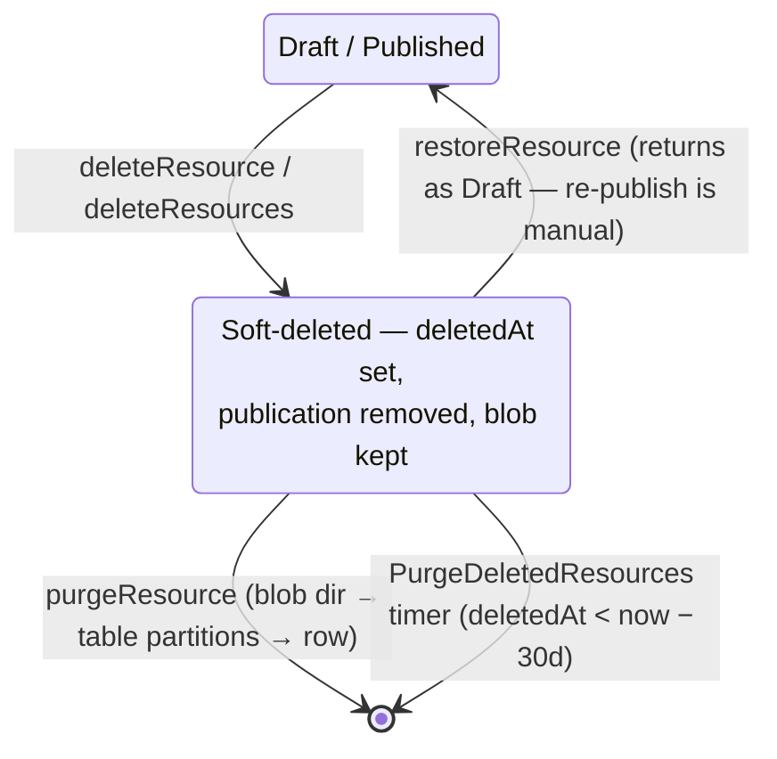

# Recycle Bin

Deleting a resource marks it rather than destroying it. `/resource-explorer/recycle-bin` lists what you deleted, restores it, or destroys it for good, and a timer sweeps anything older than 30 days.

## How it works

A Sheet or a Survey can hold hours of work behind a single Delete button. The type-the-name guard makes that click deliberate, but deliberate and correct are different things — an undo window costs one column.

Deleting sets `deletedAt` and drops the publication row. The content blob and the `{id}/` directory survive untouched; that is precisely what makes restore possible. Every read already funnels through `getResourcesWhere`, so excluding the bin is one predicate, and `getOwnerProcedure` rejects soft-deleted ids so a binned resource's page 404s. Restore and purge need the opposite, so both take the guard's `isDeletedOnly` mode.

Publication removal is deliberate: **restore returns a Draft**. Silently resurrecting a public URL because someone undid a delete would be surprising in the worst direction, so the notification says "restored as a draft" rather than letting the owner discover it later.

### The purge protocol

`purgeResource` in `@esposter/db` is shared by the procedure and the timer, and its ordering is the whole design: **blob directory, then dependent Azure Table partitions, then the Postgres row last**.

The row is the durable marker. A partial failure leaves it behind, so the next pass re-drives the whole sequence from the top; blob and table deletes treat already-gone as success, which is what makes replaying safe. Delete the row first and a failure halfway through orphans a blob directory nobody will ever look for again.

The timer purges per resource rather than as one batch, so one poisoned resource cannot block the sweep — its row survives and the next tick retries it, while everything else is already gone. That is also why its per-resource failures log instead of rethrowing: a rethrow would strand the resources this pass already purged behind a retry of the whole batch.

## Data model

`resources.deletedAt` is a nullable timestamp — null is live. It costs no migration: `metadataSchema` already gives every table `createdAt`, `updatedAt` and `deletedAt`, so soft delete rides a column the table already has.

`RECYCLE_BIN_RETENTION_MS` (30 days) lives in `@esposter/db-schema` — browser-safe, so both the app UI (the "purges in {n} days" column, the delete dialogs) and the purge timer can import the one value from the same source.

## Procedures

| Procedure                                                              | Auth                    | Input      | Purpose                                      |
| ---------------------------------------------------------------------- | ----------------------- | ---------- | -------------------------------------------- |
| `<type>.deleteResource` / `resource.deleteResources`                   | owner                   | unchanged  | Set `deletedAt`, delete the publication row  |
| `resource.readDeletedResources` / `resource.readDeletedResourcesCount` | authed                  | pagination | The caller's own bin list                    |
| `resource.restoreResource`                                             | owner (`isDeletedOnly`) | `{ id }`   | Clear `deletedAt`, append a `Restored` entry |
| `resource.purgeResource`                                               | owner (`isDeletedOnly`) | `{ id }`   | Hard delete blob dir, activity, then the row |

## Key files

| File                                                              | Role                                      |
| ----------------------------------------------------------------- | ----------------------------------------- |
| `packages/db/src/services/resource/purgeResource.ts`              | The shared, retry-ordered purge protocol  |
| `packages/db-schema/src/services/resource/constants.ts`           | `RECYCLE_BIN_RETENTION_MS`                |
| `server/trpc/routers/resource.ts`                                 | Bin/restore/purge + the `where` predicate |
| `server/trpc/procedure/resource/getOwnerProcedure.ts`             | Soft-delete guard + `isDeletedOnly` mode  |
| `packages/azure-functions/src/functions/purgeDeletedResources.ts` | Daily 30-day timer sweep                  |
| `app/pages/resource-explorer/recycle-bin.vue`                     | The bin page                              |
| `app/composables/resource/list/useReadResourcesPage.ts`           | The paged reader it shares with `/all`    |

## Notes

- Delete confirmations say the resource moves to the bin for 30 days; the post-delete toast offers **Restore** directly, so the common undo never needs a trip to the bin. A bulk delete links to the bin instead — restoring twelve things one toast button at a time is not an undo.
- Purge keeps the type-the-name guard. It is the only destroy that is now real. The bin reads through the same [`useReadResourcesPage`](/docs/platform/list-filters-and-views) as `/all`, so paging quickly or refreshing mid-read can never leave the table showing an earlier page's rows — a purge fired from a stale row is unrecoverable in a way a stale list elsewhere is not.
- Dataset references to a soft-deleted source fail exactly as they did under hard delete ([dangling dataset references](/docs/platform/deferred/dangling-dataset-references)); restore heals them.
- Names are not unique, so a restore can never conflict.
- The [activity log](/docs/platform/activity-log) partition survives the bin window — history outlives the delete, and restore appends `Restored` to it. The sweep runs at purge time, before the row goes.
