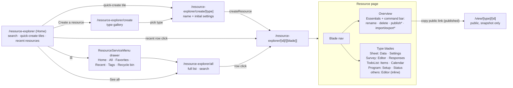
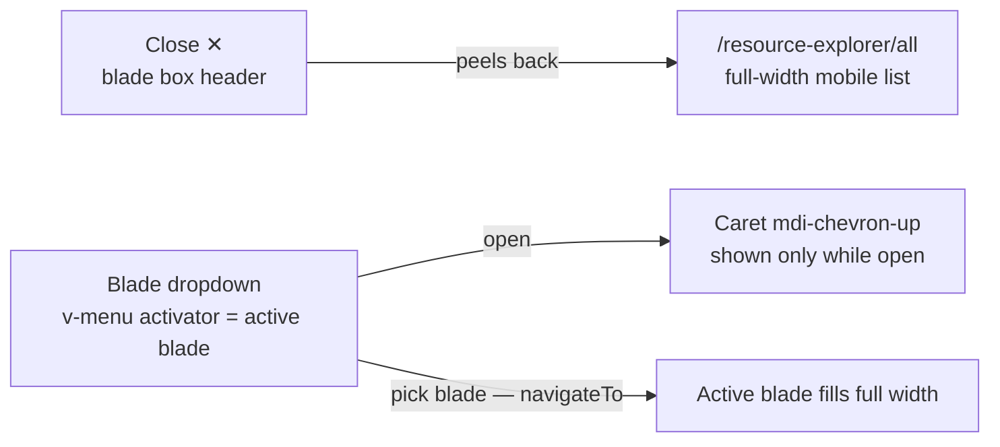
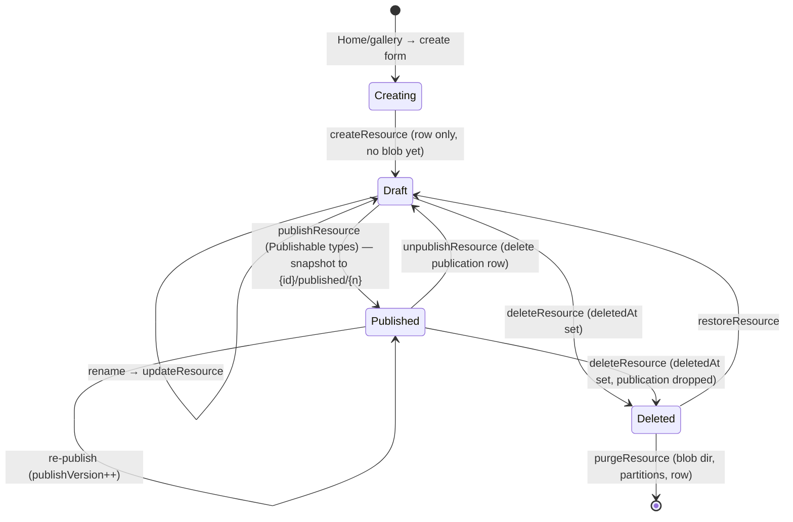

# Resource Explorer

The single Azure-portal-like UI for every resource: one list, one resource page with capability-aware blades, one public view route. It replaced the documents hub and all per-editor top-level pages — the shell is driven entirely by `ResourceDefinitionMap` ([/docs/architecture/resources](/docs/architecture/resources)). Azure Portal is the UX reference, deliberately literal: Home mirrors the portal landing, Create mirrors the marketplace (a page per resource type, never a modal).

| Azure portal                    | Resource Explorer                                                                                    |
| ------------------------------- | ---------------------------------------------------------------------------------------------------- |
| Home (search + recents)         | `/resource-explorer`                                                                                 |
| Service left menu               | `ResourceServiceMenu` ([resource service menu](/docs/platform/resource-service-menu))                |
| All resources list              | `/resource-explorer/all`                                                                             |
| Create a resource (marketplace) | `/resource-explorer/create` gallery → `/resource-explorer/create/[type]`                             |
| Resource menu (left nav)        | blade menu on `/resource-explorer/[id]/[[blade]]`                                                    |
| Overview + Essentials           | Overview blade with Essentials panel                                                                 |
| Toolbar commands                | Refresh/Rename/Delete/Duplicate always; Publish/Import/Export by capability                          |
| Breadcrumbs                     | the click path only, current page as the title ([breadcrumb trail](/docs/platform/breadcrumb-trail)) |

## Routes

| Route                               | Page                                                | Purpose                                                                                                            |
| ----------------------------------- | --------------------------------------------------- | ------------------------------------------------------------------------------------------------------------------ |
| `/resource-explorer`                | `pages/resource-explorer/index.vue` (auth)          | Home — search + quick-create + recent resources                                                                    |
| `/resource-explorer/all`            | `pages/resource-explorer/all.vue` (auth)            | full list (all types, search)                                                                                      |
| `/resource-explorer/favorites`      | `pages/resource-explorer/favorites.vue` (auth)      | the same list over starred resources ([service menu](/docs/platform/resource-service-menu))                        |
| `/resource-explorer/recents`        | `pages/resource-explorer/recents.vue` (auth)        | the same list over opened resources, newest open first                                                             |
| `/resource-explorer/tags`           | `pages/resource-explorer/tags.vue` (auth)           | tag names + resource counts, linking into `/all` pre-filtered                                                      |
| `/resource-explorer/recycle-bin`    | `pages/resource-explorer/recycle-bin.vue` (auth)    | soft-deleted resources — restore or purge ([recycle bin](/docs/platform/recycle-bin))                              |
| `/resource-explorer/create`         | `pages/resource-explorer/create/index.vue` (auth)   | create gallery — type picker (marketplace)                                                                         |
| `/resource-explorer/create/[type]`  | `pages/resource-explorer/create/[type].vue` (auth)  | per-type create form (name + initial settings) → `/resource-explorer/[id]`                                         |
| `/resource-explorer/[id]/[[blade]]` | `pages/resource-explorer/[id]/[[blade]].vue` (auth) | resource page; omitted blade = Overview; blade validated in route middleware                                       |
| `/view/[type]/[id]`                 | `pages/view/[type]/[id].vue` (public)               | published view, dispatched via `ViewComponentMap` ([/docs/architecture/publishing](/docs/architecture/publishing)) |

`all`, `favorites`, `recents`, `tags`, `recycle-bin` and `create` are static segments so they win over the dynamic `[id]` sibling. Blades are path segments (not query params) so they deep-link. Email invite blocks link the public respondent page via `RoutePath.View(ResourceType.Survey, id)`. `ProductListLinkItems` has one **Resources** entry (landing on Home) replacing the seven old editor entries.

The whole explorer is **client-only rendered**: `packages/app/configuration/routeRules.ts` sets `ssr: false` for `/resource-explorer` and `/resource-explorer/**`, so no blade needs a `<ClientOnly>` of its own. It is an auth-gated app surface with no SEO value that touches `window`/`localStorage` during setup, so there is nothing worth server-rendering. Only the public `/view/[type]/[id]` pages stay SSR, for SEO and social/OG unfurls.

## Navigation map



## Home — `/resource-explorer`

The Azure-portal landing. Not a table — a dashboard of entry points: the inline [global search](/docs/platform/global-search) mount (grouped as-you-type dropdown; Enter still routes to `/resource-explorer/all` pre-filtered), **quick-create tiles** from `ResourceDefinitionMap` (icon + title → `/resource-explorer/create/[type]`), a primary **Create a resource** button (→ gallery), and a **Resources** card with **Recent** and **Favorites** tabs and a **See all** link ([favorites & recents](/docs/platform/favorites-and-recents)). Each tab's empty state is a `StyledEmptyState`.

## All resources — `/resource-explorer/all`

`pages/resource-explorer/all.vue` renders the `resource` layout with `title="All"` above a `v-sheet flex-1` wrapping `ResourceListView` — `StyledDataTableServer` over `resource.readResources` (cross-type, owner, offset-paginated). `/favorites` and `/recents` are the same three lines with a different `source` prop, so everything below describes them too ([service menu](/docs/platform/resource-service-menu)):

- Columns: favorite (the star), type (icon + label from `ResourceDefinitionMap`), name, createdAt, updatedAt, lastAccessedAt (hidden by default), and a trailing actions `⋮`. The chooser offers every column except the pinned ones — name for every source, plus the column the source is ordered by, which is what puts **Last Accessed** permanently on `/recents` (`useResourceListColumns`). Publish status is deliberately **not** a list column — it is a capability surfaced per-resource on the Overview blade and as an opt-in filter pill.
- Toolbar (a fully-bordered `b-1` box, workbench only): search, group-by-type toggle, column chooser, Export CSV, Refresh, and a **close ✕** (`closeTo` → Home) — **not** a Create button. Create lives on Home; `/all` is a layer you close back to Home.
- Filter-pill row, bulk select, context menu, URL-synced filter state, and the footer count are the list workbench — see [list filters & views](/docs/platform/list-filters-and-views).
- Row click → `/resource-explorer/{id}` via `navigateTo` — the single affordance for opening a resource (the name cell is plain text, not a competing link).
- `?search=`, `?types=`, `?status=`, `?sortBy=`, and `?page=` deep-link the list, so [global search](/docs/platform/global-search) links land filtered.

## Create flow — `/resource-explorer/create` → `/resource-explorer/create/[type]`

Create is a **page per resource type**, mirroring the Azure marketplace + create blade — never a modal. The gallery shows tiles for every `ResourceDefinitionMap` entry (icon, title, description); the per-type form collects the name (`createNameSchema`) plus any type-specific initial settings (most types are name-only), calls `createResource(type, …)`, and routes to the new resource's Overview blade. The content blob is written on the first save inside an editor blade, not at create time.

## Resource page — `/resource-explorer/[id]/[[blade]]`

Azure-portal-faithful and deliberately simple — no absolute overlay, no `z-index`: a full-width **header bar** (the `resource` layout's `StyledPageHeader` — the trail with the storage meter on its far end) on top, then `<ResourceExplorer>` — one `<v-sheet flex flex-1>` holding the blade and nothing beside it.

Like every route but Home it does not pass `is-service-menu-shown`: the blade nav is the navigation on this page, and a second menu beside it would be two answers to "where am I".

The header carries **no title on this route**: the blade header below already names the resource and the blade showing it, so the layout is passed no title and `StyledPageHeader` drops that row entirely — one row of vertical space returned to the content, and one name on screen instead of two.

```text
  Resource Explorer › All            [▓▓▓░░ 3.2 GB of 10 GB used]  ← trail + storage meter
┌────────────────────────────────────────────────────────────────┐
│ 📄 Q3 Report | Overview          [Rename][Delete] [✕]          │  ← blade header (type + name)
├──────────────┬─────────────────────────────────────────────────┤
│ «            │  Essentials                                     │
│ ▸ Overview   │   Type     Sheet                                │
│   Data       │   Created  … ago  Updated 2h                    │
│   Settings   │                                                 │
└──────────────┴─────────────────────────────────────────────────┘
   blade nav (collapsible)   blade content (flex-1)
```

- **No list pane beside the blade.** A resource fills the surface however the visitor reached it: a pane would duplicate a way back that the breadcrumb and the header's close ✕ both already give, and it would spend width the blade itself uses better.
- **The blade nav is a standing rail, not a drawer** — it is how a reader moves between the faces of the resource they are already in, used constantly rather than a few times a session, so it stays on screen. The [service menu](/docs/platform/resource-service-menu) is the opposite case and is a drawer for exactly that reason.
- **Collapse caret on the blade nav (desktop)** — the caret sits at the end of the nav's own top row, the way the portal puts one beside its menu search. Clicking it hides the nav column outright rather than narrowing it to icons — a blade is the widest thing on the page and the nav is a handful of links — leaving a thin strip with `»` to restore it. The state is persisted (`LocalStorageKey.IsResourceBladeNavCollapsed`), because a reader who reclaimed the width wants it reclaimed on the next resource too.
- **Mobile-native** — on `smAndDown` (`useVDisplay`) the blade nav collapses from the vertical rail into a dropdown (`v-menu`) whose activator shows the active blade; its caret (`mdi-chevron-up`) renders only while the menu is open. Desktop keeps the inline rail. Both behaviours live in `StyledCollapsibleNav`.
- **Borders drawn exactly once** — no component double-draws an edge. The blade box carries `b-t` under its header; the blade nav is borderless. Widths are explicit (`b-0 b-t-1`), never inherited from a global reset — see the `styling` skill.
- **Nested close** — the ✕ peels back to whatever the trail says the visitor came through (`navigationTrail` store's `closeTo`), falling back to the hub on a direct arrival. Clicking it and clicking the last crumb are the same move, on the list page and the resource page alike.
- **Single unified breadcrumb** — the `resource` layout owns the only breadcrumb; the blade box has none. Vuetify components with a plain destination take `:to`; an inline `@click="navigateTo(...)"` is for logic-then-navigate actions. Declarative links use `NuxtLink`/`NuxtInvisibleLink`. Raw `<a>` is never used — see [navigation](/docs/architecture/navigation).
- **Blade box header** — type icon + `{name} | {active blade}` at headline size with the resource type as a small line under it, plus the command bar and close ✕. Only the **name** is bold: the resource is what the page is about, the blade is which face of it is open, and giving both the same weight made the pair read as one long string. **Overview carries no suffix** — it is the resource itself rather than somewhere else in it, so naming it adds a word that says what the name already said.

On a narrow viewport the two-box layout folds into a single full-width column with on-demand menus:



### Blades

`getResourceBladeDefinitions(type)` is the one answer to "which blades does this type have, in what order". It emits the built-ins first — **Overview** always, **Editor** only when the type registers an inline component, **Activity** always, **Publish history** only for a `PublishableResourceType` — then the type's own blades from `ResourceBladeDefinitionMap`. The `ResourceBladeType` enum is declared in that same nav order with `perfectionist/sort-enums` disabled, so the declaration stays readable as the order rather than alphabetically. Editor-backed types register their inline component in `ResourceEditorComponentMap`; `BladeOutlet` renders it under a `<Suspense>` with a `StyledSkeleton` fallback (GrapesJS and the other content blades use async setup) — the route rule above already keeps it off the server. Blade-only types (Program, Sheet, TodoList) have no `ResourceEditorComponentMap` entry, so their nav skips the Editor blade entirely.

| Type      | Blades after Overview                                         |
| --------- | ------------------------------------------------------------- |
| Sheet     | Data (grid editor), Settings (parse configuration form)       |
| Survey    | Editor (SurveyJS creator, inline), Responses (response table) |
| TodoList  | Items (todo table), Calendar (FullCalendar over this list)    |
| Program   | Setup, Status — no canvas, so no Editor                       |
| Dashboard | Editor (canvas incl. bind-to-data, inline)                    |
| Email     | Editor (GrapesJS, inline)                                     |
| Webpage   | Editor (GrapesJS, inline)                                     |
| Flowchart | Editor (VueFlow, inline)                                      |
| Note      | Editor (Tiptap, inline)                                       |
| Blueprint | Editor (inline)                                               |

- **Overview blade**: Essentials panel (type, created/updated) plus a type-specific summary slot. **Publish status + version and the public link render only for `PublishableResourceType`** — a non-publishable resource shows no status row at all.
- **Command bar** (in the blade box header): Refresh + Rename + Delete + Duplicate always; Publish/Unpublish for `PublishableResourceType`; Import/Export for `PortableResourceType` (contributed by `PortableFormatMap` entries — `deserialize` ⇒ Import, a self-contained async `export()` ⇒ Export); a trailing close ✕. Labeled buttons, group dividers, narrow-viewport `…` overflow, and the type-the-name delete guard are [resource page parity](/docs/platform/resource-page-parity).
- State via `useResourceStore` ([/docs/architecture/resources](/docs/architecture/resources)).

## Resource lifecycle

Every resource follows one lifecycle regardless of type — the type only decides which blades and capability commands appear:



**Create → first write.** `createResource` writes only the Postgres identity row; the content blob does not exist until the first `saveResourceContent` inside an editor blade — no half-written blob to reconcile.

**Update = one write path.** Settings and Data are separate blades but one content blob with one `contentVersion` — never two write paths for one artifact. Optimistic concurrency: a stale `contentVersion` rejects the save.

**Linking to other resources** is the dataset capability ([/docs/architecture/datasets](/docs/architecture/datasets)), not a resource-to-resource foreign key: a consumer holds a `DatasetReference` (`{ type, id }`) and either copies (Sheet import — one-time row copy) or references (Dashboard visual / Email merge fields — re-resolved on load via `dataset.readDataset`).

**Delete.** `deleteResource` is a soft delete — identical for every type: it stamps `deletedAt` and drops the `resource_publications` row, while the `{id}/` blob directory and the type's table partitions survive so a restore can hand the whole resource back. `purgeResource` is what destroys them, from the bin or from the 30-day timer ([recycle bin](/docs/platform/recycle-bin)). Because links are bare `DatasetReference` ids (not FKs), deleting a source leaves consumers' stored references dangling; the consumer re-resolves on load and fails/returns empty rather than cascading. Published snapshots are unaffected (they baked data in at publish time). Surfacing a "source no longer available" state is deferred ([dangling dataset references](/docs/platform/deferred/dangling-dataset-references)).

## Key files

| File                                                   | Role                                                                                                    |
| ------------------------------------------------------ | ------------------------------------------------------------------------------------------------------- |
| `app/pages/resource-explorer/[id]/[[blade]].vue`       | resource page shell: loads `useResourceStore`, 404-guards id + blade, clears the store on unmount       |
| `app/components/Resource/Explorer/Index.vue`           | the blade body — toolbar, collapsible nav rail and outlet on one surface                                |
| `app/components/Resource/List/View.vue`                | `StyledDataTableServer` over `resource.readResources` — the workbench, parameterised by `source`        |
| `app/components/Resource/ServiceMenu.vue`              | the area's menu, opened from Home's `☰` as a drawer                                                    |
| `app/components/Styled/NavDrawer.vue`                  | the drawer shell behind the service menu                                                                |
| `app/components/Styled/CollapsibleNav.vue`             | the rail shell behind the blade nav                                                                     |
| `app/components/Resource/Blade/Actions.vue`            | command bar: one command list rendered as a labelled bar or the `…` overflow, plus the star and close ✕ |
| `app/services/resource/getResourceBladeDefinitions.ts` | which blades a type has, in nav order — read by the nav, the route guard and the blade title            |
| `app/components/Resource/Blade/Nav.vue`                | blade rail from `getResourceBladeDefinitions`; desktop rail, mobile dropdown (`v-menu`)                 |
| `app/components/Resource/Blade/Outlet.vue`             | Overview vs inline editor vs type blade on the active slug                                              |
| `app/components/Resource/Overview.vue`                 | generic Overview blade (Essentials + type summary slot)                                                 |
| `app/services/resource/ResourceBladeDefinitionMap.ts`  | type → its own blade definitions                                                                        |
| `app/services/resource/ResourceEditorComponentMap.ts`  | type → inline Editor-blade component                                                                    |
| `app/services/resource/PortableFormatMap.ts`           | portable type → formats (Import/Export)                                                                 |
| `app/services/resource/ViewComponentMap.ts`            | publishable type → public view renderer                                                                 |
| `app/store/resource/index.ts`                          | the blade's own state — row + publication + typed content + save/capability actions                     |
| `app/composables/resource/useResourceRouter.ts`        | a type to its own procedures, through its name — the whole client dispatch                              |

## Notes

- The shell reuses the [shell cohesion](/docs/platform/shell-cohesion) primitives; styling follows the `styling`/`vuetify` skills.
- **One list mechanism**: there is no per-editor picker anywhere. Home recents, `/all`, `/favorites` and `/recents` are all `resource.readResources` (different filter/sort/limit), not four data paths. Home's Favorites card is the one endpoint of its own, `resource.readFavorites`, and it still builds its scope with the same `createResourcesWhere`.
- **One create mechanism**: the gallery plus a per-type form is the only way to make a resource — no per-editor "new" button or modal. Create is a page (marketplace parity), never a dialog.
- **Editors are pure editors.** The resource lifecycle (create / select / rename / delete / publish) lives only in the Explorer + Overview blade — never in an editor's header. Editor headers keep only editing tools; editors save independently (autosave / edit-dialog).
- **The layout's header bar is the only `StyledPageHeader` on the page.** A blade's own header is a plain `v-toolbar` (`ResourceEmailEditor`, `DashboardEditorHeader`) — a nested `StyledPageHeader` would render a second breadcrumb trail and a second storage meter.
