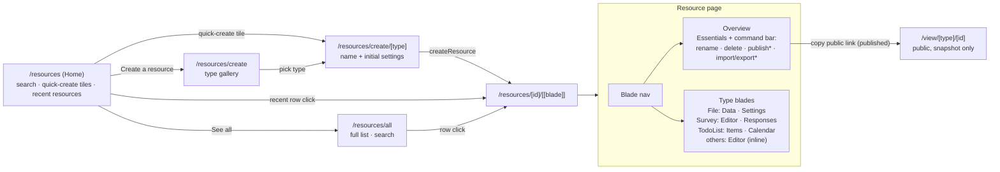
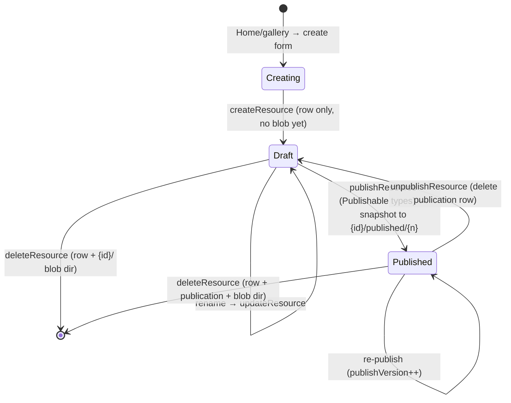

# Resource Explorer

The single Azure-portal-like UI for every resource: one list, one resource page with capability-aware blades, one public view route. It replaced the documents hub and all per-editor top-level pages — the shell is driven entirely by `ResourceDefinitionMap` ([/docs/architecture/resources](/docs/architecture/resources)). Azure Portal is the UX reference, deliberately literal: Home mirrors the portal landing, Create mirrors the marketplace (a page per resource type, never a modal).

| Azure portal                    | Resource Explorer                                         |
| ------------------------------- | --------------------------------------------------------- |
| Home (search + recents)         | `/resources`                                              |
| All resources list              | `/resources/all`                                          |
| Create a resource (marketplace) | `/resources/create` gallery → `/resources/create/[type]`  |
| Resource menu (left nav)        | blade menu on `/resources/[id]/[[blade]]`                 |
| Overview + Essentials           | Overview blade with Essentials panel                      |
| Toolbar commands                | Rename/Delete always; Publish/Import/Export by capability |
| Breadcrumbs                     | `AppBreadcrumbs`: Resource Explorer → All → {name}        |

## Routes

| Route                       | Page                                        | Purpose                                                                                                            |
| --------------------------- | ------------------------------------------- | ------------------------------------------------------------------------------------------------------------------ |
| `/resources`                | `pages/resources/index.vue` (auth)          | Home — search + quick-create + recent resources                                                                    |
| `/resources/all`            | `pages/resources/all.vue` (auth)            | full list (all types, search)                                                                                      |
| `/resources/create`         | `pages/resources/create/index.vue` (auth)   | create gallery — type picker (marketplace)                                                                         |
| `/resources/create/[type]`  | `pages/resources/create/[type].vue` (auth)  | per-type create form (name + initial settings) → `/resources/[id]`                                                 |
| `/resources/[id]/[[blade]]` | `pages/resources/[id]/[[blade]].vue` (auth) | resource page; omitted blade = Overview; blade validated in route middleware                                       |
| `/view/[type]/[id]`         | `pages/view/[type]/[id].vue` (public)       | published view, dispatched via `ViewComponentMap` ([/docs/architecture/publishing](/docs/architecture/publishing)) |

`all` and `create` are static segments so they win over the dynamic `[id]` sibling. Blades are path segments (not query params) so they deep-link. Email invite blocks link the public respondent page via `RoutePath.View(ResourceType.Survey, id)`. `ProductListLinkItems` has one **Resources** entry (landing on Home) replacing the seven old editor entries.

## Navigation map



## Home — `/resources`

The Azure-portal landing. Not a table — a dashboard of entry points: a **search bar** (submitting routes to `/resources/all` pre-filtered), **quick-create tiles** from `ResourceDefinitionMap` (icon + title → `/resources/create/[type]`), a primary **Create a resource** button (→ gallery), and **Recent resources** (`resource.readResources` sorted by `updatedAt` desc, capped, with a **See all** link). Empty state is a `StyledEmptyState` with a Create action.

## All resources — `/resources/all`

`pages/resources/all.vue` is a `StyledPageHeader title="All"` (rendering the `Home › Resource Explorer › All` breadcrumb) above a `v-sheet flex-1` wrapping `ResourceListView` (`searchable` + `:close-to`) — `StyledDataTableServer` over `resource.readResources` (cross-type, owner, offset-paginated):

- Columns: type (icon + label from `ResourceDefinitionMap`), name, createdAt, updatedAt. Publish status is deliberately **not** a list column — it is a capability surfaced per-resource on the Overview blade, not mixed into a cross-type list.
- Toolbar (a fully-bordered `b-1` box, rendered only when `searchable`): search + a **close ✕** (`closeTo` → Home) — **not** a Create button. Create lives on Home; `/all` is a layer you close back to Home.
- Row click → `/resources/{id}` via `navigateTo`; the row's **Open** action links there with `:to`.

## Create flow — `/resources/create` → `/resources/create/[type]`

Create is a **page per resource type**, mirroring the Azure marketplace + create blade — never a modal. The gallery shows tiles for every `ResourceDefinitionMap` entry (icon, title, description); the per-type form collects the name (`createNameSchema`) plus any type-specific initial settings (most types are name-only), calls `createResource(type, …)`, and routes to the new resource's Overview blade. The content blob is written on the first save inside an editor blade, not at create time.

## Resource page — `/resources/[id]/[[blade]]`

Azure-portal-faithful **two flex boxes** on one surface (deliberately simple — no absolute overlay, no `z-index`): a full-width **breadcrumb bar** (a `StyledPageHeader` whose `#breadcrumbs` slot renders the single unified `AppBreadcrumbs`) on top, then `<ResourceExplorer>` — a single `<v-sheet flex flex-1>` holding the **list box** (`ResourceExplorerList`, collapsible) and the **blade box** (`flex-1`) side by side.

```text
  Home › Resource Explorer › All › Q3 Report          ← single breadcrumb (base page owns it)
┌───────────────┬──────────────────────────────────────────────┐
│ « Resources   │ 📄 Q3 Report | Overview   [Rename][Delete] [✕] │  ← blade box header (type + name)
│ ───────────── ├───────────────┬──────────────────────────────┤
│ 📄 Q3 Report  │ ▸ Overview     │  Essentials                  │
│ 📊 Sales      │   Data         │   Type     File              │
│ 🌐 Landing…   │   Settings     │   Created  … ago  Updated 2h │
└───────────────┴───────────────┴──────────────────────────────┘
   list box (collapsible)         blade box (flex-1, owns the divider)
```

- **Collapse caret next to the list title** — the list box header is `« Resources`; clicking `«` collapses the whole list box to a thin `shrink-0` strip containing just `»` to restore it, so the blade box simply grows to fill. No width animation math, no overlay.
- **Mobile-native** — the list box starts collapsed on `smAndDown` (`useVDisplay`), and the blade nav shrinks to a `3.5rem` icon rail on the same breakpoint.
- **Borders drawn exactly once** — no component double-draws an edge. The **blade box** owns the full-height list↔blade divider (`b-l` on its header and content, plus `b-t` under the header); the list box draws no right edge. The **list box header** owns its bottom separator (`b-b`); the **blade nav** is borderless. Both headers are the shared `v-toolbar` primitive (identical native height/padding, no bespoke sizing).
- **Nested close** — the close ✕ peels back one layer: the blade box's ✕ → `/resources/all`; `/all`'s ✕ → Home. Each ✕ lives in its box's header, never on the breadcrumb's level.
- **Single unified breadcrumb** — the base page owns the only breadcrumb; the blade box has none. Navigation uses `:to` (real `<a>`, keyboard + ARIA) everywhere the target is static — `navigateTo` only for dynamic targets (search submit, post-create/-delete redirects, table row clicks).
- **Blade box header** — type icon + `{name} | {active blade}` with the resource type as a caption line, plus the command bar and close ✕.

### Blades

The blade nav's built-in slugs come from the `ResourceBladeTypes` set (enum order **Overview** first, then **Editor** — `sort-enums` disabled so the enum stays the single ordered source of truth), followed by the type's own blades from `ResourceBladeDefinitionMap`. Editor-backed types register their inline component in `ResourceEditorComponentMap`; `BladeOutlet` renders it under `<ClientOnly><Suspense>` (VueFlow/GrapesJS can't SSR, and GrapesJS uses async setup). Blade-only types (File, TodoList) have no `ResourceEditorComponentMap` entry, so their nav skips the Editor blade entirely.

| Type      | Blades after Overview                                        |
| --------- | ------------------------------------------------------------ |
| File      | Data (grid editor), Settings (parse configuration form)      |
| Survey    | Editor (SurveyJS creator, inline), Responses (dataset table) |
| TodoList  | Items (todo table), Calendar (FullCalendar over this list)   |
| Dashboard | Editor (canvas incl. bind-to-data, inline)                   |
| Email     | Editor (GrapesJS, inline)                                    |
| Webpage   | Editor (GrapesJS, inline)                                    |
| Flowchart | Editor (VueFlow, inline)                                     |

- **Overview blade**: Essentials panel (type, created/updated) plus a type-specific summary slot. **Publish status + version and the public link render only for `PublishableResourceType`** — a non-publishable resource shows no status row at all.
- **Command bar** (in the blade box header): Rename + Delete always; Publish/Unpublish for `PublishableResourceType`; Import/Export for `PortableResourceType` (contributed by `PortableFormatMap` entries — `deserialize` ⇒ Import, a self-contained async `export()` ⇒ Export); a trailing close ✕.
- State via `useResource(id)` ([/docs/architecture/resources](/docs/architecture/resources)).

## Resource lifecycle

Every resource follows one lifecycle regardless of type — the type only decides which blades and capability commands appear:



**Create → first write.** `createResource` writes only the Postgres identity row; the content blob does not exist until the first `saveResourceContent` inside an editor blade — no half-written blob to reconcile.

**Update = one write path.** Settings and Data are separate blades but one content blob with one `contentVersion` — never two write paths for one artifact. Optimistic concurrency: a stale `contentVersion` rejects the save.

**Linking to other resources** is the dataset capability ([/docs/architecture/datasets](/docs/architecture/datasets)), not a resource-to-resource foreign key: a consumer holds a `DatasetReference` (`{ type, id }`) and either copies (File import — one-time row copy) or references (Dashboard visual / Email merge fields — re-resolved on load via `dataset.readDataset`).

**Delete.** `deleteResource` removes the row, the `resource_publications` row (if any), and the whole `{id}/` blob directory — identical for every type. Because links are bare `DatasetReference` ids (not FKs), deleting a source leaves consumers' stored references dangling; the consumer re-resolves on load and fails/returns empty rather than cascading. Published snapshots are unaffected (they baked data in at publish time). Surfacing a "source no longer available" state is deferred ([dangling dataset references](/docs/platform/decisions/dangling-dataset-references)).

## Key files

| File                                                  | Role                                                                                         |
| ----------------------------------------------------- | -------------------------------------------------------------------------------------------- |
| `app/pages/resources/[id]/[[blade]].vue`              | resource page shell: `useResource`, 404-guards id + blade, breadcrumb + `<ResourceExplorer>` |
| `app/components/Resource/Explorer.vue`                | the two-flex-box body (list box \| blade box)                                                |
| `app/components/Resource/ExplorerList.vue`            | collapsible list box (owns `isListCollapsed`, mobile-collapsed default)                      |
| `app/components/Resource/ListView.vue`                | `StyledDataTableServer` over `resource.readResources` (shared by `/all`)                     |
| `app/components/Resource/BladeToolbar.vue`            | blade box header composing `BladeTitle` + `BladeActions`                                     |
| `app/components/Resource/BladeActions.vue`            | command bar: rename, delete, `PublishToggle`, `PortableActions`, close ✕                     |
| `app/components/Resource/BladeNav.vue`                | blade menu from `ResourceBladeTypes` + type blades; mobile icon rail                         |
| `app/components/Resource/BladeOutlet.vue`             | Overview vs inline editor vs type blade on the active slug                                   |
| `app/components/Resource/Overview.vue`                | generic Overview blade (Essentials + type summary slot)                                      |
| `app/services/resource/ResourceBladeDefinitionMap.ts` | type → its own blade definitions                                                             |
| `app/services/resource/ResourceEditorComponentMap.ts` | type → inline Editor-blade component                                                         |
| `app/services/resource/PortableFormatMap.ts`          | portable type → formats (Import/Export)                                                      |
| `app/services/resource/ViewComponentMap.ts`           | publishable type → public view renderer                                                      |
| `app/composables/resource/useResource.ts`             | row + typed content + save/capability actions                                                |

## Notes

- The shell reuses the [shell cohesion](/docs/platform/shell-cohesion) primitives; styling follows the `styling`/`vuetify` skills.
- **One list mechanism**: the explorer replaced `DocumentPicker`, the surveyer CRUD list, and the documents hub — no per-editor pickers survive. Home recents and `/resources/all` are both `resource.readResources` (different sort/limit), not two data paths.
- **One create mechanism**: the gallery + per-type form replaced every per-editor "new" button and modal. Create is a page (marketplace parity), never a dialog.
- **Editors are pure editors.** The resource lifecycle (create / select / rename / delete / publish) lives only in the Explorer + Overview blade — never in an editor's `StyledPageHeader`. Editor headers keep only editing tools; editors save independently (autosave / edit-dialog).
- Deleted routes: `/documents`, `/table-editor`, `/surveyer`, `/surveyer/[id]`, `/survey/[id]`, `/dashboard`, `/dashboard/editor`, `/email-editor`, `/webpage-editor`, `/flowchart-editor`, `/calendar`, `/view/dashboard/[id]`, `/view/webpage/[id]`.
