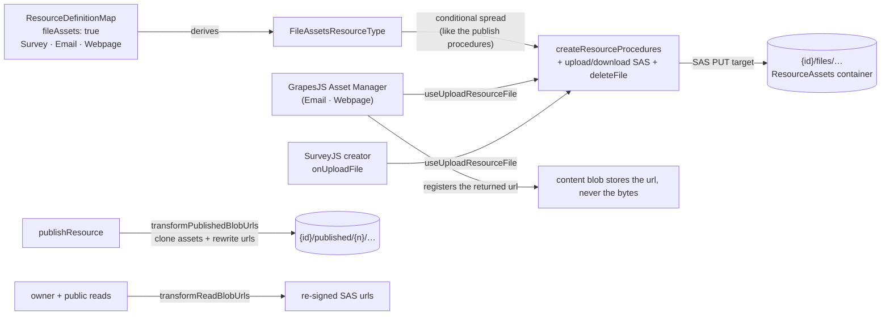
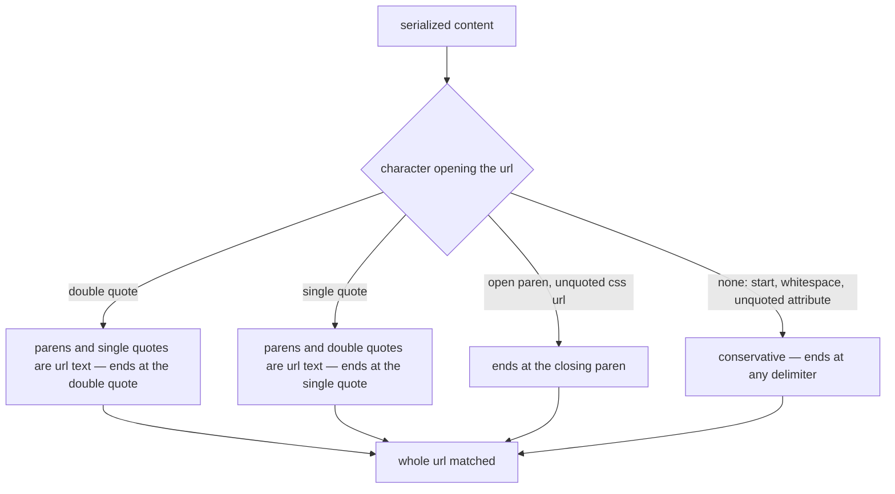

# Resource File Assets

The **FileAssets capability**: hosted binary assets for the resource types that need them. A type declaring `fileAssets: true` gets three owner-only procedures for uploading, reading and removing blobs under its own `{id}/files/…` directory, and the two GrapesJS editors wire their Asset Manager onto them — so an image in an email or a webpage is a hosted URL, never a base64 blob inlined into the content.

Adopters: Survey (SurveyJS image questions, logos, theme backgrounds), Email, Webpage. Three adopters clears the capability admission rule of two or more ([/docs/architecture/resources](/docs/architecture/resources)).

## How it works

The capability is storage plus procedures only. What an editor does with an asset URL stays type-specific — SurveyJS puts it on an image question, GrapesJS registers it in the Asset Manager — which keeps the capability at the same altitude as Portable: the mechanism is declared centrally, the semantics stay with the type.

- **Declaration** — `fileAssets: true` in `ResourceDefinitionMap`; `FileAssetsResourceType` is derived through the existing `CapabilityResourceType` mapped type. The three procedures are spread into the router conditionally, exactly like the publish procedures, so a non-declaring type has no asset endpoints at the type level.
- **Upload** — the standard two-step SAS flow ([/docs/architecture/file-uploads](/docs/architecture/file-uploads)): the server signs a PUT target scoped to one blob path, the client uploads directly to Azure Blob, then asks for a read URL. `useUploadResourceFile(type, id)` owns that round-trip once for every consumer.
- **GrapesJS wiring** — `useGrapesJsEditor` takes an optional asset adapter. With one, the Asset Manager's `uploadFile` handler runs the SAS round-trip and registers the returned URL. Without one, GrapesJS falls back to embedding dropped images as base64 — which bloats every save and is stripped by major email clients, so both editors pass an adapter.
- **Publish and reads** — every adopter shares the generic blob-url transforms ([/docs/architecture/publishing](/docs/architecture/publishing)): `transformPublishedBlobUrls` clones referenced asset blobs into the publish directory and rewrites their URLs, so a published snapshot survives the owner replacing the working-copy asset, and `transformReadBlobUrls` re-signs the urls on every owner and public read, so neither the editor nor a published page ever serves an expired SAS.
- **Canonical urls, one grammar** — see [finding a url in content](#finding-a-url-in-content) below; the matcher is the part of this capability that has drawn the most redundant review, so its decisions are recorded in full there.
- **Encoded in, decoded once** — `extractBlobUrls` returns each url percent-encoded exactly as the content carries it, because every consumer searches the content for it verbatim (the `replaceAll` in `useUpdateBlobUrls`, the copy source in `cloneBlobUrls`). Decoding is the _blob name's_ business: a name is the decoded path suffix of a url, while the url itself stays encoded wherever it is matched or fetched. Never decode before the search, and never search with a decoded url.
- **Delete** — `deleteResource` already removes the whole `{id}/` directory, so assets need no separate teardown. `deleteFile` exists for removing one asset while the resource lives on (SurveyJS deleting an image question).

## Finding a url in content

Blob names carry the uploaded filename verbatim, and Azure signs urls with `encodeURIComponent`, which leaves `!'()*` literal — exactly the characters that also delimit a url inside content (`url('…')`, `url(…)`) and that appear unescaped in a download SAS's `rscd`. Every url handed out is therefore canonicalized by `encodeBlobUrl` (percent-encoding those five; transparent to Azure, which decodes before validating `sig`).

Canonicalization alone does not decide where a url **ends**, because content persisted before it existed still carries the literal characters. A url is not a token whose shape we control, so it is matched under the second rule of [content token rewriting](/docs/architecture/content-token-rewriting) — anchored on the **opening delimiter**, which makes the terminator known rather than guessed:

What this settles for assets specifically:

- **No backfill migration.** A url signed before canonicalization is matched whole by the delimiter that opened it, so it resolves to the right blob name and is rewritten canonical on the next read — the [converge on read](/docs/architecture/content-token-rewriting#converge-on-read-do-not-backfill) rule. A migration over stored content blobs would buy nothing.
- **The un-anchored reading stays conservative.** A url opened by nothing keeps the narrow charset that terminates on every delimiter, because nothing narrows it. `srcset` lists and other space-separated positions fall here.
- **Known limit, accepted.** A pre-canonicalization url containing a literal `)` inside an _unquoted_ `url(…)` is genuinely ambiguous and truncates at that paren. CSS requires those parens escaped, so such a declaration was already broken in the browser before it reached us.
- **A url that names no blob is skipped.** Owner-authored content can carry a hand-written url with invalid percent escapes (`100%off.png`); `getBlobNameFromUrl` returns `undefined` and both `cloneBlobUrls` and `useUpdateBlobUrls` skip it. The published snapshot then keeps that url pointing at the working-copy path — accepted, because no upload can produce an undecodable url (the SDK percent-encodes the blob name), so the url names no blob under either path and there is nothing to clone.

## Procedures

| Procedure                       | Auth  | Purpose                              |
| ------------------------------- | ----- | ------------------------------------ |
| `generateUploadFileSasEntities` | owner | SAS PUT targets under `{id}/files/…` |
| `generateDownloadFileSasUrls`   | owner | refreshed read urls                  |
| `deleteFile`                    | owner | remove one asset blob                |

## Key files

| File                                                                      | Role                                         |
| ------------------------------------------------------------------------- | -------------------------------------------- |
| `packages/app/shared/models/resource/FileAssetsResourceType.ts`           | derived capability union                     |
| `packages/app/shared/services/resource/ResourceDefinitionMap.ts`          | `fileAssets` declarations                    |
| `packages/app/server/trpc/procedure/resource/createResourceProcedures.ts` | conditionally spread asset procedures        |
| `packages/app/shared/services/resource/getFilesDirectoryName.ts`          | the `{id}/files` path convention             |
| `packages/app/app/composables/resource/useUploadResourceFile.ts`          | SAS round-trip for one file                  |
| `packages/app/app/composables/resource/useDeleteResourceFile.ts`          | url to blob path, then `deleteFile`          |
| `packages/app/app/composables/grapesjs/useGrapesJsEditor.ts`              | Asset Manager upload adapter                 |
| `packages/app/app/services/grapesjs/readUploadFiles.ts`                   | files off the drag payload or the file input |

## Notes

- A standalone Asset or Image-library resource type was rejected: assets are meaningless outside their owning resource, die with it, and need no name, list or blades — an identity row per image is pure overhead. Cross-resource asset reuse has no demonstrated need; revisit only with a [brand kit](/docs/platform/deferred/brand-kit-resource).
- Served pages re-sign asset urls on every read, but a **downloaded artifact** (Email's personalized HTML export) freezes whatever urls it left with — those expire on the read-SAS horizon. Long-lived public asset urls are the [email sending](/docs/platform/deferred/email-sending) follow-on.
- Asset uploads count toward no quota ([storage usage surface](/docs/platform/deferred/storage-usage-surface) unchanged).
