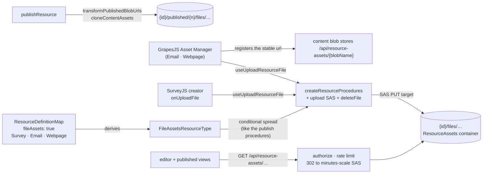

# Resource File Assets

The **FileAssets capability**: hosted binary assets for the resource types that need them. A type declaring `fileAssets: true` gets owner-only procedures for uploading and removing blobs under its own `{id}/files/…` directory, and the two GrapesJS editors wire their Asset Manager onto them — so an image in an email or a webpage is a hosted URL, never a base64 blob inlined into the content.

Adopters: Survey (SurveyJS image questions, logos, theme backgrounds), Email, Webpage. Three adopters clears the capability admission rule of two or more ([/docs/architecture/resources](/docs/architecture/resources)).

## How it works

Content embeds a **stable, relative app url** — `/api/resource-assets/{blobName}` — never a signed Azure url. The serving endpoint authorizes the caller and 302-redirects to a freshly signed minutes-scale SAS on every request, so nothing in stored content can expire and a leaked SAS dies in minutes. The app url itself carries whatever grant the authorization gives it: working-copy urls answer only to the owner, while published urls are intentionally anonymous-capable for as long as the publication row exists — unpublish is what revokes them. What an editor does with an asset url stays type-specific — SurveyJS puts it on an image question, GrapesJS registers it in the Asset Manager — which keeps the capability at the same altitude as Portable: the mechanism is declared centrally, the semantics stay with the type.

- **Declaration** — `fileAssets: true` in `ResourceDefinitionMap`; `FileAssetsResourceType` is derived through the existing `CapabilityResourceType` mapped type. The procedures are spread into the router conditionally, exactly like the publish procedures, so a non-declaring type has no asset endpoints at the type level.
- **Upload** — the standard two-step SAS flow ([/docs/architecture/file-uploads](/docs/architecture/file-uploads)): the server signs a PUT target scoped to one blob path and the client uploads directly to Azure Blob. The client then builds the stable url itself from the pieces it already holds (`getResourceAssetUrl` over `{id}/files/{fileId}|{filename}`) — no second round trip. `useUploadResourceFile(type, id)` owns this once for every consumer.
- **Serving** — `GET /api/resource-assets/{encodedPath}`: parse and validate (`parseResourceAssetPath`), rate limit, authorize, then 302 to a short-lived read SAS with `Cache-Control: private, max-age` just under the SAS life so a browser-cached redirect can never outlive its signature. No existence probe — Azure itself 404s a missing blob.
- **Publish** — `transformPublishedBlobUrls` → `cloneContentAssets`: referenced working-copy asset blobs are cloned under `{id}/published/{n}/files/…` and the content rewritten to the clones' stable urls, so a published snapshot survives the owner replacing or deleting the working-copy asset. Already-published urls in the content are immutable snapshot references and are carried as-is — re-cloning one under the publish directory would nest an unparseable `published/{n}/published/{m}` path.
- **Duplicate** — `duplicateResource` runs the same `cloneContentAssets` against `{newId}` with published-reference cloning on: **every** referenced asset — working-copy and published alike — is cloned under the copy, so the copy is fully self-contained: its editor can delete files, and deleting or unpublishing the original never strands it. **Every clone lands in the copy's own working files directory (`{newId}/files/…`), whatever directory it came from.** A published source is deliberately _not_ mirrored to `{newId}/published/{n}/files/…`: that prefix is what unpublishing wipes, so a copy whose assets lived there would lose them the first time the copy was unpublished. The clone drops the _source_ resource id from the destination path, which is also why the rewrite is a per-url map, never a prefix replace — content can legitimately carry foreign-id urls (duplicated or blueprint-deployed content).

  Flattening two directories into one means two sources can name one destination: a working copy and a published snapshot of the same file are identical from `files/` onwards. Content that embeds both would otherwise issue two concurrent copies at one destination blob, and Azure fails the second with a pending-copy conflict — unwinding the entire duplicate. The second clone is therefore given a fresh id in its destination name. Nothing reads an id back out of a blob name (`parseResourceAssetPath` yields only the resource id and whether the path is published), and the rewrite map is what points content at the clone, so re-identifying is invisible to everything downstream.

- **Delete** — `deleteResource` already removes the whole `{id}/` directory, so assets need no separate teardown. `deleteFile` exists for removing one asset while the resource lives on (SurveyJS deleting an image question); the client recovers the blob path from the stable url and ignores anything outside this resource's files directory.

## Authorization matrix

| Path shape                        | Who                                                 | Why                                                                                                                                   |
| --------------------------------- | --------------------------------------------------- | ------------------------------------------------------------------------------------------------------------------------------------- |
| `{id}/files/{file}`               | session owner of the resource                       | working-copy assets render only inside the owner's editor (same-origin, cookies present)                                              |
| `{id}/published/{v}/files/{file}` | anyone while a publication row exists; owner always | published views render in a sandboxed `srcdoc` iframe whose opaque origin sends no cookies; the owner fallback backs version previews |

CSP needs no special-casing: `ImageSourceWhitelist` carries `'self'` (the relative url) and the Azure base url (the redirect target — CSP checks redirect targets).

## Matching a stable url

The url is emitted only by `getResourceAssetUrl`, whose per-segment encoding (`encodeURIComponent` plus percent-encoding `!'()*`) closes the charset to `[\w.~%-]` by construction — the **token we control** case of [content token rewriting](/docs/architecture/content-token-rewriting). `RESOURCE_ASSET_URL_REGEX` is therefore a prefix-anchored positive-charset match with no opener analysis, and `parseResourceAssetPath` is the single decoder/validator: url segments map one-to-one onto blob-name segments, so rejecting any decoded segment that could re-introduce a separator makes traversal impossible by construction. A url that fails to parse is data, not an error — the clone carries it verbatim and the endpoint 400s it.

## Procedures

| Procedure                       | Auth  | Purpose                              |
| ------------------------------- | ----- | ------------------------------------ |
| `generateUploadFileSasEntities` | owner | SAS PUT targets under `{id}/files/…` |
| `deleteFile`                    | owner | remove one asset blob                |

Reads have no procedure — they go through the `/api/resource-assets` endpoint.

## Key files

| File                                                                      | Role                                       |
| ------------------------------------------------------------------------- | ------------------------------------------ |
| `packages/app/shared/services/resource/getResourceAssetUrl.ts`            | blob name → stable url (closed charset)    |
| `packages/app/shared/services/resource/parseResourceAssetPath.ts`         | the single decoder/validator               |
| `packages/app/server/api/resource-assets/[...path].get.ts`                | authorize + 302 to a minutes-scale SAS     |
| `packages/app/server/services/resource/cloneContentAssets.ts`             | clone referenced blobs + rewrite urls      |
| `packages/app/shared/services/resource/ResourceDefinitionMap.ts`          | `fileAssets` declarations                  |
| `packages/app/server/trpc/procedure/resource/createResourceProcedures.ts` | conditionally spread asset procedures      |
| `packages/app/shared/services/resource/getFilesDirectoryName.ts`          | the `{id}/files` path convention           |
| `packages/app/app/composables/resource/useUploadResourceFile.ts`          | upload round-trip, returns the stable url  |
| `packages/app/app/composables/resource/useDeleteResourceFile.ts`          | stable url to blob path, then `deleteFile` |
| `packages/app/app/composables/grapesjs/useGrapesJsEditor.ts`              | Asset Manager upload adapter               |

## Notes

- The stable-url model **replaced** an earlier model that baked signed Azure urls into content and re-signed them on every read. The cutover shipped latest-shape-only ([persisted data — latest shape only](/docs/architecture/persisted-data-latest-shape-only)): nothing reads, converges, or migrates pre-cutover baked-url content — an old draft renders its assets broken until they are re-added in the editor, which is accepted. Do not re-propose a dual-form reader or a backfill for this transition; [converge-on-read](/docs/architecture/content-token-rewriting) governs future changes to the stable url's own form.
- A standalone Asset or Image-library resource type was rejected: assets are meaningless outside their owning resource, die with it, and need no name, list or blades — an identity row per image is pure overhead. Cross-resource asset reuse has no demonstrated need; revisit only with a [brand kit](/docs/platform/deferred/brand-kit-resource).
- A **downloaded artifact** (Email's personalized HTML export) absolutizes its stable urls against the app origin, so its images render only for viewers with an owner session. Durable public asset urls are the [email sending](/docs/platform/deferred/email-sending) follow-on.
- Blueprint capture/deploy carries asset urls untouched (only whole-string resource ids are aliased), so deployed content references the _source_ resource's blobs; deleting a captured source strands those references — accepted, identical to deleting any referenced resource.
- Asset uploads count toward no quota yet — the [storage quotas](/docs/proposals/platform/storage-quotas) proposal adds per-user accounting that would fold these in.
