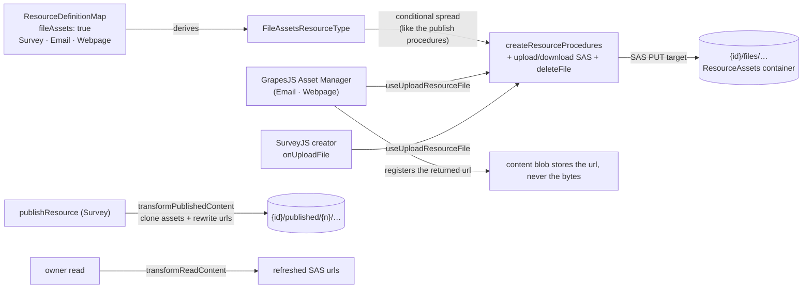

# Resource File Assets

The **FileAssets capability**: hosted binary assets for the resource types that need them. A type declaring `fileAssets: true` gets three owner-only procedures for uploading, reading and removing blobs under its own `{id}/files/…` directory, and the two GrapesJS editors wire their Asset Manager onto them — so an image in an email or a webpage is a hosted URL, never a base64 blob inlined into the content.

Adopters: Survey (SurveyJS image questions, logos, theme backgrounds), Email, Webpage. Three adopters clears the capability admission rule of two or more ([/docs/architecture/resources](/docs/architecture/resources)).

## How it works

The capability is storage plus procedures only. What an editor does with an asset URL stays type-specific — SurveyJS puts it on an image question, GrapesJS registers it in the Asset Manager — which keeps the capability at the same altitude as Portable: the mechanism is declared centrally, the semantics stay with the type.

- **Declaration** — `fileAssets: true` in `ResourceDefinitionMap`; `FileAssetsResourceType` is derived through the existing `CapabilityResourceType` mapped type. The three procedures are spread into the router conditionally, exactly like the publish procedures, so a non-declaring type has no asset endpoints at the type level.
- **Upload** — the standard two-step SAS flow ([/docs/architecture/file-uploads](/docs/architecture/file-uploads)): the server signs a PUT target scoped to one blob path, the client uploads directly to Azure Blob, then asks for a read URL. `useUploadResourceFile(type, id)` owns that round-trip once for every consumer.
- **GrapesJS wiring** — `useGrapesJsEditor` takes an optional asset adapter. With one, the Asset Manager's `uploadFile` handler runs the SAS round-trip and registers the returned URL. Without one, GrapesJS falls back to embedding dropped images as base64 — which bloats every save and is stripped by major email clients, so both editors pass an adapter.
- **Publish** — Survey's `transformPublishedContent` clones referenced asset blobs into the publish directory and rewrites their URLs, so a published snapshot survives the owner replacing the working-copy asset ([/docs/architecture/publishing](/docs/architecture/publishing)).
- **Delete** — `deleteResource` already removes the whole `{id}/` directory, so assets need no separate teardown. `deleteFile` exists for removing one asset while the resource lives on (SurveyJS deleting an image question).

## Procedures

| Procedure                       | Auth  | Purpose                              |
| ------------------------------- | ----- | ------------------------------------ |
| `generateUploadFileSasEntities` | owner | SAS PUT targets under `{id}/files/…` |
| `generateDownloadFileSasUrls`   | owner | refreshed read urls                  |
| `deleteFile`                    | owner | remove one asset blob                |

## Key files

| File                                                                      | Role                                         |
| ------------------------------------------------------------------------- | -------------------------------------------- |
| `packages/app/shared/models/resource/FileAssetsResourceType.ts`           | derived capability union                     |
| `packages/app/shared/services/resource/ResourceDefinitionMap.ts`          | `fileAssets` declarations                    |
| `packages/app/server/trpc/procedure/resource/createResourceProcedures.ts` | conditionally spread asset procedures        |
| `packages/app/server/services/resource/getFilesDirectoryName.ts`          | the `{id}/files` path convention             |
| `packages/app/app/composables/resource/useUploadResourceFile.ts`          | SAS round-trip for one file                  |
| `packages/app/app/composables/resource/useDeleteResourceFile.ts`          | url to blob path, then `deleteFile`          |
| `packages/app/app/composables/grapesjs/useGrapesJsEditor.ts`              | Asset Manager upload adapter                 |
| `packages/app/app/services/grapesjs/readUploadFiles.ts`                   | files off the drag payload or the file input |

## Notes

- A standalone Asset or Image-library resource type was rejected: assets are meaningless outside their owning resource, die with it, and need no name, list or blades — an identity row per image is pure overhead. Cross-resource asset reuse has no demonstrated need; revisit only with a [brand kit](/docs/platform/deferred/brand-kit-resource).
- Email's exported HTML references owner-read SAS urls, which expire. Long-lived public asset urls are the [email sending](/docs/platform/deferred/email-sending) follow-on.
- Asset uploads count toward no quota ([storage usage surface](/docs/platform/deferred/storage-usage-surface) unchanged).
