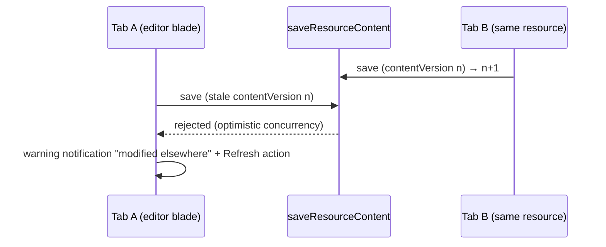

# Resource Page Parity

Azure command-bar and destructive-operation parity on `/resource-explorer/[id]/[[blade]]`: labeled toolbar commands with a `…` overflow, Refresh, a Duplicate command, and a type-the-name delete confirmation.

## Command bar

- **Presentation** (`BladeActions`): `variant="text"` buttons with `prepend-icon` + label (Refresh, Rename, Delete, Duplicate, Publish/Unpublish, Import, Export), `v-divider vertical` between groups; Delete keeps `color="error"`.
- **Overflow**: on `smAndDown`, every command collapses into a single `…` menu (labels always visible in the menu), rendered by `BladeActions` from the same gates as the wide bar; the close ✕ never collapses.
- **Refresh**: re-runs `useResource`'s `load` (row + publication) with the toolbar button showing the loading state.
- **Duplicate**: `resource.duplicateResource` — copies the row as `{name} (copy)` + the content blob; never the publication (a copy starts as Draft). Routes to the new resource's Overview and raises a "Go to resource" [notification](/docs/platform/notifications). Capability-independent (every type supports it).

## Destructive-operation guard

`StyledDeleteFormDialog` takes an optional `confirmName` prop: a text field whose value must equal it before Delete enables (Azure's "type the resource name to confirm"). The blade Delete command and the `/all` row delete type the resource name; a bulk delete past one selection has no single name to type, so it falls back to a count phrase ([list filters & views](/docs/platform/list-filters-and-views)).

## Save-conflict surface

A `saveResourceContent` rejected for a stale `contentVersion` routes into the [notifications](/docs/platform/notifications) store as "'{name}' was modified elsewhere — refresh to load the latest", with a Refresh action that hard-reloads (the one path guaranteed to re-run every blade's content loader).

## Procedures

| Procedure                    | Auth                | Input    | Purpose                                                                  |
| ---------------------------- | ------------------- | -------- | ------------------------------------------------------------------------ |
| `resource.duplicateResource` | `getOwnerProcedure` | `{ id }` | copy row (`{name} (copy)`, fresh id, no publication) + copy content blob |

## Key files

| File                                         | Role                                                        |
| -------------------------------------------- | ----------------------------------------------------------- |
| `app/components/Resource/Blade/Actions.vue`  | labeled buttons, dividers, narrow-viewport `…` menu         |
| `app/components/Styled/DeleteFormDialog.vue` | `confirmName` guard prop                                    |
| `app/composables/resource/useResource.ts`    | refresh/duplicate actions, conflict + outcome notifications |

## Notes

- Commands stay capability-gated exactly as before — this changed presentation and added Refresh/Duplicate, not the gating model.
- Listing published snapshots, previewing one, and rolling back to it are [publish history](/docs/platform/publish-history), not command-bar parity.
- JSON view / export-template parity is [out of scope](/docs/platform/rejected/json-config-parity).
